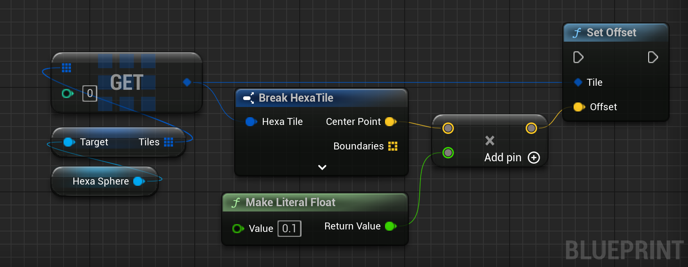

# Applying Noise on Tiles

This section covers how to add noise to the tiles.


## Built In Noise

Noise can be applied to a list of tiles by using the `Apply Noise` method.


<div class="code-switcher show-cpp-false">
<div class="switcher" >
<span class="sw-bp" onclick="switchBp()">Blueprints</span><span class="sw-cpp" onclick="switchCpp()">C++</span>
</div>
<div class="cpp">

```cpp
// Sets up the noise applied to the tiles.
FHexaSphereNoise Noise;
Noise.bEnableNoise = true;
Noise.Frequency = 0.01f;
Noise.Amplitude = 0.01f;
Noise.Octave = 1;
Noise.Persistence = 0.5f;
Noise.Seed = FMath::Rand();
Noise.UniformOffset = 0.f;
Noise.MinValue = 0.f;
Noise.MinOffset = 0.f;

// Applies the noise to the tiles.
FHexaSphereLib::ApplyNoise(Noise, Tiles);

```

</div>
<div class="bp">
<div class="bpcode">
<textarea readonly>
Begin Object Class=/Script/BlueprintGraph.K2Node_CallFunction Name="K2Node_CallFunction_1" ExportPath=/Script/BlueprintGraph.K2Node_CallFunction'"/Game/QuickStart/MyPlanet.MyPlanet:EventGraph.K2Node_CallFunction_1"'
   FunctionReference=(MemberParent=/Script/CoreUObject.Class'"/Script/HexaSphereLib.HexaSphereBlueprintLib"',MemberName="ApplyNoiseToTiles")
   NodePosX=-192
   NodePosY=-544
   NodeGuid=C395B43E406FB171144392B9BBD4C99D
   CustomProperties Pin (PinId=2FF6A8944E3E77C020F589B39D66A5C7,PinName="execute",PinToolTip="\nExec",PinType.PinCategory="exec",PinType.PinSubCategory="",PinType.PinSubCategoryObject=None,PinType.PinSubCategoryMemberReference=(),PinType.PinValueType=(),PinType.ContainerType=None,PinType.bIsReference=False,PinType.bIsConst=False,PinType.bIsWeakPointer=False,PinType.bIsUObjectWrapper=False,PinType.bSerializeAsSinglePrecisionFloat=False,PersistentGuid=00000000000000000000000000000000,bHidden=False,bNotConnectable=False,bDefaultValueIsReadOnly=False,bDefaultValueIsIgnored=False,bAdvancedView=False,bOrphanedPin=False,)
   CustomProperties Pin (PinId=D30032B8499F75010B19C6812786707B,PinName="then",PinToolTip="\nExec",Direction="EGPD_Output",PinType.PinCategory="exec",PinType.PinSubCategory="",PinType.PinSubCategoryObject=None,PinType.PinSubCategoryMemberReference=(),PinType.PinValueType=(),PinType.ContainerType=None,PinType.bIsReference=False,PinType.bIsConst=False,PinType.bIsWeakPointer=False,PinType.bIsUObjectWrapper=False,PinType.bSerializeAsSinglePrecisionFloat=False,PersistentGuid=00000000000000000000000000000000,bHidden=False,bNotConnectable=False,bDefaultValueIsReadOnly=False,bDefaultValueIsIgnored=False,bAdvancedView=False,bOrphanedPin=False,)
   CustomProperties Pin (PinId=659085AC4A4304C0F68202B3B8D54DEA,PinName="self",PinFriendlyName=NSLOCTEXT("K2Node", "Target", "Target"),PinToolTip="Target\nHexa Sphere Blueprint Lib Object Reference",PinType.PinCategory="object",PinType.PinSubCategory="",PinType.PinSubCategoryObject=/Script/CoreUObject.Class'"/Script/HexaSphereLib.HexaSphereBlueprintLib"',PinType.PinSubCategoryMemberReference=(),PinType.PinValueType=(),PinType.ContainerType=None,PinType.bIsReference=False,PinType.bIsConst=False,PinType.bIsWeakPointer=False,PinType.bIsUObjectWrapper=False,PinType.bSerializeAsSinglePrecisionFloat=False,DefaultObject="/Script/HexaSphereLib.Default__HexaSphereBlueprintLib",PersistentGuid=00000000000000000000000000000000,bHidden=True,bNotConnectable=False,bDefaultValueIsReadOnly=False,bDefaultValueIsIgnored=False,bAdvancedView=False,bOrphanedPin=False,)
   CustomProperties Pin (PinId=E006E1CA4C0FB817E611EEBAC000857E,PinName="Tiles",PinToolTip="Tiles\nArray of Hexa Tile Structures\n\nThe tiles we want to apply noise to.",PinType.PinCategory="struct",PinType.PinSubCategory="",PinType.PinSubCategoryObject=/Script/CoreUObject.ScriptStruct'"/Script/HexaSphereLib.HexaTile"',PinType.PinSubCategoryMemberReference=(),PinType.PinValueType=(),PinType.ContainerType=Array,PinType.bIsReference=True,PinType.bIsConst=False,PinType.bIsWeakPointer=False,PinType.bIsUObjectWrapper=False,PinType.bSerializeAsSinglePrecisionFloat=False,PersistentGuid=00000000000000000000000000000000,bHidden=False,bNotConnectable=False,bDefaultValueIsReadOnly=False,bDefaultValueIsIgnored=False,bAdvancedView=False,bOrphanedPin=False,)
   CustomProperties Pin (PinId=F2C3A1D443D28CDC59EA749EC3028199,PinName="Noise",PinToolTip="Noise\nHexa Sphere Noise Structure (by ref)\n\nThe noise to apply.",PinType.PinCategory="struct",PinType.PinSubCategory="",PinType.PinSubCategoryObject=/Script/CoreUObject.ScriptStruct'"/Script/HexaSphereLib.HexaSphereNoise"',PinType.PinSubCategoryMemberReference=(),PinType.PinValueType=(),PinType.ContainerType=None,PinType.bIsReference=True,PinType.bIsConst=True,PinType.bIsWeakPointer=False,PinType.bIsUObjectWrapper=False,PinType.bSerializeAsSinglePrecisionFloat=False,LinkedTo=(K2Node_MakeStruct_1 695A300A43AB32AFB55E2B938AA6E3DF,),PersistentGuid=00000000000000000000000000000000,bHidden=False,bNotConnectable=False,bDefaultValueIsReadOnly=False,bDefaultValueIsIgnored=True,bAdvancedView=False,bOrphanedPin=False,)
End Object
Begin Object Class=/Script/BlueprintGraph.K2Node_MakeStruct Name="K2Node_MakeStruct_1" ExportPath=/Script/BlueprintGraph.K2Node_MakeStruct'"/Game/QuickStart/MyPlanet.MyPlanet:EventGraph.K2Node_MakeStruct_1"'
   bMadeAfterOverridePinRemoval=True
   ShowPinForProperties(0)=(PropertyName="bEnableNoise",PropertyFriendlyName="Enable Noise",PropertyTooltip=NSLOCTEXT("", "AC2C770C490B82E96318DD8E138CE1B8", "If the noise is enabled."),CategoryName="HexaSphere",bShowPin=True,bCanToggleVisibility=True)
   ShowPinForProperties(1)=(PropertyName="Frequency",PropertyFriendlyName="Frequency",PropertyTooltip=NSLOCTEXT("", "D14BD9904C24D7E4491AF9A1E803629A", "The frequency (speed) of the noise."),CategoryName="HexaSphere",bShowPin=True,bCanToggleVisibility=True)
   ShowPinForProperties(2)=(PropertyName="Amplitude",PropertyFriendlyName="Amplitude",PropertyTooltip=NSLOCTEXT("", "C1A40C6B40AB99600F4F06ABAFD875DA", "The amplitude of the noise.\nThe resulting noise is in [-Amplitude, Amplitude]."),CategoryName="HexaSphere",bShowPin=True,bCanToggleVisibility=True)
   ShowPinForProperties(3)=(PropertyName="Octave",PropertyFriendlyName="Octave",PropertyTooltip=NSLOCTEXT("", "3DFFEEEA4CC2B0651A3ADC9B0115E27D", "The number of octaves to apply to the noise.\nIf <= 0, there is no noise."),CategoryName="HexaSphere",bShowPin=True,bCanToggleVisibility=True)
   ShowPinForProperties(4)=(PropertyName="Persistence",PropertyFriendlyName="Persistence",PropertyTooltip=NSLOCTEXT("", "716D7B284C6ACD80365B64B4799C1FCB", "The persistence of the noise across octaves."),CategoryName="HexaSphere",bShowPin=True,bCanToggleVisibility=True)
   ShowPinForProperties(5)=(PropertyName="Seed",PropertyFriendlyName="Seed",PropertyTooltip=NSLOCTEXT("", "5A163BE44D9A3F652B0DC2B0A027443A", "The seed for the noise. Used as an offset added in XYZ."),CategoryName="HexaSphere",bShowPin=True,bCanToggleVisibility=True)
   ShowPinForProperties(6)=(PropertyName="UniformOffset",PropertyFriendlyName="Uniform Offset",PropertyTooltip=NSLOCTEXT("", "70DAE8C1489D5AC2E7CEE4BA26D6989E", "Abrbitrary offset applied to all tiles in percent."),CategoryName="HexaSphere",bShowPin=True,bCanToggleVisibility=True)
   ShowPinForProperties(7)=(PropertyName="MinValue",PropertyFriendlyName="Min Value",PropertyTooltip=NSLOCTEXT("", "0FD184AF429E1EE81F7094BF671ECB97", "The minimal value of the noise. Noise is clamped to this value.\nCan be used to imitate water."),CategoryName="HexaSphere",bShowPin=True,bCanToggleVisibility=True)
   ShowPinForProperties(8)=(PropertyName="MinOffset",PropertyFriendlyName="Min Offset",PropertyTooltip=NSLOCTEXT("", "A04C477B45AD97A0004E47AD6239F08F", "The minimal offset for the noise. Applied to a tile if it its noise\nvalue is greater than MinValue."),CategoryName="HexaSphere",bShowPin=True,bCanToggleVisibility=True)
   StructType=/Script/CoreUObject.ScriptStruct'"/Script/HexaSphereLib.HexaSphereNoise"'
   NodePosX=-560
   NodePosY=-704
   AdvancedPinDisplay=Shown
   NodeGuid=8F47C848475B5201A8EF57A14EE29562
   CustomProperties Pin (PinId=695A300A43AB32AFB55E2B938AA6E3DF,PinName="HexaSphereNoise",Direction="EGPD_Output",PinType.PinCategory="struct",PinType.PinSubCategory="",PinType.PinSubCategoryObject=/Script/CoreUObject.ScriptStruct'"/Script/HexaSphereLib.HexaSphereNoise"',PinType.PinSubCategoryMemberReference=(),PinType.PinValueType=(),PinType.ContainerType=None,PinType.bIsReference=False,PinType.bIsConst=False,PinType.bIsWeakPointer=False,PinType.bIsUObjectWrapper=False,PinType.bSerializeAsSinglePrecisionFloat=False,LinkedTo=(K2Node_CallFunction_1 F2C3A1D443D28CDC59EA749EC3028199,),PersistentGuid=00000000000000000000000000000000,bHidden=False,bNotConnectable=False,bDefaultValueIsReadOnly=False,bDefaultValueIsIgnored=False,bAdvancedView=False,bOrphanedPin=False,)
   CustomProperties Pin (PinId=678449084C80F246EFEB5DB45AA7ED94,PinName="bEnableNoise",PinFriendlyName=NSLOCTEXT("", "AB762C3D438A1C26EB255DA05F2A3E4F", "Enable Noise"),PinToolTip="Enable Noise\nBoolean\n\nIf the noise is enabled.",PinType.PinCategory="bool",PinType.PinSubCategory="",PinType.PinSubCategoryObject=None,PinType.PinSubCategoryMemberReference=(),PinType.PinValueType=(),PinType.ContainerType=None,PinType.bIsReference=False,PinType.bIsConst=False,PinType.bIsWeakPointer=False,PinType.bIsUObjectWrapper=False,PinType.bSerializeAsSinglePrecisionFloat=False,DefaultValue="true",AutogeneratedDefaultValue="False",PersistentGuid=00000000000000000000000000000000,bHidden=False,bNotConnectable=False,bDefaultValueIsReadOnly=False,bDefaultValueIsIgnored=False,bAdvancedView=False,bOrphanedPin=False,)
   CustomProperties Pin (PinId=3C92AEE1465AE813EC2305827A299133,PinName="Frequency",PinFriendlyName=NSLOCTEXT("", "67C990E74F430A3F43717A8E785C15B1", "Frequency"),PinToolTip="Frequency\nFloat (single-precision)\n\nThe frequency (speed) of the noise.",PinType.PinCategory="real",PinType.PinSubCategory="float",PinType.PinSubCategoryObject=None,PinType.PinSubCategoryMemberReference=(),PinType.PinValueType=(),PinType.ContainerType=None,PinType.bIsReference=False,PinType.bIsConst=False,PinType.bIsWeakPointer=False,PinType.bIsUObjectWrapper=False,PinType.bSerializeAsSinglePrecisionFloat=False,DefaultValue="0.010000",AutogeneratedDefaultValue="1.000000",PersistentGuid=00000000000000000000000000000000,bHidden=False,bNotConnectable=False,bDefaultValueIsReadOnly=False,bDefaultValueIsIgnored=False,bAdvancedView=False,bOrphanedPin=False,)
   CustomProperties Pin (PinId=893610544BE1F17283F1448E613D4974,PinName="Amplitude",PinFriendlyName=NSLOCTEXT("", "5770540045558B4A919F4193765AC8CA", "Amplitude"),PinToolTip="Amplitude\nFloat (single-precision)\n\nThe amplitude of the noise.\nThe resulting noise is in [-Amplitude, Amplitude].",PinType.PinCategory="real",PinType.PinSubCategory="float",PinType.PinSubCategoryObject=None,PinType.PinSubCategoryMemberReference=(),PinType.PinValueType=(),PinType.ContainerType=None,PinType.bIsReference=False,PinType.bIsConst=False,PinType.bIsWeakPointer=False,PinType.bIsUObjectWrapper=False,PinType.bSerializeAsSinglePrecisionFloat=False,DefaultValue="0.020000",AutogeneratedDefaultValue="1.000000",PersistentGuid=00000000000000000000000000000000,bHidden=False,bNotConnectable=False,bDefaultValueIsReadOnly=False,bDefaultValueIsIgnored=False,bAdvancedView=True,bOrphanedPin=False,)
   CustomProperties Pin (PinId=BB951BC34AD7609133AC489F406B00AA,PinName="Octave",PinFriendlyName=NSLOCTEXT("", "ECEB005E4C960E45BFF235B31747184A", "Octave"),PinToolTip="Octave\nInteger\n\nThe number of octaves to apply to the noise.\nIf <= 0, there is no noise.",PinType.PinCategory="int",PinType.PinSubCategory="",PinType.PinSubCategoryObject=None,PinType.PinSubCategoryMemberReference=(),PinType.PinValueType=(),PinType.ContainerType=None,PinType.bIsReference=False,PinType.bIsConst=False,PinType.bIsWeakPointer=False,PinType.bIsUObjectWrapper=False,PinType.bSerializeAsSinglePrecisionFloat=False,DefaultValue="1",AutogeneratedDefaultValue="1",PersistentGuid=00000000000000000000000000000000,bHidden=False,bNotConnectable=False,bDefaultValueIsReadOnly=False,bDefaultValueIsIgnored=False,bAdvancedView=True,bOrphanedPin=False,)
   CustomProperties Pin (PinId=0122E3C04C2F1A16307D1198AB2FE980,PinName="Persistence",PinFriendlyName=NSLOCTEXT("", "4D099EE640F3D95B2958D581B2C690B7", "Persistence"),PinToolTip="Persistence\nFloat (single-precision)\n\nThe persistence of the noise across octaves.",PinType.PinCategory="real",PinType.PinSubCategory="float",PinType.PinSubCategoryObject=None,PinType.PinSubCategoryMemberReference=(),PinType.PinValueType=(),PinType.ContainerType=None,PinType.bIsReference=False,PinType.bIsConst=False,PinType.bIsWeakPointer=False,PinType.bIsUObjectWrapper=False,PinType.bSerializeAsSinglePrecisionFloat=False,DefaultValue="1.000000",AutogeneratedDefaultValue="1.000000",PersistentGuid=00000000000000000000000000000000,bHidden=False,bNotConnectable=False,bDefaultValueIsReadOnly=False,bDefaultValueIsIgnored=False,bAdvancedView=True,bOrphanedPin=False,)
   CustomProperties Pin (PinId=7443AEA3415E3F8C793ED9BB22300DC2,PinName="Seed",PinFriendlyName=NSLOCTEXT("", "1445AE92429900C4C8C08E92982D8998", "Seed"),PinToolTip="Seed\nInteger\n\nThe seed for the noise. Used as an offset added in XYZ.",PinType.PinCategory="int",PinType.PinSubCategory="",PinType.PinSubCategoryObject=None,PinType.PinSubCategoryMemberReference=(),PinType.PinValueType=(),PinType.ContainerType=None,PinType.bIsReference=False,PinType.bIsConst=False,PinType.bIsWeakPointer=False,PinType.bIsUObjectWrapper=False,PinType.bSerializeAsSinglePrecisionFloat=False,DefaultValue="0",AutogeneratedDefaultValue="0",PersistentGuid=00000000000000000000000000000000,bHidden=False,bNotConnectable=False,bDefaultValueIsReadOnly=False,bDefaultValueIsIgnored=False,bAdvancedView=True,bOrphanedPin=False,)
   CustomProperties Pin (PinId=0BDCC0BA42551CB1F7E50F86099FF02C,PinName="UniformOffset",PinFriendlyName=NSLOCTEXT("", "6ADA2ED4441F1ADB5070C6B46FFC12FE", "Uniform Offset"),PinToolTip="Uniform Offset\nFloat (single-precision)\n\nAbrbitrary offset applied to all tiles in percent.",PinType.PinCategory="real",PinType.PinSubCategory="float",PinType.PinSubCategoryObject=None,PinType.PinSubCategoryMemberReference=(),PinType.PinValueType=(),PinType.ContainerType=None,PinType.bIsReference=False,PinType.bIsConst=False,PinType.bIsWeakPointer=False,PinType.bIsUObjectWrapper=False,PinType.bSerializeAsSinglePrecisionFloat=False,DefaultValue="0.000000",AutogeneratedDefaultValue="0.000000",PersistentGuid=00000000000000000000000000000000,bHidden=False,bNotConnectable=False,bDefaultValueIsReadOnly=False,bDefaultValueIsIgnored=False,bAdvancedView=True,bOrphanedPin=False,)
   CustomProperties Pin (PinId=2991FC2A4F38D6A0325F25A5AF52CD3F,PinName="MinValue",PinFriendlyName=NSLOCTEXT("", "D1C2A5E34082A8F3C19C7DA089E1427C", "Min Value"),PinToolTip="Min Value\nFloat (single-precision)\n\nThe minimal value of the noise. Noise is clamped to this value.\nCan be used to imitate water.",PinType.PinCategory="real",PinType.PinSubCategory="float",PinType.PinSubCategoryObject=None,PinType.PinSubCategoryMemberReference=(),PinType.PinValueType=(),PinType.ContainerType=None,PinType.bIsReference=False,PinType.bIsConst=False,PinType.bIsWeakPointer=False,PinType.bIsUObjectWrapper=False,PinType.bSerializeAsSinglePrecisionFloat=False,DefaultValue="0.000000",AutogeneratedDefaultValue="0.000000",PersistentGuid=00000000000000000000000000000000,bHidden=False,bNotConnectable=False,bDefaultValueIsReadOnly=False,bDefaultValueIsIgnored=False,bAdvancedView=True,bOrphanedPin=False,)
   CustomProperties Pin (PinId=9862057E4548DA5D47BD7681D17D7A6E,PinName="MinOffset",PinFriendlyName=NSLOCTEXT("", "24E0E8A74FD112338BA152935D3BC5B2", "Min Offset"),PinToolTip="Min Offset\nFloat (single-precision)\n\nThe minimal offset for the noise. Applied to a tile if it its noise\nvalue is greater than MinValue.",PinType.PinCategory="real",PinType.PinSubCategory="float",PinType.PinSubCategoryObject=None,PinType.PinSubCategoryMemberReference=(),PinType.PinValueType=(),PinType.ContainerType=None,PinType.bIsReference=False,PinType.bIsConst=False,PinType.bIsWeakPointer=False,PinType.bIsUObjectWrapper=False,PinType.bSerializeAsSinglePrecisionFloat=False,DefaultValue="0.000000",AutogeneratedDefaultValue="0.000000",PersistentGuid=00000000000000000000000000000000,bHidden=False,bNotConnectable=False,bDefaultValueIsReadOnly=False,bDefaultValueIsIgnored=False,bAdvancedView=True,bOrphanedPin=False,)
End Object
</textarea>

<button onclick="copyBlueprintCode(this)">Copy Code</button>
</div>
</div>
</div>

The resulting noise vector can be read and modified in a tile's `Offset` attribute.

## Custom Deformation

Custom deformation can be applied to a tile.


<div class="code-switcher show-cpp-false">
<div class="switcher" >
<span class="sw-bp" onclick="switchBp()">Blueprints</span><span class="sw-cpp" onclick="switchCpp()">C++</span>
</div>
<div class="cpp">

```cpp
// Extrudes a tile by 10% of the sphere width.
Tile.Offset = Tile.CenterPoint * 0.1f; 
```

</div>
<div class="bp">

The following code shows how to set the offset of a specific tile to `10%` of the planet radius.
<div class="bpcode">
<textarea readonly>
Begin Object Class=/Script/BlueprintGraph.K2Node_VariableGet Name="K2Node_VariableGet_4" ExportPath=/Script/BlueprintGraph.K2Node_VariableGet'"/Game/QuickStart/MyPlanet.MyPlanet:EventGraph.K2Node_VariableGet_4"'
   VariableReference=(MemberName="Hexa Sphere",MemberGuid=FD75A70E45BA20382AA5B9A8C345B35C,bSelfContext=True)
   NodePosX=-1072
   NodePosY=-1056
   NodeGuid=858A2FB24AECE2DC5AF327802AAE0EF6
   CustomProperties Pin (PinId=4CB40BC74EEBDE2A50FBB693032D17AA,PinName="Hexa Sphere",Direction="EGPD_Output",PinType.PinCategory="object",PinType.PinSubCategory="",PinType.PinSubCategoryObject=/Script/CoreUObject.Class'"/Script/HexaSphereLib.HexaSphere"',PinType.PinSubCategoryMemberReference=(),PinType.PinValueType=(),PinType.ContainerType=None,PinType.bIsReference=False,PinType.bIsConst=False,PinType.bIsWeakPointer=False,PinType.bIsUObjectWrapper=False,PinType.bSerializeAsSinglePrecisionFloat=False,LinkedTo=(K2Node_VariableGet_5 BC28378A4A25394820B1C6A94E63FDB6,),PersistentGuid=00000000000000000000000000000000,bHidden=False,bNotConnectable=False,bDefaultValueIsReadOnly=False,bDefaultValueIsIgnored=False,bAdvancedView=False,bOrphanedPin=False,)
   CustomProperties Pin (PinId=279CA2CD4DEF1AFA818AEE9C58A57A5A,PinName="self",PinFriendlyName=NSLOCTEXT("K2Node", "Target", "Target"),PinType.PinCategory="object",PinType.PinSubCategory="",PinType.PinSubCategoryObject=/Script/Engine.BlueprintGeneratedClass'"/Game/QuickStart/MyPlanet.MyPlanet_C"',PinType.PinSubCategoryMemberReference=(),PinType.PinValueType=(),PinType.ContainerType=None,PinType.bIsReference=False,PinType.bIsConst=False,PinType.bIsWeakPointer=False,PinType.bIsUObjectWrapper=False,PinType.bSerializeAsSinglePrecisionFloat=False,PersistentGuid=00000000000000000000000000000000,bHidden=True,bNotConnectable=False,bDefaultValueIsReadOnly=False,bDefaultValueIsIgnored=False,bAdvancedView=False,bOrphanedPin=False,)
End Object
Begin Object Class=/Script/BlueprintGraph.K2Node_VariableGet Name="K2Node_VariableGet_5" ExportPath=/Script/BlueprintGraph.K2Node_VariableGet'"/Game/QuickStart/MyPlanet.MyPlanet:EventGraph.K2Node_VariableGet_5"'
   VariableReference=(MemberParent=/Script/CoreUObject.Class'"/Script/HexaSphereLib.HexaSphere"',MemberName="Tiles")
   SelfContextInfo=NotSelfContext
   NodePosX=-1072
   NodePosY=-1104
   NodeGuid=766575FD49D30FB5ABD2BCBC2EB430D3
   CustomProperties Pin (PinId=A8E823544B24D99995364FBBF6BFA112,PinName="Tiles",PinFriendlyName=NSLOCTEXT("", "87B8A0974A6A1652CBC0CD9FE879352A", "Tiles"),Direction="EGPD_Output",PinType.PinCategory="struct",PinType.PinSubCategory="",PinType.PinSubCategoryObject=/Script/CoreUObject.ScriptStruct'"/Script/HexaSphereLib.HexaTile"',PinType.PinSubCategoryMemberReference=(),PinType.PinValueType=(),PinType.ContainerType=Array,PinType.bIsReference=False,PinType.bIsConst=False,PinType.bIsWeakPointer=False,PinType.bIsUObjectWrapper=False,PinType.bSerializeAsSinglePrecisionFloat=False,LinkedTo=(K2Node_GetArrayItem_0 4C73817440179895AE008FA1FE2987FC,),PersistentGuid=00000000000000000000000000000000,bHidden=False,bNotConnectable=False,bDefaultValueIsReadOnly=False,bDefaultValueIsIgnored=False,bAdvancedView=False,bOrphanedPin=False,)
   CustomProperties Pin (PinId=BC28378A4A25394820B1C6A94E63FDB6,PinName="self",PinFriendlyName=NSLOCTEXT("K2Node", "Target", "Target"),PinType.PinCategory="object",PinType.PinSubCategory="",PinType.PinSubCategoryObject=/Script/CoreUObject.Class'"/Script/HexaSphereLib.HexaSphere"',PinType.PinSubCategoryMemberReference=(),PinType.PinValueType=(),PinType.ContainerType=None,PinType.bIsReference=False,PinType.bIsConst=False,PinType.bIsWeakPointer=False,PinType.bIsUObjectWrapper=False,PinType.bSerializeAsSinglePrecisionFloat=False,LinkedTo=(K2Node_VariableGet_4 4CB40BC74EEBDE2A50FBB693032D17AA,),PersistentGuid=00000000000000000000000000000000,bHidden=False,bNotConnectable=False,bDefaultValueIsReadOnly=False,bDefaultValueIsIgnored=False,bAdvancedView=False,bOrphanedPin=False,)
End Object
Begin Object Class=/Script/BlueprintGraph.K2Node_GetArrayItem Name="K2Node_GetArrayItem_0" ExportPath=/Script/BlueprintGraph.K2Node_GetArrayItem'"/Game/QuickStart/MyPlanet.MyPlanet:EventGraph.K2Node_GetArrayItem_0"'
   NodePosX=-1072
   NodePosY=-1196
   NodeGuid=AA9EC70841D7CD4FF90B32B68CD83B22
   CustomProperties Pin (PinId=4C73817440179895AE008FA1FE2987FC,PinName="Array",PinType.PinCategory="struct",PinType.PinSubCategory="",PinType.PinSubCategoryObject=/Script/CoreUObject.ScriptStruct'"/Script/HexaSphereLib.HexaTile"',PinType.PinSubCategoryMemberReference=(),PinType.PinValueType=(),PinType.ContainerType=Array,PinType.bIsReference=False,PinType.bIsConst=False,PinType.bIsWeakPointer=False,PinType.bIsUObjectWrapper=False,PinType.bSerializeAsSinglePrecisionFloat=False,LinkedTo=(K2Node_VariableGet_5 A8E823544B24D99995364FBBF6BFA112,),PersistentGuid=00000000000000000000000000000000,bHidden=False,bNotConnectable=False,bDefaultValueIsReadOnly=False,bDefaultValueIsIgnored=False,bAdvancedView=False,bOrphanedPin=False,)
   CustomProperties Pin (PinId=D024BE6A4B906CF908D056B4FEA34FB9,PinName="Dimension 1",PinType.PinCategory="int",PinType.PinSubCategory="",PinType.PinSubCategoryObject=None,PinType.PinSubCategoryMemberReference=(),PinType.PinValueType=(),PinType.ContainerType=None,PinType.bIsReference=False,PinType.bIsConst=False,PinType.bIsWeakPointer=False,PinType.bIsUObjectWrapper=False,PinType.bSerializeAsSinglePrecisionFloat=False,DefaultValue="0",AutogeneratedDefaultValue="0",PersistentGuid=00000000000000000000000000000000,bHidden=False,bNotConnectable=False,bDefaultValueIsReadOnly=False,bDefaultValueIsIgnored=False,bAdvancedView=False,bOrphanedPin=False,)
   CustomProperties Pin (PinId=5DB5198C45982226E50EC8AEBC60096B,PinName="Output",Direction="EGPD_Output",PinType.PinCategory="struct",PinType.PinSubCategory="",PinType.PinSubCategoryObject=/Script/CoreUObject.ScriptStruct'"/Script/HexaSphereLib.HexaTile"',PinType.PinSubCategoryMemberReference=(),PinType.PinValueType=(),PinType.ContainerType=None,PinType.bIsReference=True,PinType.bIsConst=False,PinType.bIsWeakPointer=False,PinType.bIsUObjectWrapper=False,PinType.bSerializeAsSinglePrecisionFloat=False,LinkedTo=(K2Node_CallFunction_2 7BCCF6564052684ECA9A83BC27E87D9C,K2Node_BreakStruct_1 F4D1825746583CC26AC45EAC593678FA,),PersistentGuid=00000000000000000000000000000000,bHidden=False,bNotConnectable=False,bDefaultValueIsReadOnly=False,bDefaultValueIsIgnored=False,bAdvancedView=False,bOrphanedPin=False,)
End Object
Begin Object Class=/Script/BlueprintGraph.K2Node_CallFunction Name="K2Node_CallFunction_2" ExportPath=/Script/BlueprintGraph.K2Node_CallFunction'"/Game/QuickStart/MyPlanet.MyPlanet:EventGraph.K2Node_CallFunction_2"'
   FunctionReference=(MemberParent=/Script/CoreUObject.Class'"/Script/HexaSphereLib.HexaSphereBlueprintLib"',MemberName="SetOffset")
   NodePosX=-448
   NodePosY=-1232
   NodeGuid=B93DEA9A454C14570DD57A97DCC5039D
   CustomProperties Pin (PinId=DAC64BCA43FB7528CB4816B1AACCFF2E,PinName="execute",PinToolTip="\nExec",PinType.PinCategory="exec",PinType.PinSubCategory="",PinType.PinSubCategoryObject=None,PinType.PinSubCategoryMemberReference=(),PinType.PinValueType=(),PinType.ContainerType=None,PinType.bIsReference=False,PinType.bIsConst=False,PinType.bIsWeakPointer=False,PinType.bIsUObjectWrapper=False,PinType.bSerializeAsSinglePrecisionFloat=False,PersistentGuid=00000000000000000000000000000000,bHidden=False,bNotConnectable=False,bDefaultValueIsReadOnly=False,bDefaultValueIsIgnored=False,bAdvancedView=False,bOrphanedPin=False,)
   CustomProperties Pin (PinId=C722726645CD09D8DE318AAD69A37976,PinName="then",PinToolTip="\nExec",Direction="EGPD_Output",PinType.PinCategory="exec",PinType.PinSubCategory="",PinType.PinSubCategoryObject=None,PinType.PinSubCategoryMemberReference=(),PinType.PinValueType=(),PinType.ContainerType=None,PinType.bIsReference=False,PinType.bIsConst=False,PinType.bIsWeakPointer=False,PinType.bIsUObjectWrapper=False,PinType.bSerializeAsSinglePrecisionFloat=False,PersistentGuid=00000000000000000000000000000000,bHidden=False,bNotConnectable=False,bDefaultValueIsReadOnly=False,bDefaultValueIsIgnored=False,bAdvancedView=False,bOrphanedPin=False,)
   CustomProperties Pin (PinId=8845CC184FB4038699A4C7958D095F53,PinName="self",PinFriendlyName=NSLOCTEXT("K2Node", "Target", "Target"),PinToolTip="Target\nHexa Sphere Blueprint Lib Object Reference",PinType.PinCategory="object",PinType.PinSubCategory="",PinType.PinSubCategoryObject=/Script/CoreUObject.Class'"/Script/HexaSphereLib.HexaSphereBlueprintLib"',PinType.PinSubCategoryMemberReference=(),PinType.PinValueType=(),PinType.ContainerType=None,PinType.bIsReference=False,PinType.bIsConst=False,PinType.bIsWeakPointer=False,PinType.bIsUObjectWrapper=False,PinType.bSerializeAsSinglePrecisionFloat=False,DefaultObject="/Script/HexaSphereLib.Default__HexaSphereBlueprintLib",PersistentGuid=00000000000000000000000000000000,bHidden=True,bNotConnectable=False,bDefaultValueIsReadOnly=False,bDefaultValueIsIgnored=False,bAdvancedView=False,bOrphanedPin=False,)
   CustomProperties Pin (PinId=7BCCF6564052684ECA9A83BC27E87D9C,PinName="Tile",PinToolTip="Tile\nHexa Tile Structure (by ref)\n\nThe target tile.",PinType.PinCategory="struct",PinType.PinSubCategory="",PinType.PinSubCategoryObject=/Script/CoreUObject.ScriptStruct'"/Script/HexaSphereLib.HexaTile"',PinType.PinSubCategoryMemberReference=(),PinType.PinValueType=(),PinType.ContainerType=None,PinType.bIsReference=True,PinType.bIsConst=False,PinType.bIsWeakPointer=False,PinType.bIsUObjectWrapper=False,PinType.bSerializeAsSinglePrecisionFloat=False,LinkedTo=(K2Node_GetArrayItem_0 5DB5198C45982226E50EC8AEBC60096B,),PersistentGuid=00000000000000000000000000000000,bHidden=False,bNotConnectable=False,bDefaultValueIsReadOnly=False,bDefaultValueIsIgnored=False,bAdvancedView=False,bOrphanedPin=False,)
   CustomProperties Pin (PinId=5123E3F34EA4E3DFBB5A54AD016A48DE,PinName="Offset",PinToolTip="Offset\nVector\n\nThe new offset for the tile.",PinType.PinCategory="struct",PinType.PinSubCategory="",PinType.PinSubCategoryObject=/Script/CoreUObject.ScriptStruct'"/Script/CoreUObject.Vector"',PinType.PinSubCategoryMemberReference=(),PinType.PinValueType=(),PinType.ContainerType=None,PinType.bIsReference=False,PinType.bIsConst=False,PinType.bIsWeakPointer=False,PinType.bIsUObjectWrapper=False,PinType.bSerializeAsSinglePrecisionFloat=False,DefaultValue="0, 0, 0",AutogeneratedDefaultValue="0, 0, 0",LinkedTo=(K2Node_PromotableOperator_3 6E86146840FB23517FB361A580683A41,),PersistentGuid=00000000000000000000000000000000,bHidden=False,bNotConnectable=False,bDefaultValueIsReadOnly=False,bDefaultValueIsIgnored=False,bAdvancedView=False,bOrphanedPin=False,)
End Object
Begin Object Class=/Script/BlueprintGraph.K2Node_BreakStruct Name="K2Node_BreakStruct_1" ExportPath=/Script/BlueprintGraph.K2Node_BreakStruct'"/Game/QuickStart/MyPlanet.MyPlanet:EventGraph.K2Node_BreakStruct_1"'
   bMadeAfterOverridePinRemoval=True
   ShowPinForProperties(0)=(PropertyName="CenterPoint",PropertyFriendlyName="Center Point",PropertyTooltip=NSLOCTEXT("", "5B7C0B1E410BD6240003E1854B88D81E", "The center point of the tile."),CategoryName="Tile",bShowPin=True,bCanToggleVisibility=True)
   ShowPinForProperties(1)=(PropertyName="Boundaries",PropertyFriendlyName="Boundaries",PropertyTooltip=NSLOCTEXT("", "C04747054903B857B4FBD7994F979D9A", "The boundaries of the tile. Each element is a vertex of the (hexa/penta)gone."),CategoryName="Tile",bShowPin=True,bCanToggleVisibility=True)
   ShowPinForProperties(2)=(PropertyName="Offset",PropertyFriendlyName="Offset",PropertyTooltip=NSLOCTEXT("", "4ABFB85A4D3852C3192D39AF5F83900D", "The offset of the tile."),CategoryName="Tile",bShowPin=True,bCanToggleVisibility=True)
   ShowPinForProperties(3)=(PropertyName="Color",PropertyFriendlyName="Color",PropertyTooltip=NSLOCTEXT("", "288EB4AD4224B7F24831FEB3781D0E50", "The color of the tile. Passed as Vertex color for the vertices composing\nthis tile."),CategoryName="Tile",bShowPin=True,bCanToggleVisibility=True)
   ShowPinForProperties(4)=(PropertyName="Neighbors",PropertyFriendlyName="Neighbors",PropertyTooltip=NSLOCTEXT("", "77E1DA374C782F7FE91EE6A939C48F4A", "The index of the neighboring tiles."),CategoryName="Tile",bShowPin=True,bCanToggleVisibility=True)
   StructType=/Script/CoreUObject.ScriptStruct'"/Script/HexaSphereLib.HexaTile"'
   NodePosX=-848
   NodePosY=-1152
   AdvancedPinDisplay=Hidden
   NodeGuid=14D8FA6E4D5589EDC29C329A754A90AC
   CustomProperties Pin (PinId=F4D1825746583CC26AC45EAC593678FA,PinName="HexaTile",PinType.PinCategory="struct",PinType.PinSubCategory="",PinType.PinSubCategoryObject=/Script/CoreUObject.ScriptStruct'"/Script/HexaSphereLib.HexaTile"',PinType.PinSubCategoryMemberReference=(),PinType.PinValueType=(),PinType.ContainerType=None,PinType.bIsReference=True,PinType.bIsConst=True,PinType.bIsWeakPointer=False,PinType.bIsUObjectWrapper=False,PinType.bSerializeAsSinglePrecisionFloat=False,LinkedTo=(K2Node_GetArrayItem_0 5DB5198C45982226E50EC8AEBC60096B,),PersistentGuid=00000000000000000000000000000000,bHidden=False,bNotConnectable=False,bDefaultValueIsReadOnly=False,bDefaultValueIsIgnored=False,bAdvancedView=False,bOrphanedPin=False,)
   CustomProperties Pin (PinId=4C20EA4C477759B21FDDEAA8D458FDAA,PinName="CenterPoint",PinFriendlyName=NSLOCTEXT("", "88E1D3BE4AB2A1F5F1BED992F6272001", "Center Point"),PinToolTip="Center Point\nVector\n\nThe center point of the tile.",Direction="EGPD_Output",PinType.PinCategory="struct",PinType.PinSubCategory="",PinType.PinSubCategoryObject=/Script/CoreUObject.ScriptStruct'"/Script/CoreUObject.Vector"',PinType.PinSubCategoryMemberReference=(),PinType.PinValueType=(),PinType.ContainerType=None,PinType.bIsReference=False,PinType.bIsConst=False,PinType.bIsWeakPointer=False,PinType.bIsUObjectWrapper=False,PinType.bSerializeAsSinglePrecisionFloat=False,LinkedTo=(K2Node_PromotableOperator_3 A20076BE4BD66283909A23A36E9308B0,),PersistentGuid=00000000000000000000000000000000,bHidden=False,bNotConnectable=False,bDefaultValueIsReadOnly=False,bDefaultValueIsIgnored=False,bAdvancedView=False,bOrphanedPin=False,)
   CustomProperties Pin (PinId=387DA1DA47B8193B3A060CAC083494C7,PinName="Boundaries",PinFriendlyName=NSLOCTEXT("", "CE08AF1A4A00E89322EE8587649B6B12", "Boundaries"),PinToolTip="Boundaries\nArray of Vectors\n\nThe boundaries of the tile. Each element is a vertex of the (hexa/penta)gone.",Direction="EGPD_Output",PinType.PinCategory="struct",PinType.PinSubCategory="",PinType.PinSubCategoryObject=/Script/CoreUObject.ScriptStruct'"/Script/CoreUObject.Vector"',PinType.PinSubCategoryMemberReference=(),PinType.PinValueType=(),PinType.ContainerType=Array,PinType.bIsReference=False,PinType.bIsConst=False,PinType.bIsWeakPointer=False,PinType.bIsUObjectWrapper=False,PinType.bSerializeAsSinglePrecisionFloat=False,PersistentGuid=00000000000000000000000000000000,bHidden=False,bNotConnectable=False,bDefaultValueIsReadOnly=False,bDefaultValueIsIgnored=False,bAdvancedView=False,bOrphanedPin=False,)
   CustomProperties Pin (PinId=1F9AAD3B44C25A673C94B5939A4EB4E1,PinName="Offset",PinFriendlyName=NSLOCTEXT("", "E395C93040409B43BE8C15A3F57678E8", "Offset"),PinToolTip="Offset\nVector\n\nThe offset of the tile.",Direction="EGPD_Output",PinType.PinCategory="struct",PinType.PinSubCategory="",PinType.PinSubCategoryObject=/Script/CoreUObject.ScriptStruct'"/Script/CoreUObject.Vector"',PinType.PinSubCategoryMemberReference=(),PinType.PinValueType=(),PinType.ContainerType=None,PinType.bIsReference=False,PinType.bIsConst=False,PinType.bIsWeakPointer=False,PinType.bIsUObjectWrapper=False,PinType.bSerializeAsSinglePrecisionFloat=False,PersistentGuid=00000000000000000000000000000000,bHidden=False,bNotConnectable=False,bDefaultValueIsReadOnly=False,bDefaultValueIsIgnored=False,bAdvancedView=True,bOrphanedPin=False,)
   CustomProperties Pin (PinId=99B7DEF04D2FC7EB2E0189B5C1B87483,PinName="Color",PinFriendlyName=NSLOCTEXT("", "E4752292416DEFC851D62887A4E05456", "Color"),PinToolTip="Color\nLinear Color Structure\n\nThe color of the tile. Passed as Vertex color for the vertices composing\nthis tile.",Direction="EGPD_Output",PinType.PinCategory="struct",PinType.PinSubCategory="",PinType.PinSubCategoryObject=/Script/CoreUObject.ScriptStruct'"/Script/CoreUObject.LinearColor"',PinType.PinSubCategoryMemberReference=(),PinType.PinValueType=(),PinType.ContainerType=None,PinType.bIsReference=False,PinType.bIsConst=False,PinType.bIsWeakPointer=False,PinType.bIsUObjectWrapper=False,PinType.bSerializeAsSinglePrecisionFloat=False,PersistentGuid=00000000000000000000000000000000,bHidden=False,bNotConnectable=False,bDefaultValueIsReadOnly=False,bDefaultValueIsIgnored=False,bAdvancedView=True,bOrphanedPin=False,)
   CustomProperties Pin (PinId=0116D8BB4FC7A48024E2EC930658391B,PinName="Neighbors",PinFriendlyName=NSLOCTEXT("", "8B1BF364438479CE9A358D9FD98D3851", "Neighbors"),PinToolTip="Neighbors\nArray of Integers\n\nThe index of the neighboring tiles.",Direction="EGPD_Output",PinType.PinCategory="int",PinType.PinSubCategory="",PinType.PinSubCategoryObject=None,PinType.PinSubCategoryMemberReference=(),PinType.PinValueType=(),PinType.ContainerType=Array,PinType.bIsReference=False,PinType.bIsConst=False,PinType.bIsWeakPointer=False,PinType.bIsUObjectWrapper=False,PinType.bSerializeAsSinglePrecisionFloat=False,PersistentGuid=00000000000000000000000000000000,bHidden=False,bNotConnectable=False,bDefaultValueIsReadOnly=False,bDefaultValueIsIgnored=False,bAdvancedView=True,bOrphanedPin=False,)
End Object
Begin Object Class=/Script/BlueprintGraph.K2Node_CallFunction Name="K2Node_CallFunction_3" ExportPath=/Script/BlueprintGraph.K2Node_CallFunction'"/Game/QuickStart/MyPlanet.MyPlanet:EventGraph.K2Node_CallFunction_3"'
   bIsPureFunc=True
   FunctionReference=(MemberParent=/Script/CoreUObject.Class'"/Script/Engine.KismetSystemLibrary"',MemberName="MakeLiteralDouble")
   NodePosX=-864
   NodePosY=-1024
   NodeGuid=430F13614BDAA4C9CAE3AE85FD63DDF3
   CustomProperties Pin (PinId=72DA25174DA831F96FCD7DBAC1FB31AA,PinName="self",PinFriendlyName=NSLOCTEXT("K2Node", "Target", "Target"),PinToolTip="Target\nKismet System Library Object Reference",PinType.PinCategory="object",PinType.PinSubCategory="",PinType.PinSubCategoryObject=/Script/CoreUObject.Class'"/Script/Engine.KismetSystemLibrary"',PinType.PinSubCategoryMemberReference=(),PinType.PinValueType=(),PinType.ContainerType=None,PinType.bIsReference=False,PinType.bIsConst=False,PinType.bIsWeakPointer=False,PinType.bIsUObjectWrapper=False,PinType.bSerializeAsSinglePrecisionFloat=False,DefaultObject="/Script/Engine.Default__KismetSystemLibrary",PersistentGuid=00000000000000000000000000000000,bHidden=True,bNotConnectable=False,bDefaultValueIsReadOnly=False,bDefaultValueIsIgnored=False,bAdvancedView=False,bOrphanedPin=False,)
   CustomProperties Pin (PinId=FCC7241C4A211280411F24AF2A53756B,PinName="Value",PinToolTip="Value\nFloat (double-precision)\n\nvalue to set the float (double-precision) to",PinType.PinCategory="real",PinType.PinSubCategory="double",PinType.PinSubCategoryObject=None,PinType.PinSubCategoryMemberReference=(),PinType.PinValueType=(),PinType.ContainerType=None,PinType.bIsReference=False,PinType.bIsConst=False,PinType.bIsWeakPointer=False,PinType.bIsUObjectWrapper=False,PinType.bSerializeAsSinglePrecisionFloat=False,DefaultValue="0.100000",AutogeneratedDefaultValue="0.0",PersistentGuid=00000000000000000000000000000000,bHidden=False,bNotConnectable=False,bDefaultValueIsReadOnly=False,bDefaultValueIsIgnored=False,bAdvancedView=False,bOrphanedPin=False,)
   CustomProperties Pin (PinId=3710FCFA40C94C2B3818F1AE2220A899,PinName="ReturnValue",PinToolTip="Return Value\nFloat (double-precision)\n\nThe literal float (double-precision)",Direction="EGPD_Output",PinType.PinCategory="real",PinType.PinSubCategory="double",PinType.PinSubCategoryObject=None,PinType.PinSubCategoryMemberReference=(),PinType.PinValueType=(),PinType.ContainerType=None,PinType.bIsReference=False,PinType.bIsConst=False,PinType.bIsWeakPointer=False,PinType.bIsUObjectWrapper=False,PinType.bSerializeAsSinglePrecisionFloat=False,DefaultValue="0.0",AutogeneratedDefaultValue="0.0",LinkedTo=(K2Node_PromotableOperator_3 63AFFE31490AD5AB3902C6BD5B58DCF0,),PersistentGuid=00000000000000000000000000000000,bHidden=False,bNotConnectable=False,bDefaultValueIsReadOnly=False,bDefaultValueIsIgnored=False,bAdvancedView=False,bOrphanedPin=False,)
End Object
Begin Object Class=/Script/BlueprintGraph.K2Node_PromotableOperator Name="K2Node_PromotableOperator_3" ExportPath=/Script/BlueprintGraph.K2Node_PromotableOperator'"/Game/QuickStart/MyPlanet.MyPlanet:EventGraph.K2Node_PromotableOperator_3"'
   bIsPureFunc=True
   FunctionReference=(MemberParent=/Script/CoreUObject.Class'"/Script/Engine.KismetMathLibrary"',MemberName="Multiply_VectorVector")
   NodePosX=-608
   NodePosY=-1120
   NodeGuid=262A39CB4F9547EBF934CEA68AB2EF0F
   CustomProperties Pin (PinId=A20076BE4BD66283909A23A36E9308B0,PinName="A",PinToolTip="A\nVector",PinType.PinCategory="struct",PinType.PinSubCategory="",PinType.PinSubCategoryObject=/Script/CoreUObject.ScriptStruct'"/Script/CoreUObject.Vector"',PinType.PinSubCategoryMemberReference=(),PinType.PinValueType=(),PinType.ContainerType=None,PinType.bIsReference=False,PinType.bIsConst=False,PinType.bIsWeakPointer=False,PinType.bIsUObjectWrapper=False,PinType.bSerializeAsSinglePrecisionFloat=False,LinkedTo=(K2Node_BreakStruct_1 4C20EA4C477759B21FDDEAA8D458FDAA,),PersistentGuid=00000000000000000000000000000000,bHidden=False,bNotConnectable=False,bDefaultValueIsReadOnly=False,bDefaultValueIsIgnored=False,bAdvancedView=False,bOrphanedPin=False,)
   CustomProperties Pin (PinId=63AFFE31490AD5AB3902C6BD5B58DCF0,PinName="B",PinToolTip="B\nFloat (double-precision)",PinType.PinCategory="real",PinType.PinSubCategory="double",PinType.PinSubCategoryObject=None,PinType.PinSubCategoryMemberReference=(),PinType.PinValueType=(),PinType.ContainerType=None,PinType.bIsReference=False,PinType.bIsConst=False,PinType.bIsWeakPointer=False,PinType.bIsUObjectWrapper=False,PinType.bSerializeAsSinglePrecisionFloat=False,LinkedTo=(K2Node_CallFunction_3 3710FCFA40C94C2B3818F1AE2220A899,),PersistentGuid=00000000000000000000000000000000,bHidden=False,bNotConnectable=False,bDefaultValueIsReadOnly=False,bDefaultValueIsIgnored=False,bAdvancedView=False,bOrphanedPin=False,)
   CustomProperties Pin (PinId=6E86146840FB23517FB361A580683A41,PinName="ReturnValue",PinToolTip="Return Value\nVector\n\nElement-wise Vector multiplication (Result = {A.x*B.x, A.y*B.y, A.z*B.z})",Direction="EGPD_Output",PinType.PinCategory="struct",PinType.PinSubCategory="",PinType.PinSubCategoryObject=/Script/CoreUObject.ScriptStruct'"/Script/CoreUObject.Vector"',PinType.PinSubCategoryMemberReference=(),PinType.PinValueType=(),PinType.ContainerType=None,PinType.bIsReference=False,PinType.bIsConst=False,PinType.bIsWeakPointer=False,PinType.bIsUObjectWrapper=False,PinType.bSerializeAsSinglePrecisionFloat=False,LinkedTo=(K2Node_CallFunction_2 5123E3F34EA4E3DFBB5A54AD016A48DE,),PersistentGuid=00000000000000000000000000000000,bHidden=False,bNotConnectable=False,bDefaultValueIsReadOnly=False,bDefaultValueIsIgnored=False,bAdvancedView=False,bOrphanedPin=False,)
End Object
</textarea>

<button onclick="copyBlueprintCode(this)">Copy Code</button>
</div>
</div>
</div>


<script>
setTimeout(() => {
	bShowCPP = !JSON.parse(getCookie('bShowCPP'));
	switchCode();
}, 0);
</script>


