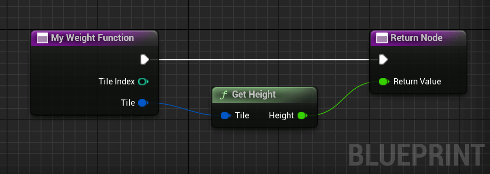
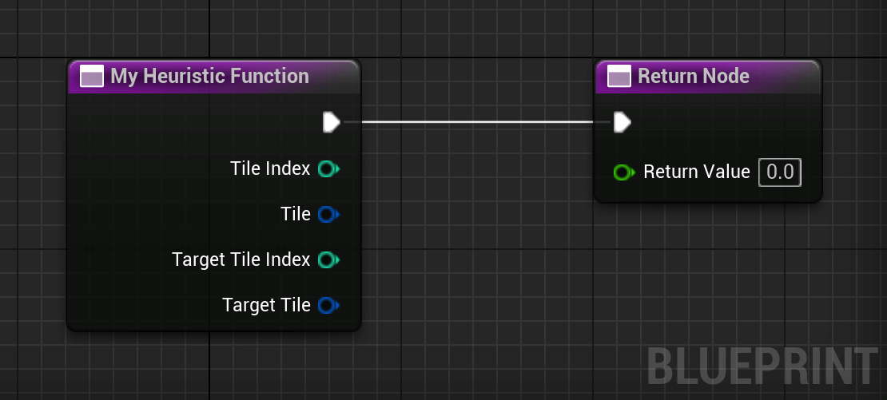
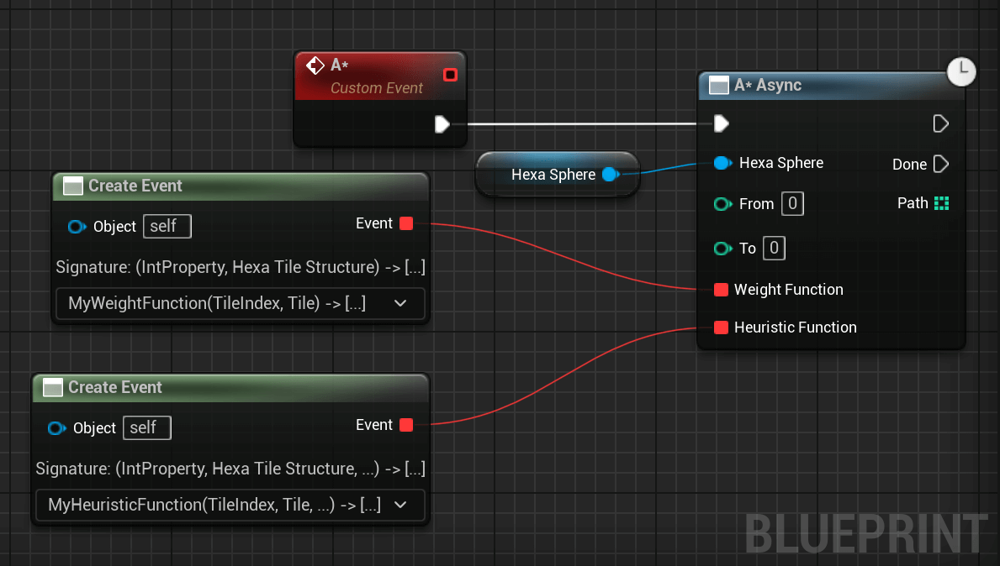
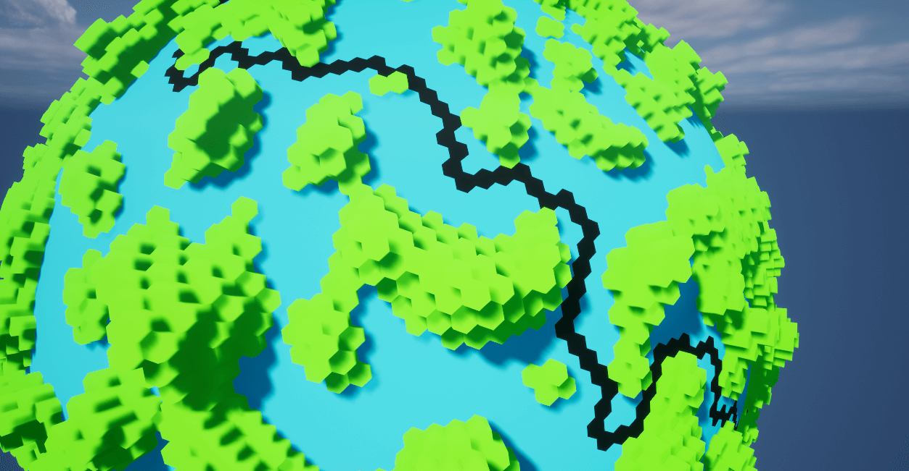

# Path Finding

This section shows how to run A* on the hexasphere.

## Creating a Weight Function
To guide the path finding algorithm, we need a weight function to express the cost of visiting a tile. A* prioritizes exploration of cheaper tiles.

The following weight function prioritizes tiles of lower height, avoiding mountains.

> You can use a constant weight function to get the shortest path. In this case, make sure to use a distance-based heuristic to speedup the algorithm.

<div class="code-switcher show-cpp-false">
<div class="switcher" >
<span class="sw-bp" onclick="switchBp()">Blueprints</span><span class="sw-cpp" onclick="switchCpp()">C++</span>
</div>
<div class="cpp">

```cpp
// C++ example code not available yet.
```

</div>
<div class="bp">
<div class="bpcode">
<textarea readonly>
Begin Object Class=/Script/BlueprintGraph.K2Node_FunctionEntry Name="K2Node_FunctionEntry_0" ExportPath="/Script/BlueprintGraph.K2Node_FunctionEntry'/Game/Test.Test:MyWeightFunction.K2Node_FunctionEntry_0'"
   ExtraFlags=201457664
   FunctionReference=(MemberName="MyWeightFunction")
   bIsEditable=True
   NodePosX=-224
   NodeGuid=7558432E4A6ACACA8608B49C1BC78302
   CustomProperties Pin (PinId=8D03F53B4CD8484474BAC0B436A92021,PinName="then",Direction="EGPD_Output",PinType.PinCategory="exec",PinType.PinSubCategory="",PinType.PinSubCategoryObject=None,PinType.PinSubCategoryMemberReference=(),PinType.PinValueType=(),PinType.ContainerType=None,PinType.bIsReference=False,PinType.bIsConst=False,PinType.bIsWeakPointer=False,PinType.bIsUObjectWrapper=False,PinType.bSerializeAsSinglePrecisionFloat=False,LinkedTo=(K2Node_FunctionResult_0 E73E5BF94466D500B23506BEF5ADA01A,),PersistentGuid=00000000000000000000000000000000,bHidden=False,bNotConnectable=False,bDefaultValueIsReadOnly=False,bDefaultValueIsIgnored=False,bAdvancedView=False,bOrphanedPin=False,)
   CustomProperties Pin (PinId=19EC29DB432F8A2747A0C9BCAC8C0DF9,PinName="TileIndex",Direction="EGPD_Output",PinType.PinCategory="int",PinType.PinSubCategory="",PinType.PinSubCategoryObject=None,PinType.PinSubCategoryMemberReference=(),PinType.PinValueType=(),PinType.ContainerType=None,PinType.bIsReference=False,PinType.bIsConst=True,PinType.bIsWeakPointer=False,PinType.bIsUObjectWrapper=False,PinType.bSerializeAsSinglePrecisionFloat=False,PersistentGuid=00000000000000000000000000000000,bHidden=False,bNotConnectable=False,bDefaultValueIsReadOnly=False,bDefaultValueIsIgnored=False,bAdvancedView=False,bOrphanedPin=False,)
   CustomProperties Pin (PinId=198017664D3885B02247F3B0A33EECFB,PinName="Tile",Direction="EGPD_Output",PinType.PinCategory="struct",PinType.PinSubCategory="",PinType.PinSubCategoryObject="/Script/CoreUObject.ScriptStruct'/Script/HexaSphereLib.HexaTile'",PinType.PinSubCategoryMemberReference=(),PinType.PinValueType=(),PinType.ContainerType=None,PinType.bIsReference=True,PinType.bIsConst=True,PinType.bIsWeakPointer=False,PinType.bIsUObjectWrapper=False,PinType.bSerializeAsSinglePrecisionFloat=False,LinkedTo=(K2Node_CallFunction_0 241AAE504DC990C66EE4548EB1704A49,),PersistentGuid=00000000000000000000000000000000,bHidden=False,bNotConnectable=False,bDefaultValueIsReadOnly=False,bDefaultValueIsIgnored=False,bAdvancedView=False,bOrphanedPin=False,)
   CustomProperties UserDefinedPin (PinName="TileIndex",PinType=(PinCategory="int",bIsConst=True),DesiredPinDirection=EGPD_Output)
   CustomProperties UserDefinedPin (PinName="Tile",PinType=(PinCategory="struct",PinSubCategoryObject="/Script/CoreUObject.ScriptStruct'/Script/HexaSphereLib.HexaTile'",bIsReference=True,bIsConst=True),DesiredPinDirection=EGPD_Output)
End Object
Begin Object Class=/Script/BlueprintGraph.K2Node_FunctionResult Name="K2Node_FunctionResult_0" ExportPath="/Script/BlueprintGraph.K2Node_FunctionResult'/Game/Test.Test:MyWeightFunction.K2Node_FunctionResult_0'"
   FunctionReference=(MemberName="MyWeightFunction")
   bIsEditable=True
   NodePosX=256
   NodeGuid=5D12342D4221CB76D5CEE28CAED807B3
   CustomProperties Pin (PinId=E73E5BF94466D500B23506BEF5ADA01A,PinName="execute",PinType.PinCategory="exec",PinType.PinSubCategory="",PinType.PinSubCategoryObject=None,PinType.PinSubCategoryMemberReference=(),PinType.PinValueType=(),PinType.ContainerType=None,PinType.bIsReference=False,PinType.bIsConst=False,PinType.bIsWeakPointer=False,PinType.bIsUObjectWrapper=False,PinType.bSerializeAsSinglePrecisionFloat=False,LinkedTo=(K2Node_FunctionEntry_0 8D03F53B4CD8484474BAC0B436A92021,),PersistentGuid=00000000000000000000000000000000,bHidden=False,bNotConnectable=False,bDefaultValueIsReadOnly=False,bDefaultValueIsIgnored=False,bAdvancedView=False,bOrphanedPin=False,)
   CustomProperties Pin (PinId=FE9ACB304B4146FE0D830E8F23468BE9,PinName="ReturnValue",PinType.PinCategory="real",PinType.PinSubCategory="float",PinType.PinSubCategoryObject=None,PinType.PinSubCategoryMemberReference=(),PinType.PinValueType=(),PinType.ContainerType=None,PinType.bIsReference=False,PinType.bIsConst=False,PinType.bIsWeakPointer=False,PinType.bIsUObjectWrapper=False,PinType.bSerializeAsSinglePrecisionFloat=False,DefaultValue="0.0",AutogeneratedDefaultValue="0.0",LinkedTo=(K2Node_CallFunction_0 884BB4BD44380A5862E692BCCA235392,),PersistentGuid=00000000000000000000000000000000,bHidden=False,bNotConnectable=False,bDefaultValueIsReadOnly=False,bDefaultValueIsIgnored=False,bAdvancedView=False,bOrphanedPin=False,)
   CustomProperties UserDefinedPin (PinName="ReturnValue",PinType=(PinCategory="real",PinSubCategory="float"),DesiredPinDirection=EGPD_Input,PinDefaultValue="0.0")
End Object
Begin Object Class=/Script/BlueprintGraph.K2Node_CallFunction Name="K2Node_CallFunction_0" ExportPath="/Script/BlueprintGraph.K2Node_CallFunction'/Game/Test.Test:MyWeightFunction.K2Node_CallFunction_0'"
   bIsPureFunc=True
   FunctionReference=(MemberParent="/Script/CoreUObject.Class'/Script/HexaSphereLib.HexaSphereBlueprintLib'",MemberName="GetHeight")
   NodePosX=32
   NodePosY=80
   NodeGuid=4E1FE10441E70B7C4636679171BA875F
   CustomProperties Pin (PinId=B702CCED407B55ED74CC22ADA34465DA,PinName="self",PinFriendlyName=NSLOCTEXT("K2Node", "Target", "Target"),PinToolTip="Target\nHexa Sphere Blueprint Lib Object Reference",PinType.PinCategory="object",PinType.PinSubCategory="",PinType.PinSubCategoryObject="/Script/CoreUObject.Class'/Script/HexaSphereLib.HexaSphereBlueprintLib'",PinType.PinSubCategoryMemberReference=(),PinType.PinValueType=(),PinType.ContainerType=None,PinType.bIsReference=False,PinType.bIsConst=False,PinType.bIsWeakPointer=False,PinType.bIsUObjectWrapper=False,PinType.bSerializeAsSinglePrecisionFloat=False,DefaultObject="/Script/HexaSphereLib.Default__HexaSphereBlueprintLib",PersistentGuid=00000000000000000000000000000000,bHidden=True,bNotConnectable=False,bDefaultValueIsReadOnly=False,bDefaultValueIsIgnored=False,bAdvancedView=False,bOrphanedPin=False,)
   CustomProperties Pin (PinId=241AAE504DC990C66EE4548EB1704A49,PinName="Tile",PinToolTip="Tile\nHexa Tile Structure (by ref)",PinType.PinCategory="struct",PinType.PinSubCategory="",PinType.PinSubCategoryObject="/Script/CoreUObject.ScriptStruct'/Script/HexaSphereLib.HexaTile'",PinType.PinSubCategoryMemberReference=(),PinType.PinValueType=(),PinType.ContainerType=None,PinType.bIsReference=True,PinType.bIsConst=True,PinType.bIsWeakPointer=False,PinType.bIsUObjectWrapper=False,PinType.bSerializeAsSinglePrecisionFloat=False,LinkedTo=(K2Node_FunctionEntry_0 198017664D3885B02247F3B0A33EECFB,),PersistentGuid=00000000000000000000000000000000,bHidden=False,bNotConnectable=False,bDefaultValueIsReadOnly=False,bDefaultValueIsIgnored=True,bAdvancedView=False,bOrphanedPin=False,)
   CustomProperties Pin (PinId=884BB4BD44380A5862E692BCCA235392,PinName="ReturnValue",PinFriendlyName=NSLOCTEXT("", "1CE332794A5B510B9C88FC865A956ED1", "Height"),PinToolTip="Height\nFloat (single-precision)\n\nThe height of the tile.",Direction="EGPD_Output",PinType.PinCategory="real",PinType.PinSubCategory="float",PinType.PinSubCategoryObject=None,PinType.PinSubCategoryMemberReference=(),PinType.PinValueType=(),PinType.ContainerType=None,PinType.bIsReference=False,PinType.bIsConst=False,PinType.bIsWeakPointer=False,PinType.bIsUObjectWrapper=False,PinType.bSerializeAsSinglePrecisionFloat=False,DefaultValue="0.0",AutogeneratedDefaultValue="0.0",LinkedTo=(K2Node_FunctionResult_0 FE9ACB304B4146FE0D830E8F23468BE9,),PersistentGuid=00000000000000000000000000000000,bHidden=False,bNotConnectable=False,bDefaultValueIsReadOnly=False,bDefaultValueIsIgnored=False,bAdvancedView=False,bOrphanedPin=False,)
End Object
</textarea>

<button onclick="copyBlueprintCode(this)">Copy Code</button>
</div>
</div>
</div>

## Creating a Heuristic Function

The heuristic function guides the search, helping the algorithm to find a good path faster. It tells an estimation of the cost from a tile to the target tile. 


!> If the weight function overestimates the cost of a tile relatively to another tile, the algorithm can return non-optimal paths.

In the following code, we use a constant heuristic function, which is the same as not using one. Doing so guarantees the path found is optimal.

<div class="code-switcher show-cpp-false">
<div class="switcher" >
<span class="sw-bp" onclick="switchBp()">Blueprints</span><span class="sw-cpp" onclick="switchCpp()">C++</span>
</div>
<div class="cpp">

```cpp
// C++ example code not available yet.
```

</div>
<div class="bp">
<div class="bpcode">
<textarea readonly>
Begin Object Class=/Script/BlueprintGraph.K2Node_FunctionEntry Name="K2Node_FunctionEntry_0" ExportPath="/Script/BlueprintGraph.K2Node_FunctionEntry'/Game/Test.Test:MyHeuristicFunction.K2Node_FunctionEntry_0'"
   ExtraFlags=201457664
   FunctionReference=(MemberName="MyHeuristicFunction")
   bIsEditable=True
   NodePosX=-96
   NodeGuid=1EEE423C4CD7AF0819407F9AD8742A3E
   CustomProperties Pin (PinId=7C99126645ED93644D0794A3FA4B0B53,PinName="then",Direction="EGPD_Output",PinType.PinCategory="exec",PinType.PinSubCategory="",PinType.PinSubCategoryObject=None,PinType.PinSubCategoryMemberReference=(),PinType.PinValueType=(),PinType.ContainerType=None,PinType.bIsReference=False,PinType.bIsConst=False,PinType.bIsWeakPointer=False,PinType.bIsUObjectWrapper=False,PinType.bSerializeAsSinglePrecisionFloat=False,LinkedTo=(K2Node_FunctionResult_0 80AD53BD42EBED2D5076B69DD0FAB55B,),PersistentGuid=00000000000000000000000000000000,bHidden=False,bNotConnectable=False,bDefaultValueIsReadOnly=False,bDefaultValueIsIgnored=False,bAdvancedView=False,bOrphanedPin=False,)
   CustomProperties Pin (PinId=759EBE90461D6978BA90499F6F2B44E7,PinName="TileIndex",Direction="EGPD_Output",PinType.PinCategory="int",PinType.PinSubCategory="",PinType.PinSubCategoryObject=None,PinType.PinSubCategoryMemberReference=(),PinType.PinValueType=(),PinType.ContainerType=None,PinType.bIsReference=False,PinType.bIsConst=True,PinType.bIsWeakPointer=False,PinType.bIsUObjectWrapper=False,PinType.bSerializeAsSinglePrecisionFloat=False,PersistentGuid=00000000000000000000000000000000,bHidden=False,bNotConnectable=False,bDefaultValueIsReadOnly=False,bDefaultValueIsIgnored=False,bAdvancedView=False,bOrphanedPin=False,)
   CustomProperties Pin (PinId=4E9C90954FD20ABDCDFC4786CD013940,PinName="Tile",Direction="EGPD_Output",PinType.PinCategory="struct",PinType.PinSubCategory="",PinType.PinSubCategoryObject="/Script/CoreUObject.ScriptStruct'/Script/HexaSphereLib.HexaTile'",PinType.PinSubCategoryMemberReference=(),PinType.PinValueType=(),PinType.ContainerType=None,PinType.bIsReference=True,PinType.bIsConst=True,PinType.bIsWeakPointer=False,PinType.bIsUObjectWrapper=False,PinType.bSerializeAsSinglePrecisionFloat=False,PersistentGuid=00000000000000000000000000000000,bHidden=False,bNotConnectable=False,bDefaultValueIsReadOnly=False,bDefaultValueIsIgnored=False,bAdvancedView=False,bOrphanedPin=False,)
   CustomProperties Pin (PinId=81C5E3924ED1722818B060B75EFCF60F,PinName="TargetTileIndex",Direction="EGPD_Output",PinType.PinCategory="int",PinType.PinSubCategory="",PinType.PinSubCategoryObject=None,PinType.PinSubCategoryMemberReference=(),PinType.PinValueType=(),PinType.ContainerType=None,PinType.bIsReference=False,PinType.bIsConst=True,PinType.bIsWeakPointer=False,PinType.bIsUObjectWrapper=False,PinType.bSerializeAsSinglePrecisionFloat=False,PersistentGuid=00000000000000000000000000000000,bHidden=False,bNotConnectable=False,bDefaultValueIsReadOnly=False,bDefaultValueIsIgnored=False,bAdvancedView=False,bOrphanedPin=False,)
   CustomProperties Pin (PinId=FFD441F84AB853B852B8148F71ABF1AF,PinName="TargetTile",Direction="EGPD_Output",PinType.PinCategory="struct",PinType.PinSubCategory="",PinType.PinSubCategoryObject="/Script/CoreUObject.ScriptStruct'/Script/HexaSphereLib.HexaTile'",PinType.PinSubCategoryMemberReference=(),PinType.PinValueType=(),PinType.ContainerType=None,PinType.bIsReference=True,PinType.bIsConst=True,PinType.bIsWeakPointer=False,PinType.bIsUObjectWrapper=False,PinType.bSerializeAsSinglePrecisionFloat=False,PersistentGuid=00000000000000000000000000000000,bHidden=False,bNotConnectable=False,bDefaultValueIsReadOnly=False,bDefaultValueIsIgnored=False,bAdvancedView=False,bOrphanedPin=False,)
   CustomProperties UserDefinedPin (PinName="TileIndex",PinType=(PinCategory="int",bIsConst=True),DesiredPinDirection=EGPD_Output)
   CustomProperties UserDefinedPin (PinName="Tile",PinType=(PinCategory="struct",PinSubCategoryObject="/Script/CoreUObject.ScriptStruct'/Script/HexaSphereLib.HexaTile'",bIsReference=True,bIsConst=True),DesiredPinDirection=EGPD_Output)
   CustomProperties UserDefinedPin (PinName="TargetTileIndex",PinType=(PinCategory="int",bIsConst=True),DesiredPinDirection=EGPD_Output)
   CustomProperties UserDefinedPin (PinName="TargetTile",PinType=(PinCategory="struct",PinSubCategoryObject="/Script/CoreUObject.ScriptStruct'/Script/HexaSphereLib.HexaTile'",bIsReference=True,bIsConst=True),DesiredPinDirection=EGPD_Output)
End Object
Begin Object Class=/Script/BlueprintGraph.K2Node_FunctionResult Name="K2Node_FunctionResult_0" ExportPath="/Script/BlueprintGraph.K2Node_FunctionResult'/Game/Test.Test:MyHeuristicFunction.K2Node_FunctionResult_0'"
   FunctionReference=(MemberName="MyHeuristicFunction")
   bIsEditable=True
   NodePosX=256
   NodeGuid=77D403FB483C3C2816CB23AA8C289A93
   CustomProperties Pin (PinId=80AD53BD42EBED2D5076B69DD0FAB55B,PinName="execute",PinType.PinCategory="exec",PinType.PinSubCategory="",PinType.PinSubCategoryObject=None,PinType.PinSubCategoryMemberReference=(),PinType.PinValueType=(),PinType.ContainerType=None,PinType.bIsReference=False,PinType.bIsConst=False,PinType.bIsWeakPointer=False,PinType.bIsUObjectWrapper=False,PinType.bSerializeAsSinglePrecisionFloat=False,LinkedTo=(K2Node_FunctionEntry_0 7C99126645ED93644D0794A3FA4B0B53,),PersistentGuid=00000000000000000000000000000000,bHidden=False,bNotConnectable=False,bDefaultValueIsReadOnly=False,bDefaultValueIsIgnored=False,bAdvancedView=False,bOrphanedPin=False,)
   CustomProperties Pin (PinId=9DBD3B7C46D37043491EB48E35C5BC87,PinName="ReturnValue",PinType.PinCategory="real",PinType.PinSubCategory="float",PinType.PinSubCategoryObject=None,PinType.PinSubCategoryMemberReference=(),PinType.PinValueType=(),PinType.ContainerType=None,PinType.bIsReference=False,PinType.bIsConst=False,PinType.bIsWeakPointer=False,PinType.bIsUObjectWrapper=False,PinType.bSerializeAsSinglePrecisionFloat=False,PersistentGuid=00000000000000000000000000000000,bHidden=False,bNotConnectable=False,bDefaultValueIsReadOnly=False,bDefaultValueIsIgnored=False,bAdvancedView=False,bOrphanedPin=False,)
   CustomProperties UserDefinedPin (PinName="ReturnValue",PinType=(PinCategory="real",PinSubCategory="float"),DesiredPinDirection=EGPD_Input)
End Object
</textarea>

<button onclick="copyBlueprintCode(this)">Copy Code</button>
</div>
</div>
</div>

## Running A*

Now that we have a weight and an heuristic function, we can run A*. A* returns the `Tile IDs` of each tile in the path in order.

<div class="code-switcher show-cpp-false">
<div class="switcher" >
<span class="sw-bp" onclick="switchBp()">Blueprints</span><span class="sw-cpp" onclick="switchCpp()">C++</span>
</div>
<div class="cpp">

```cpp
// C++ example code not available yet.
```

</div>
<div class="bp">
<div class="bpcode">
<textarea readonly>
Begin Object Class=/Script/BlueprintGraph.K2Node_AsyncAction Name="K2Node_AsyncAction_0" ExportPath="/Script/BlueprintGraph.K2Node_AsyncAction'/Game/Test.Test:EventGraph.K2Node_AsyncAction_0'"
   ProxyFactoryFunctionName="AStar"
   ProxyFactoryClass="/Script/CoreUObject.Class'/Script/HexaSphereLib.HexaSphereAStarAsyncProxy'"
   ProxyClass="/Script/CoreUObject.Class'/Script/HexaSphereLib.HexaSphereAStarAsyncProxy'"
   NodePosX=-1248
   NodePosY=-720
   NodeGuid=F4301CC244F1F47053A0ED966854548F
   CustomProperties Pin (PinId=451EE8824890DC5887B1DDA2A76D001A,PinName="execute",PinToolTip="\nExec",PinType.PinCategory="exec",PinType.PinSubCategory="",PinType.PinSubCategoryObject=None,PinType.PinSubCategoryMemberReference=(),PinType.PinValueType=(),PinType.ContainerType=None,PinType.bIsReference=False,PinType.bIsConst=False,PinType.bIsWeakPointer=False,PinType.bIsUObjectWrapper=False,PinType.bSerializeAsSinglePrecisionFloat=False,LinkedTo=(K2Node_CustomEvent_1 A5DBA60E4D90FBAA7918E39DF984042D,),PersistentGuid=00000000000000000000000000000000,bHidden=False,bNotConnectable=False,bDefaultValueIsReadOnly=False,bDefaultValueIsIgnored=False,bAdvancedView=False,bOrphanedPin=False,)
   CustomProperties Pin (PinId=CD106B884B2C52565CB9D48210969156,PinName="then",Direction="EGPD_Output",PinType.PinCategory="exec",PinType.PinSubCategory="",PinType.PinSubCategoryObject=None,PinType.PinSubCategoryMemberReference=(),PinType.PinValueType=(),PinType.ContainerType=None,PinType.bIsReference=False,PinType.bIsConst=False,PinType.bIsWeakPointer=False,PinType.bIsUObjectWrapper=False,PinType.bSerializeAsSinglePrecisionFloat=False,PersistentGuid=00000000000000000000000000000000,bHidden=False,bNotConnectable=False,bDefaultValueIsReadOnly=False,bDefaultValueIsIgnored=False,bAdvancedView=False,bOrphanedPin=False,)
   CustomProperties Pin (PinId=CE88FC984E5A5BB8B47F5C953432E041,PinName="Done",PinFriendlyName="Done",Direction="EGPD_Output",PinType.PinCategory="exec",PinType.PinSubCategory="",PinType.PinSubCategoryObject=None,PinType.PinSubCategoryMemberReference=(),PinType.PinValueType=(),PinType.ContainerType=None,PinType.bIsReference=False,PinType.bIsConst=False,PinType.bIsWeakPointer=False,PinType.bIsUObjectWrapper=False,PinType.bSerializeAsSinglePrecisionFloat=False,PersistentGuid=00000000000000000000000000000000,bHidden=False,bNotConnectable=False,bDefaultValueIsReadOnly=False,bDefaultValueIsIgnored=False,bAdvancedView=False,bOrphanedPin=False,)
   CustomProperties Pin (PinId=277C3E02477AD7EFD91184B2543E8DEA,PinName="Path",PinToolTip="Path\nArray of Integers",Direction="EGPD_Output",PinType.PinCategory="int",PinType.PinSubCategory="",PinType.PinSubCategoryObject=None,PinType.PinSubCategoryMemberReference=(),PinType.PinValueType=(),PinType.ContainerType=Array,PinType.bIsReference=True,PinType.bIsConst=True,PinType.bIsWeakPointer=False,PinType.bIsUObjectWrapper=False,PinType.bSerializeAsSinglePrecisionFloat=False,PersistentGuid=00000000000000000000000000000000,bHidden=False,bNotConnectable=False,bDefaultValueIsReadOnly=False,bDefaultValueIsIgnored=False,bAdvancedView=False,bOrphanedPin=False,)
   CustomProperties Pin (PinId=ED9552284B3882435D759F9AF326FE6E,PinName="HexaSphere",PinToolTip="Hexa Sphere\nHexa Sphere Object Reference",PinType.PinCategory="object",PinType.PinSubCategory="",PinType.PinSubCategoryObject="/Script/CoreUObject.Class'/Script/HexaSphereLib.HexaSphere'",PinType.PinSubCategoryMemberReference=(),PinType.PinValueType=(),PinType.ContainerType=None,PinType.bIsReference=False,PinType.bIsConst=False,PinType.bIsWeakPointer=False,PinType.bIsUObjectWrapper=False,PinType.bSerializeAsSinglePrecisionFloat=False,LinkedTo=(K2Node_VariableGet_3 379FB0E84294E4B84EB22F9A4B869E98,),PersistentGuid=00000000000000000000000000000000,bHidden=False,bNotConnectable=False,bDefaultValueIsReadOnly=False,bDefaultValueIsIgnored=False,bAdvancedView=False,bOrphanedPin=False,)
   CustomProperties Pin (PinId=B960C07F4B731BE3C3BB238690DBED13,PinName="From",PinToolTip="From\nInteger",PinType.PinCategory="int",PinType.PinSubCategory="",PinType.PinSubCategoryObject=None,PinType.PinSubCategoryMemberReference=(),PinType.PinValueType=(),PinType.ContainerType=None,PinType.bIsReference=False,PinType.bIsConst=True,PinType.bIsWeakPointer=False,PinType.bIsUObjectWrapper=False,PinType.bSerializeAsSinglePrecisionFloat=False,DefaultValue="0",AutogeneratedDefaultValue="0",PersistentGuid=00000000000000000000000000000000,bHidden=False,bNotConnectable=False,bDefaultValueIsReadOnly=False,bDefaultValueIsIgnored=False,bAdvancedView=False,bOrphanedPin=False,)
   CustomProperties Pin (PinId=5D5EA4124A2A27C8B1883295FE97A720,PinName="To",PinToolTip="To\nInteger",PinType.PinCategory="int",PinType.PinSubCategory="",PinType.PinSubCategoryObject=None,PinType.PinSubCategoryMemberReference=(),PinType.PinValueType=(),PinType.ContainerType=None,PinType.bIsReference=False,PinType.bIsConst=True,PinType.bIsWeakPointer=False,PinType.bIsUObjectWrapper=False,PinType.bSerializeAsSinglePrecisionFloat=False,DefaultValue="0",AutogeneratedDefaultValue="0",PersistentGuid=00000000000000000000000000000000,bHidden=False,bNotConnectable=False,bDefaultValueIsReadOnly=False,bDefaultValueIsIgnored=False,bAdvancedView=False,bOrphanedPin=False,)
   CustomProperties Pin (PinId=9305E4FD4050D229BE3EDEBE0325A8F9,PinName="WeightFunction",PinToolTip="Weight Function\nDelegate",PinType.PinCategory="delegate",PinType.PinSubCategory="",PinType.PinSubCategoryObject=None,PinType.PinSubCategoryMemberReference=(MemberParent="/Script/CoreUObject.Package'/Script/HexaSphereLib'",MemberName="TileWeightDelegate__DelegateSignature"),PinType.PinValueType=(),PinType.ContainerType=None,PinType.bIsReference=False,PinType.bIsConst=False,PinType.bIsWeakPointer=False,PinType.bIsUObjectWrapper=False,PinType.bSerializeAsSinglePrecisionFloat=False,LinkedTo=(K2Node_CreateDelegate_0 7BC7E6D84E612D663019AAAAA5D56205,),PersistentGuid=00000000000000000000000000000000,bHidden=False,bNotConnectable=False,bDefaultValueIsReadOnly=False,bDefaultValueIsIgnored=False,bAdvancedView=False,bOrphanedPin=False,)
   CustomProperties Pin (PinId=0547C2B844BB05C5B9477B93072F8962,PinName="HeuristicFunction",PinToolTip="Heuristic Function\nDelegate",PinType.PinCategory="delegate",PinType.PinSubCategory="",PinType.PinSubCategoryObject=None,PinType.PinSubCategoryMemberReference=(MemberParent="/Script/CoreUObject.Package'/Script/HexaSphereLib'",MemberName="TileHeuristicDelegate__DelegateSignature"),PinType.PinValueType=(),PinType.ContainerType=None,PinType.bIsReference=False,PinType.bIsConst=False,PinType.bIsWeakPointer=False,PinType.bIsUObjectWrapper=False,PinType.bSerializeAsSinglePrecisionFloat=False,LinkedTo=(K2Node_CreateDelegate_1 DED077F04923F2AE815979863626AAA0,),PersistentGuid=00000000000000000000000000000000,bHidden=False,bNotConnectable=False,bDefaultValueIsReadOnly=False,bDefaultValueIsIgnored=False,bAdvancedView=False,bOrphanedPin=False,)
End Object
Begin Object Class=/Script/BlueprintGraph.K2Node_CustomEvent Name="K2Node_CustomEvent_1" ExportPath="/Script/BlueprintGraph.K2Node_CustomEvent'/Game/Test.Test:EventGraph.K2Node_CustomEvent_1'"
   CustomFunctionName="A*"
   NodePosX=-1568
   NodePosY=-736
   NodeGuid=A72A02124E185BE4A1FFEEAB328381E7
   CustomProperties Pin (PinId=FFE49EBB43210ECE541BBA9E7D395AA7,PinName="OutputDelegate",Direction="EGPD_Output",PinType.PinCategory="delegate",PinType.PinSubCategory="",PinType.PinSubCategoryObject=None,PinType.PinSubCategoryMemberReference=(MemberParent="/Script/Engine.BlueprintGeneratedClass'/Game/Test.Test_C'",MemberName="A*",MemberGuid=A72A02124E185BE4A1FFEEAB328381E7),PinType.PinValueType=(),PinType.ContainerType=None,PinType.bIsReference=False,PinType.bIsConst=False,PinType.bIsWeakPointer=False,PinType.bIsUObjectWrapper=False,PinType.bSerializeAsSinglePrecisionFloat=False,PersistentGuid=00000000000000000000000000000000,bHidden=False,bNotConnectable=False,bDefaultValueIsReadOnly=False,bDefaultValueIsIgnored=False,bAdvancedView=False,bOrphanedPin=False,)
   CustomProperties Pin (PinId=A5DBA60E4D90FBAA7918E39DF984042D,PinName="then",Direction="EGPD_Output",PinType.PinCategory="exec",PinType.PinSubCategory="",PinType.PinSubCategoryObject=None,PinType.PinSubCategoryMemberReference=(),PinType.PinValueType=(),PinType.ContainerType=None,PinType.bIsReference=False,PinType.bIsConst=False,PinType.bIsWeakPointer=False,PinType.bIsUObjectWrapper=False,PinType.bSerializeAsSinglePrecisionFloat=False,LinkedTo=(K2Node_AsyncAction_0 451EE8824890DC5887B1DDA2A76D001A,),PersistentGuid=00000000000000000000000000000000,bHidden=False,bNotConnectable=False,bDefaultValueIsReadOnly=False,bDefaultValueIsIgnored=False,bAdvancedView=False,bOrphanedPin=False,)
End Object
Begin Object Class=/Script/BlueprintGraph.K2Node_CreateDelegate Name="K2Node_CreateDelegate_0" ExportPath="/Script/BlueprintGraph.K2Node_CreateDelegate'/Game/Test.Test:EventGraph.K2Node_CreateDelegate_0'"
   SelectedFunctionName="MyWeightFunction"
   SelectedFunctionGuid=A02C5A00419562423EC71392D9E59FB0
   NodePosX=-1760
   NodePosY=-640
   NodeGuid=6220BE224D1D6F2A4F13FBA75F6AB8B0
   CustomProperties Pin (PinId=FC068127448C5A4D0FAB9C835494E812,PinName="self",PinFriendlyName=NSLOCTEXT("K2Node", "CreateDelegate_ObjectInputName", "Object"),PinType.PinCategory="object",PinType.PinSubCategory="",PinType.PinSubCategoryObject="/Script/CoreUObject.Class'/Script/CoreUObject.Object'",PinType.PinSubCategoryMemberReference=(),PinType.PinValueType=(),PinType.ContainerType=None,PinType.bIsReference=False,PinType.bIsConst=False,PinType.bIsWeakPointer=False,PinType.bIsUObjectWrapper=False,PinType.bSerializeAsSinglePrecisionFloat=False,PersistentGuid=00000000000000000000000000000000,bHidden=False,bNotConnectable=False,bDefaultValueIsReadOnly=False,bDefaultValueIsIgnored=False,bAdvancedView=False,bOrphanedPin=False,)
   CustomProperties Pin (PinId=7BC7E6D84E612D663019AAAAA5D56205,PinName="OutputDelegate",PinFriendlyName=NSLOCTEXT("K2Node", "CreateDelegate_DelegateOutName", "Event"),Direction="EGPD_Output",PinType.PinCategory="delegate",PinType.PinSubCategory="",PinType.PinSubCategoryObject=None,PinType.PinSubCategoryMemberReference=(),PinType.PinValueType=(),PinType.ContainerType=None,PinType.bIsReference=False,PinType.bIsConst=False,PinType.bIsWeakPointer=False,PinType.bIsUObjectWrapper=False,PinType.bSerializeAsSinglePrecisionFloat=False,LinkedTo=(K2Node_AsyncAction_0 9305E4FD4050D229BE3EDEBE0325A8F9,),PersistentGuid=00000000000000000000000000000000,bHidden=False,bNotConnectable=False,bDefaultValueIsReadOnly=False,bDefaultValueIsIgnored=False,bAdvancedView=False,bOrphanedPin=False,)
End Object
Begin Object Class=/Script/BlueprintGraph.K2Node_CreateDelegate Name="K2Node_CreateDelegate_1" ExportPath="/Script/BlueprintGraph.K2Node_CreateDelegate'/Game/Test.Test:EventGraph.K2Node_CreateDelegate_1'"
   SelectedFunctionName="MyHeuristicFunction"
   SelectedFunctionGuid=2A4A25B74673B70EF5536B994893A3C7
   NodePosX=-1776
   NodePosY=-480
   NodeGuid=CB80FCF5465AB09DB5E1B3A4BD61CB39
   CustomProperties Pin (PinId=1FC38C88494F9B46230FF192EEC9DDD0,PinName="self",PinFriendlyName=NSLOCTEXT("K2Node", "CreateDelegate_ObjectInputName", "Object"),PinType.PinCategory="object",PinType.PinSubCategory="",PinType.PinSubCategoryObject="/Script/CoreUObject.Class'/Script/CoreUObject.Object'",PinType.PinSubCategoryMemberReference=(),PinType.PinValueType=(),PinType.ContainerType=None,PinType.bIsReference=False,PinType.bIsConst=False,PinType.bIsWeakPointer=False,PinType.bIsUObjectWrapper=False,PinType.bSerializeAsSinglePrecisionFloat=False,PersistentGuid=00000000000000000000000000000000,bHidden=False,bNotConnectable=False,bDefaultValueIsReadOnly=False,bDefaultValueIsIgnored=False,bAdvancedView=False,bOrphanedPin=False,)
   CustomProperties Pin (PinId=DED077F04923F2AE815979863626AAA0,PinName="OutputDelegate",PinFriendlyName=NSLOCTEXT("K2Node", "CreateDelegate_DelegateOutName", "Event"),Direction="EGPD_Output",PinType.PinCategory="delegate",PinType.PinSubCategory="",PinType.PinSubCategoryObject=None,PinType.PinSubCategoryMemberReference=(),PinType.PinValueType=(),PinType.ContainerType=None,PinType.bIsReference=False,PinType.bIsConst=False,PinType.bIsWeakPointer=False,PinType.bIsUObjectWrapper=False,PinType.bSerializeAsSinglePrecisionFloat=False,LinkedTo=(K2Node_AsyncAction_0 0547C2B844BB05C5B9477B93072F8962,),PersistentGuid=00000000000000000000000000000000,bHidden=False,bNotConnectable=False,bDefaultValueIsReadOnly=False,bDefaultValueIsIgnored=False,bAdvancedView=False,bOrphanedPin=False,)
End Object
Begin Object Class=/Script/BlueprintGraph.K2Node_VariableGet Name="K2Node_VariableGet_3" ExportPath="/Script/BlueprintGraph.K2Node_VariableGet'/Game/Test.Test:EventGraph.K2Node_VariableGet_3'"
   VariableReference=(MemberName="Hexa Sphere",MemberGuid=BD276986465E66A826A6F0A9045234B5,bSelfContext=True)
   NodePosX=-1424
   NodePosY=-656
   NodeGuid=5D78F73C418EDA70205A8C9F30FFFB8B
   CustomProperties Pin (PinId=379FB0E84294E4B84EB22F9A4B869E98,PinName="Hexa Sphere",Direction="EGPD_Output",PinType.PinCategory="object",PinType.PinSubCategory="",PinType.PinSubCategoryObject="/Script/CoreUObject.Class'/Script/HexaSphereLib.HexaSphere'",PinType.PinSubCategoryMemberReference=(),PinType.PinValueType=(),PinType.ContainerType=None,PinType.bIsReference=False,PinType.bIsConst=False,PinType.bIsWeakPointer=False,PinType.bIsUObjectWrapper=False,PinType.bSerializeAsSinglePrecisionFloat=False,LinkedTo=(K2Node_AsyncAction_0 ED9552284B3882435D759F9AF326FE6E,),PersistentGuid=00000000000000000000000000000000,bHidden=False,bNotConnectable=False,bDefaultValueIsReadOnly=False,bDefaultValueIsIgnored=False,bAdvancedView=False,bOrphanedPin=False,)
   CustomProperties Pin (PinId=A456AAE441A70F5B6B5FB78483271E5B,PinName="self",PinFriendlyName=NSLOCTEXT("K2Node", "Target", "Target"),PinType.PinCategory="object",PinType.PinSubCategory="",PinType.PinSubCategoryObject="/Script/Engine.BlueprintGeneratedClass'/Game/Test.Test_C'",PinType.PinSubCategoryMemberReference=(),PinType.PinValueType=(),PinType.ContainerType=None,PinType.bIsReference=False,PinType.bIsConst=False,PinType.bIsWeakPointer=False,PinType.bIsUObjectWrapper=False,PinType.bSerializeAsSinglePrecisionFloat=False,PersistentGuid=00000000000000000000000000000000,bHidden=True,bNotConnectable=False,bDefaultValueIsReadOnly=False,bDefaultValueIsIgnored=False,bAdvancedView=False,bOrphanedPin=False,)
End Object
</textarea>

<button onclick="copyBlueprintCode(this)">Copy Code</button>
</div>
</div>
</div>

## Result

Painting the tiles returned by A*, we get the result shown below, we can see the path avoiding mountains, as expected. Note that as height is `0` for several tiles, the algorithm can visit tiles for free and makes some small suboptimal turns which are still optimal weight-wise. It can be solved by adding a constant to the weight function, for example `height + 1`.


<div class="centered">



</div>


<script>
setTimeout(() => {
	bShowCPP = !JSON.parse(getCookie('bShowCPP'));
	switchCode();
}, 0);
</script>

