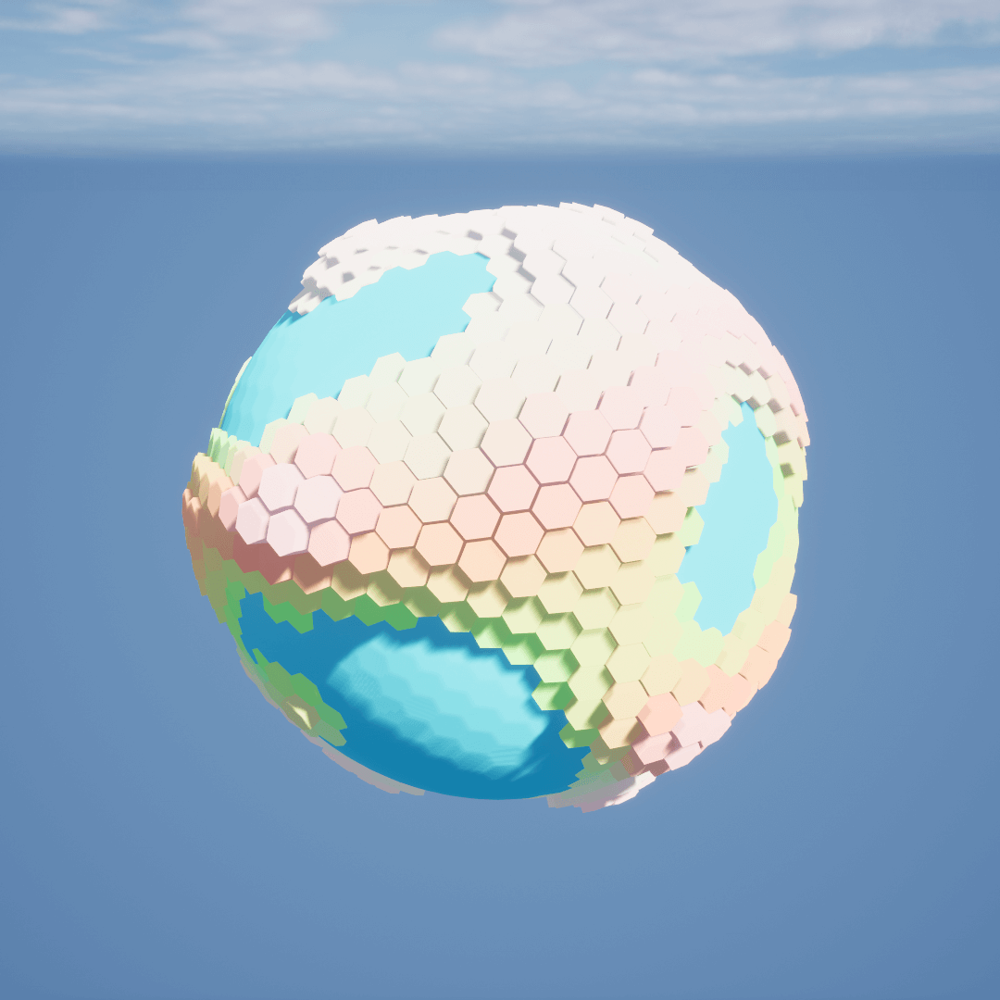
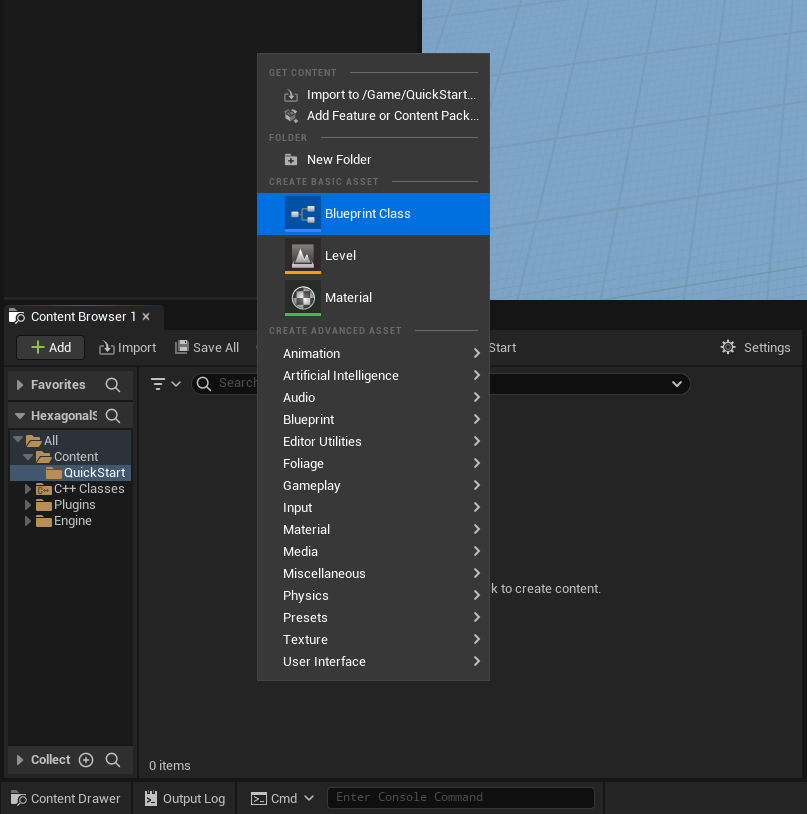
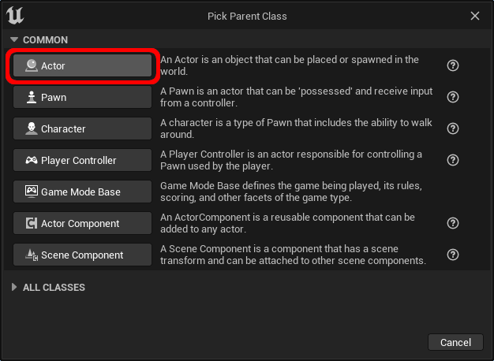
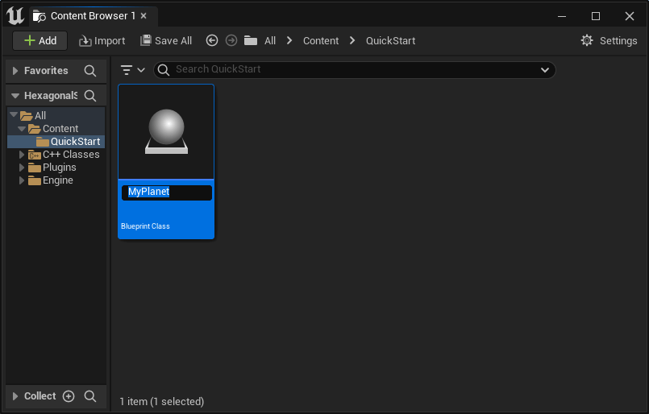
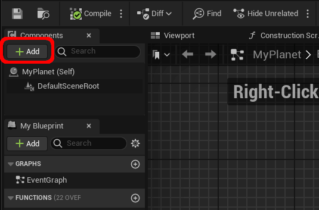
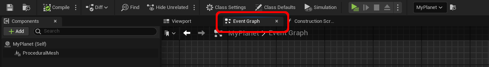
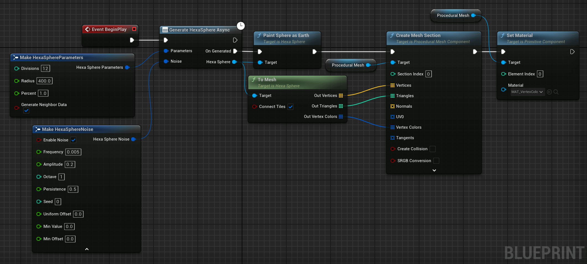

# Create a Planet - Quick Start 
This section shows how to create a simple planet-like sphere using the plugin. For more specific examples, visit the corresponding categories.

> This guide assumes no prior knowledge of the Unreal Engine Editor and uses Blueprints.

## Goal

After this tutorial, you will have the following planet in your scene.

## Tutorial

### 1. Create the Planet actor

To create and spawn a planet, we need an Actor Blueprint. Let's start by creating an actor that will be used to spawn the planet.

In the Unreal Engine Editor, right click in the content browser and select `Blueprint Class`.

In the window, select `Actor` to create the Actor Blueprint.

Finish by giving a name to the newly created actor.

### 2. Add a Procedural Mesh Component
Now that our actor is created, we need a procedural mesh component to render the planet. After opening the actor created in the previous section, add a procedural mesh component by clicking on `Add` in the component panel.

Search for `procedural` and add a `Procedural Mesh` component.

### 3. Generate the Planet Data

Go to the actor's Event Graph by clicking on the Event Graph tab.

Remove any nodes already in the graph and add the following code to the graph.

> _Tip:_ You can click on the `Copy Code` button at the bottom of the image.

<textarea readonly>
Begin Object Class=/Script/BlueprintGraph.K2Node_Event Name="K2Node_Event_4" ExportPath=/Script/BlueprintGraph.K2Node_Event'"/Game/QuickStart/MyPlanet.MyPlanet:EventGraph.K2Node_Event_4"'
   EventReference=(MemberParent=/Script/CoreUObject.Class'"/Script/Engine.Actor"',MemberName="ReceiveBeginPlay")
   bOverrideFunction=True
   NodePosX=-464
   NodePosY=-67
   NodeGuid=3DCA5E4546F4BB6E0C0559BA5A26A15A
   CustomProperties Pin (PinId=3EC2780447DC90AB79B060A1410E84C2,PinName="OutputDelegate",Direction="EGPD_Output",PinType.PinCategory="delegate",PinType.PinSubCategory="",PinType.PinSubCategoryObject=None,PinType.PinSubCategoryMemberReference=(MemberParent=/Script/CoreUObject.Class'"/Script/Engine.Actor"',MemberName="ReceiveBeginPlay"),PinType.PinValueType=(),PinType.ContainerType=None,PinType.bIsReference=False,PinType.bIsConst=False,PinType.bIsWeakPointer=False,PinType.bIsUObjectWrapper=False,PinType.bSerializeAsSinglePrecisionFloat=False,PersistentGuid=00000000000000000000000000000000,bHidden=False,bNotConnectable=False,bDefaultValueIsReadOnly=False,bDefaultValueIsIgnored=False,bAdvancedView=False,bOrphanedPin=False,)
   CustomProperties Pin (PinId=AC082DD048A0B5BFBC59F88A49640508,PinName="then",Direction="EGPD_Output",PinType.PinCategory="exec",PinType.PinSubCategory="",PinType.PinSubCategoryObject=None,PinType.PinSubCategoryMemberReference=(),PinType.PinValueType=(),PinType.ContainerType=None,PinType.bIsReference=False,PinType.bIsConst=False,PinType.bIsWeakPointer=False,PinType.bIsUObjectWrapper=False,PinType.bSerializeAsSinglePrecisionFloat=False,LinkedTo=(K2Node_AsyncAction_2 BDDDF7F045A30519E82ABBA23B34D2FF,),PersistentGuid=00000000000000000000000000000000,bHidden=False,bNotConnectable=False,bDefaultValueIsReadOnly=False,bDefaultValueIsIgnored=False,bAdvancedView=False,bOrphanedPin=False,)
End Object
Begin Object Class=/Script/BlueprintGraph.K2Node_MakeStruct Name="K2Node_MakeStruct_2" ExportPath=/Script/BlueprintGraph.K2Node_MakeStruct'"/Game/QuickStart/MyPlanet.MyPlanet:EventGraph.K2Node_MakeStruct_2"'
   bMadeAfterOverridePinRemoval=True
   ShowPinForProperties(0)=(PropertyName="Divisions",PropertyFriendlyName="Divisions",PropertyTooltip=NSLOCTEXT("", "BE415BA74B8A64B708C7FEA4BF66FB17", "The number of divisions to perform on the sphere.\nA higher number means more tiles. Greatly influences the generation time."),CategoryName="HexaSphere",bShowPin=True,bCanToggleVisibility=True)
   ShowPinForProperties(1)=(PropertyName="Radius",PropertyFriendlyName="Radius",PropertyTooltip=NSLOCTEXT("", "FD892AE24BEEA74E81A974AF96BA0C69", "The radius of the hexasphere generated."),CategoryName="HexaSphere",bShowPin=True,bCanToggleVisibility=True)
   ShowPinForProperties(2)=(PropertyName="Percent",PropertyFriendlyName="Percent",PropertyTooltip=NSLOCTEXT("", "824F4B584375D596CA3051BB57D79916", "The percentage each tile covers. Must be in [0;1]."),CategoryName="HexaSphere",bShowPin=True,bCanToggleVisibility=True)
   ShowPinForProperties(3)=(PropertyName="bGenerateNeighborData",PropertyFriendlyName="Generate Neighbor Data",PropertyTooltip=NSLOCTEXT("", "9435696743E83247C0C5DFBBE1D1191B", "If tile neighboring data should be generated."),CategoryName="HexaSphere",bShowPin=True,bCanToggleVisibility=True)
   StructType=/Script/CoreUObject.ScriptStruct'"/Script/HexaSphereLib.HexaSphereParameters"'
   NodePosX=-672
   NodePosY=16
   NodeGuid=FB2723DE42963A8567A6FB9BEDB05E57
   CustomProperties Pin (PinId=0D9FA39F4B87C909EAB788A5E899D59B,PinName="HexaSphereParameters",Direction="EGPD_Output",PinType.PinCategory="struct",PinType.PinSubCategory="",PinType.PinSubCategoryObject=/Script/CoreUObject.ScriptStruct'"/Script/HexaSphereLib.HexaSphereParameters"',PinType.PinSubCategoryMemberReference=(),PinType.PinValueType=(),PinType.ContainerType=None,PinType.bIsReference=False,PinType.bIsConst=False,PinType.bIsWeakPointer=False,PinType.bIsUObjectWrapper=False,PinType.bSerializeAsSinglePrecisionFloat=False,LinkedTo=(K2Node_AsyncAction_2 41FAC0EC45D863B08FED478230B38FFB,),PersistentGuid=00000000000000000000000000000000,bHidden=False,bNotConnectable=False,bDefaultValueIsReadOnly=False,bDefaultValueIsIgnored=False,bAdvancedView=False,bOrphanedPin=False,)
   CustomProperties Pin (PinId=58981F2441212A694BFC45BE9C94A466,PinName="Divisions",PinFriendlyName=NSLOCTEXT("", "EAAFE8C94B92B448DAA92E836A4A9B32", "Divisions"),PinToolTip="Divisions\nInteger\n\nThe number of divisions to perform on the sphere.\nA higher number means more tiles. Greatly influences the generation time.",PinType.PinCategory="int",PinType.PinSubCategory="",PinType.PinSubCategoryObject=None,PinType.PinSubCategoryMemberReference=(),PinType.PinValueType=(),PinType.ContainerType=None,PinType.bIsReference=False,PinType.bIsConst=False,PinType.bIsWeakPointer=False,PinType.bIsUObjectWrapper=False,PinType.bSerializeAsSinglePrecisionFloat=False,DefaultValue="12",AutogeneratedDefaultValue="8",PersistentGuid=00000000000000000000000000000000,bHidden=False,bNotConnectable=False,bDefaultValueIsReadOnly=False,bDefaultValueIsIgnored=False,bAdvancedView=False,bOrphanedPin=False,)
   CustomProperties Pin (PinId=4DB64118490F0D1871171F8E7C3D5787,PinName="Radius",PinFriendlyName=NSLOCTEXT("", "4BC202F142CEEAB3182112B92FABFAA7", "Radius"),PinToolTip="Radius\nFloat (single-precision)\n\nThe radius of the hexasphere generated.",PinType.PinCategory="real",PinType.PinSubCategory="float",PinType.PinSubCategoryObject=None,PinType.PinSubCategoryMemberReference=(),PinType.PinValueType=(),PinType.ContainerType=None,PinType.bIsReference=False,PinType.bIsConst=False,PinType.bIsWeakPointer=False,PinType.bIsUObjectWrapper=False,PinType.bSerializeAsSinglePrecisionFloat=False,DefaultValue="400.000000",AutogeneratedDefaultValue="10.000000",PersistentGuid=00000000000000000000000000000000,bHidden=False,bNotConnectable=False,bDefaultValueIsReadOnly=False,bDefaultValueIsIgnored=False,bAdvancedView=False,bOrphanedPin=False,)
   CustomProperties Pin (PinId=8401D49C4055CF4F55B185B66F77EB1C,PinName="Percent",PinFriendlyName=NSLOCTEXT("", "17F7F42E45401905CA9208A4029F7CA5", "Percent"),PinToolTip="Percent\nFloat (single-precision)\n\nThe percentage each tile covers. Must be in [0;1].",PinType.PinCategory="real",PinType.PinSubCategory="float",PinType.PinSubCategoryObject=None,PinType.PinSubCategoryMemberReference=(),PinType.PinValueType=(),PinType.ContainerType=None,PinType.bIsReference=False,PinType.bIsConst=False,PinType.bIsWeakPointer=False,PinType.bIsUObjectWrapper=False,PinType.bSerializeAsSinglePrecisionFloat=False,DefaultValue="1.000000",AutogeneratedDefaultValue="1.000000",PersistentGuid=00000000000000000000000000000000,bHidden=False,bNotConnectable=False,bDefaultValueIsReadOnly=False,bDefaultValueIsIgnored=False,bAdvancedView=False,bOrphanedPin=False,)
   CustomProperties Pin (PinId=25F2E67D4379810547E501A36347364A,PinName="bGenerateNeighborData",PinFriendlyName=NSLOCTEXT("", "A5C4D6EE47FA3328B824E8BDEB3DCF0F", "Generate Neighbor Data"),PinToolTip="Generate Neighbor Data\nBoolean\n\nIf tile neighboring data should be generated.",PinType.PinCategory="bool",PinType.PinSubCategory="",PinType.PinSubCategoryObject=None,PinType.PinSubCategoryMemberReference=(),PinType.PinValueType=(),PinType.ContainerType=None,PinType.bIsReference=False,PinType.bIsConst=False,PinType.bIsWeakPointer=False,PinType.bIsUObjectWrapper=False,PinType.bSerializeAsSinglePrecisionFloat=False,DefaultValue="True",AutogeneratedDefaultValue="True",PersistentGuid=00000000000000000000000000000000,bHidden=False,bNotConnectable=False,bDefaultValueIsReadOnly=False,bDefaultValueIsIgnored=False,bAdvancedView=False,bOrphanedPin=False,)
End Object
Begin Object Class=/Script/BlueprintGraph.K2Node_CallFunction Name="K2Node_CallFunction_4" ExportPath=/Script/BlueprintGraph.K2Node_CallFunction'"/Game/QuickStart/MyPlanet.MyPlanet:EventGraph.K2Node_CallFunction_4"'
   bIsPureFunc=True
   bIsConstFunc=True
   FunctionReference=(MemberParent=/Script/CoreUObject.Class'"/Script/HexaSphereLib.HexaSphere"',MemberName="ToMesh")
   NodePosX=16
   NodePosY=80
   NodeGuid=511C3542488280604378A4903C6CA865
   CustomProperties Pin (PinId=6356E7AC41564EC7245976B4D060D181,PinName="self",PinFriendlyName=NSLOCTEXT("K2Node", "Target", "Target"),PinType.PinCategory="object",PinType.PinSubCategory="",PinType.PinSubCategoryObject=/Script/CoreUObject.Class'"/Script/HexaSphereLib.HexaSphere"',PinType.PinSubCategoryMemberReference=(),PinType.PinValueType=(),PinType.ContainerType=None,PinType.bIsReference=False,PinType.bIsConst=False,PinType.bIsWeakPointer=False,PinType.bIsUObjectWrapper=False,PinType.bSerializeAsSinglePrecisionFloat=False,LinkedTo=(K2Node_AsyncAction_2 7CFCD39343BE240C59DDAFAF8D6B7FCB,),PersistentGuid=00000000000000000000000000000000,bHidden=False,bNotConnectable=False,bDefaultValueIsReadOnly=False,bDefaultValueIsIgnored=False,bAdvancedView=False,bOrphanedPin=False,)
   CustomProperties Pin (PinId=02F70F1C43678AD50DA745B4463AA881,PinName="OutVertices",Direction="EGPD_Output",PinType.PinCategory="struct",PinType.PinSubCategory="",PinType.PinSubCategoryObject=/Script/CoreUObject.ScriptStruct'"/Script/CoreUObject.Vector"',PinType.PinSubCategoryMemberReference=(),PinType.PinValueType=(),PinType.ContainerType=Array,PinType.bIsReference=False,PinType.bIsConst=False,PinType.bIsWeakPointer=False,PinType.bIsUObjectWrapper=False,PinType.bSerializeAsSinglePrecisionFloat=False,LinkedTo=(K2Node_CallFunction_5 197435F6499B369B3DBEDDA9D9A49BC6,),PersistentGuid=00000000000000000000000000000000,bHidden=False,bNotConnectable=False,bDefaultValueIsReadOnly=False,bDefaultValueIsIgnored=False,bAdvancedView=False,bOrphanedPin=False,)
   CustomProperties Pin (PinId=FEC265E140B81793B1D276BA6F091FAC,PinName="OutTriangles",Direction="EGPD_Output",PinType.PinCategory="int",PinType.PinSubCategory="",PinType.PinSubCategoryObject=None,PinType.PinSubCategoryMemberReference=(),PinType.PinValueType=(),PinType.ContainerType=Array,PinType.bIsReference=False,PinType.bIsConst=False,PinType.bIsWeakPointer=False,PinType.bIsUObjectWrapper=False,PinType.bSerializeAsSinglePrecisionFloat=False,LinkedTo=(K2Node_CallFunction_5 14E55BAD4B2E8603FB900D92145B9EF1,),PersistentGuid=00000000000000000000000000000000,bHidden=False,bNotConnectable=False,bDefaultValueIsReadOnly=False,bDefaultValueIsIgnored=False,bAdvancedView=False,bOrphanedPin=False,)
   CustomProperties Pin (PinId=1048DCE540A3FADA7772E894938482BE,PinName="OutVertexColors",Direction="EGPD_Output",PinType.PinCategory="struct",PinType.PinSubCategory="",PinType.PinSubCategoryObject=/Script/CoreUObject.ScriptStruct'"/Script/CoreUObject.LinearColor"',PinType.PinSubCategoryMemberReference=(),PinType.PinValueType=(),PinType.ContainerType=Array,PinType.bIsReference=False,PinType.bIsConst=False,PinType.bIsWeakPointer=False,PinType.bIsUObjectWrapper=False,PinType.bSerializeAsSinglePrecisionFloat=False,LinkedTo=(K2Node_CallFunction_5 A37AE94C48291269B6FBAAB83A056296,),PersistentGuid=00000000000000000000000000000000,bHidden=False,bNotConnectable=False,bDefaultValueIsReadOnly=False,bDefaultValueIsIgnored=False,bAdvancedView=False,bOrphanedPin=False,)
   CustomProperties Pin (PinId=A66A9127484BA24C8146B180E88E461C,PinName="bConnectTiles",PinType.PinCategory="bool",PinType.PinSubCategory="",PinType.PinSubCategoryObject=None,PinType.PinSubCategoryMemberReference=(),PinType.PinValueType=(),PinType.ContainerType=None,PinType.bIsReference=False,PinType.bIsConst=True,PinType.bIsWeakPointer=False,PinType.bIsUObjectWrapper=False,PinType.bSerializeAsSinglePrecisionFloat=False,DefaultValue="true",AutogeneratedDefaultValue="false",PersistentGuid=00000000000000000000000000000000,bHidden=False,bNotConnectable=False,bDefaultValueIsReadOnly=False,bDefaultValueIsIgnored=False,bAdvancedView=False,bOrphanedPin=False,)
End Object
Begin Object Class=/Script/BlueprintGraph.K2Node_CallFunction Name="K2Node_CallFunction_5" ExportPath=/Script/BlueprintGraph.K2Node_CallFunction'"/Game/QuickStart/MyPlanet.MyPlanet:EventGraph.K2Node_CallFunction_5"'
   FunctionReference=(MemberParent=/Script/CoreUObject.Class'"/Script/ProceduralMeshComponent.ProceduralMeshComponent"',MemberName="CreateMeshSection_LinearColor")
   NodePosX=416
   NodePosY=-48
   AdvancedPinDisplay=Hidden
   NodeGuid=E040308C4300403BC71C27A5D0FA53BB
   CustomProperties Pin (PinId=D0D6EE124A72551105E644A6BD17757C,PinName="execute",PinToolTip="\nExec",PinType.PinCategory="exec",PinType.PinSubCategory="",PinType.PinSubCategoryObject=None,PinType.PinSubCategoryMemberReference=(),PinType.PinValueType=(),PinType.ContainerType=None,PinType.bIsReference=False,PinType.bIsConst=False,PinType.bIsWeakPointer=False,PinType.bIsUObjectWrapper=False,PinType.bSerializeAsSinglePrecisionFloat=False,LinkedTo=(K2Node_CallFunction_6 D2FCC5244057EA1FEE5C1F9C0B677F3E,),PersistentGuid=00000000000000000000000000000000,bHidden=False,bNotConnectable=False,bDefaultValueIsReadOnly=False,bDefaultValueIsIgnored=False,bAdvancedView=False,bOrphanedPin=False,)
   CustomProperties Pin (PinId=CA620DC5487EEF1C8EB6858BC55CF758,PinName="then",PinToolTip="\nExec",Direction="EGPD_Output",PinType.PinCategory="exec",PinType.PinSubCategory="",PinType.PinSubCategoryObject=None,PinType.PinSubCategoryMemberReference=(),PinType.PinValueType=(),PinType.ContainerType=None,PinType.bIsReference=False,PinType.bIsConst=False,PinType.bIsWeakPointer=False,PinType.bIsUObjectWrapper=False,PinType.bSerializeAsSinglePrecisionFloat=False,LinkedTo=(K2Node_CallFunction_0 2E3D912A41FB2690A2307C99B1E3A110,),PersistentGuid=00000000000000000000000000000000,bHidden=False,bNotConnectable=False,bDefaultValueIsReadOnly=False,bDefaultValueIsIgnored=False,bAdvancedView=False,bOrphanedPin=False,)
   CustomProperties Pin (PinId=529EA20A49BFC57451433B9EB7E2731C,PinName="self",PinFriendlyName=NSLOCTEXT("K2Node", "Target", "Target"),PinToolTip="Target\nProcedural Mesh Component Object Reference",PinType.PinCategory="object",PinType.PinSubCategory="",PinType.PinSubCategoryObject=/Script/CoreUObject.Class'"/Script/ProceduralMeshComponent.ProceduralMeshComponent"',PinType.PinSubCategoryMemberReference=(),PinType.PinValueType=(),PinType.ContainerType=None,PinType.bIsReference=False,PinType.bIsConst=False,PinType.bIsWeakPointer=False,PinType.bIsUObjectWrapper=False,PinType.bSerializeAsSinglePrecisionFloat=False,LinkedTo=(K2Node_VariableGet_0 EC551AEA46E2A02D347E14B6C57407F0,),PersistentGuid=00000000000000000000000000000000,bHidden=False,bNotConnectable=False,bDefaultValueIsReadOnly=False,bDefaultValueIsIgnored=False,bAdvancedView=False,bOrphanedPin=False,)
   CustomProperties Pin (PinId=0CBE498D476BF68284048F8FBCB5198E,PinName="SectionIndex",PinToolTip="Section Index\nInteger\n\nIndex of the section to create or replace.",PinType.PinCategory="int",PinType.PinSubCategory="",PinType.PinSubCategoryObject=None,PinType.PinSubCategoryMemberReference=(),PinType.PinValueType=(),PinType.ContainerType=None,PinType.bIsReference=False,PinType.bIsConst=False,PinType.bIsWeakPointer=False,PinType.bIsUObjectWrapper=False,PinType.bSerializeAsSinglePrecisionFloat=False,DefaultValue="0",AutogeneratedDefaultValue="0",PersistentGuid=00000000000000000000000000000000,bHidden=False,bNotConnectable=False,bDefaultValueIsReadOnly=False,bDefaultValueIsIgnored=False,bAdvancedView=False,bOrphanedPin=False,)
   CustomProperties Pin (PinId=197435F6499B369B3DBEDDA9D9A49BC6,PinName="Vertices",PinToolTip="Vertices\nArray of Vectors\n\nVertex buffer of all vertex positions to use for this mesh section.",PinType.PinCategory="struct",PinType.PinSubCategory="",PinType.PinSubCategoryObject=/Script/CoreUObject.ScriptStruct'"/Script/CoreUObject.Vector"',PinType.PinSubCategoryMemberReference=(),PinType.PinValueType=(),PinType.ContainerType=Array,PinType.bIsReference=True,PinType.bIsConst=True,PinType.bIsWeakPointer=False,PinType.bIsUObjectWrapper=False,PinType.bSerializeAsSinglePrecisionFloat=False,LinkedTo=(K2Node_CallFunction_4 02F70F1C43678AD50DA745B4463AA881,),PersistentGuid=00000000000000000000000000000000,bHidden=False,bNotConnectable=False,bDefaultValueIsReadOnly=False,bDefaultValueIsIgnored=True,bAdvancedView=False,bOrphanedPin=False,)
   CustomProperties Pin (PinId=14E55BAD4B2E8603FB900D92145B9EF1,PinName="Triangles",PinToolTip="Triangles\nArray of Integers\n\nIndex buffer indicating which vertices make up each triangle. Length must be a multiple of 3.",PinType.PinCategory="int",PinType.PinSubCategory="",PinType.PinSubCategoryObject=None,PinType.PinSubCategoryMemberReference=(),PinType.PinValueType=(),PinType.ContainerType=Array,PinType.bIsReference=True,PinType.bIsConst=True,PinType.bIsWeakPointer=False,PinType.bIsUObjectWrapper=False,PinType.bSerializeAsSinglePrecisionFloat=False,LinkedTo=(K2Node_CallFunction_4 FEC265E140B81793B1D276BA6F091FAC,),PersistentGuid=00000000000000000000000000000000,bHidden=False,bNotConnectable=False,bDefaultValueIsReadOnly=False,bDefaultValueIsIgnored=True,bAdvancedView=False,bOrphanedPin=False,)
   CustomProperties Pin (PinId=86C78FAF46E755C7062B56BB2266B4F4,PinName="Normals",PinToolTip="Normals\nArray of Vectors\n\nOptional array of normal vectors for each vertex. If supplied, must be same length as Vertices array.",PinType.PinCategory="struct",PinType.PinSubCategory="",PinType.PinSubCategoryObject=/Script/CoreUObject.ScriptStruct'"/Script/CoreUObject.Vector"',PinType.PinSubCategoryMemberReference=(),PinType.PinValueType=(),PinType.ContainerType=Array,PinType.bIsReference=True,PinType.bIsConst=True,PinType.bIsWeakPointer=False,PinType.bIsUObjectWrapper=False,PinType.bSerializeAsSinglePrecisionFloat=False,PersistentGuid=00000000000000000000000000000000,bHidden=False,bNotConnectable=False,bDefaultValueIsReadOnly=False,bDefaultValueIsIgnored=True,bAdvancedView=False,bOrphanedPin=False,)
   CustomProperties Pin (PinId=056F9B094677C7A8C4BB5CAC4C93C346,PinName="UV0",PinToolTip="UV0\nArray of Vector 2D Structures\n\nOptional array of texture co-ordinates for each vertex. If supplied, must be same length as Vertices array.",PinType.PinCategory="struct",PinType.PinSubCategory="",PinType.PinSubCategoryObject=/Script/CoreUObject.ScriptStruct'"/Script/CoreUObject.Vector2D"',PinType.PinSubCategoryMemberReference=(),PinType.PinValueType=(),PinType.ContainerType=Array,PinType.bIsReference=True,PinType.bIsConst=True,PinType.bIsWeakPointer=False,PinType.bIsUObjectWrapper=False,PinType.bSerializeAsSinglePrecisionFloat=False,PersistentGuid=00000000000000000000000000000000,bHidden=False,bNotConnectable=False,bDefaultValueIsReadOnly=False,bDefaultValueIsIgnored=True,bAdvancedView=False,bOrphanedPin=False,)
   CustomProperties Pin (PinId=EE8C1EC0465B793397CBDF858576AF7D,PinName="UV1",PinToolTip="UV1\nArray of Vector 2D Structures",PinType.PinCategory="struct",PinType.PinSubCategory="",PinType.PinSubCategoryObject=/Script/CoreUObject.ScriptStruct'"/Script/CoreUObject.Vector2D"',PinType.PinSubCategoryMemberReference=(),PinType.PinValueType=(),PinType.ContainerType=Array,PinType.bIsReference=True,PinType.bIsConst=True,PinType.bIsWeakPointer=False,PinType.bIsUObjectWrapper=False,PinType.bSerializeAsSinglePrecisionFloat=False,PersistentGuid=00000000000000000000000000000000,bHidden=False,bNotConnectable=False,bDefaultValueIsReadOnly=False,bDefaultValueIsIgnored=True,bAdvancedView=True,bOrphanedPin=False,)
   CustomProperties Pin (PinId=88589FAC49A67BB3AE2B689285E7277E,PinName="UV2",PinToolTip="UV2\nArray of Vector 2D Structures",PinType.PinCategory="struct",PinType.PinSubCategory="",PinType.PinSubCategoryObject=/Script/CoreUObject.ScriptStruct'"/Script/CoreUObject.Vector2D"',PinType.PinSubCategoryMemberReference=(),PinType.PinValueType=(),PinType.ContainerType=Array,PinType.bIsReference=True,PinType.bIsConst=True,PinType.bIsWeakPointer=False,PinType.bIsUObjectWrapper=False,PinType.bSerializeAsSinglePrecisionFloat=False,PersistentGuid=00000000000000000000000000000000,bHidden=False,bNotConnectable=False,bDefaultValueIsReadOnly=False,bDefaultValueIsIgnored=True,bAdvancedView=True,bOrphanedPin=False,)
   CustomProperties Pin (PinId=E16D19F746700F8F845C1197CBF3BA54,PinName="UV3",PinToolTip="UV3\nArray of Vector 2D Structures",PinType.PinCategory="struct",PinType.PinSubCategory="",PinType.PinSubCategoryObject=/Script/CoreUObject.ScriptStruct'"/Script/CoreUObject.Vector2D"',PinType.PinSubCategoryMemberReference=(),PinType.PinValueType=(),PinType.ContainerType=Array,PinType.bIsReference=True,PinType.bIsConst=True,PinType.bIsWeakPointer=False,PinType.bIsUObjectWrapper=False,PinType.bSerializeAsSinglePrecisionFloat=False,PersistentGuid=00000000000000000000000000000000,bHidden=False,bNotConnectable=False,bDefaultValueIsReadOnly=False,bDefaultValueIsIgnored=True,bAdvancedView=True,bOrphanedPin=False,)
   CustomProperties Pin (PinId=A37AE94C48291269B6FBAAB83A056296,PinName="VertexColors",PinToolTip="Vertex Colors\nArray of Linear Color Structures\n\nOptional array of colors for each vertex. If supplied, must be same length as Vertices array.",PinType.PinCategory="struct",PinType.PinSubCategory="",PinType.PinSubCategoryObject=/Script/CoreUObject.ScriptStruct'"/Script/CoreUObject.LinearColor"',PinType.PinSubCategoryMemberReference=(),PinType.PinValueType=(),PinType.ContainerType=Array,PinType.bIsReference=True,PinType.bIsConst=True,PinType.bIsWeakPointer=False,PinType.bIsUObjectWrapper=False,PinType.bSerializeAsSinglePrecisionFloat=False,LinkedTo=(K2Node_CallFunction_4 1048DCE540A3FADA7772E894938482BE,),PersistentGuid=00000000000000000000000000000000,bHidden=False,bNotConnectable=False,bDefaultValueIsReadOnly=False,bDefaultValueIsIgnored=True,bAdvancedView=False,bOrphanedPin=False,)
   CustomProperties Pin (PinId=3CE2DF3C4452C3B5C964368BBF6E5B01,PinName="Tangents",PinToolTip="Tangents\nArray of Proc Mesh Tangent Structures\n\nOptional array of tangent vector for each vertex. If supplied, must be same length as Vertices array.",PinType.PinCategory="struct",PinType.PinSubCategory="",PinType.PinSubCategoryObject=/Script/CoreUObject.ScriptStruct'"/Script/ProceduralMeshComponent.ProcMeshTangent"',PinType.PinSubCategoryMemberReference=(),PinType.PinValueType=(),PinType.ContainerType=Array,PinType.bIsReference=True,PinType.bIsConst=True,PinType.bIsWeakPointer=False,PinType.bIsUObjectWrapper=False,PinType.bSerializeAsSinglePrecisionFloat=False,PersistentGuid=00000000000000000000000000000000,bHidden=False,bNotConnectable=False,bDefaultValueIsReadOnly=False,bDefaultValueIsIgnored=True,bAdvancedView=False,bOrphanedPin=False,)
   CustomProperties Pin (PinId=20023B2F48665383E1AAB3B82E45DA8B,PinName="bCreateCollision",PinToolTip="Create Collision\nBoolean\n\nIndicates whether collision should be created for this section. This adds significant cost.",PinType.PinCategory="bool",PinType.PinSubCategory="",PinType.PinSubCategoryObject=None,PinType.PinSubCategoryMemberReference=(),PinType.PinValueType=(),PinType.ContainerType=None,PinType.bIsReference=False,PinType.bIsConst=False,PinType.bIsWeakPointer=False,PinType.bIsUObjectWrapper=False,PinType.bSerializeAsSinglePrecisionFloat=False,DefaultValue="false",AutogeneratedDefaultValue="false",PersistentGuid=00000000000000000000000000000000,bHidden=False,bNotConnectable=False,bDefaultValueIsReadOnly=False,bDefaultValueIsIgnored=False,bAdvancedView=False,bOrphanedPin=False,)
   CustomProperties Pin (PinId=9FB48E4A4FCC4D712FD9429E7F1DC976,PinName="bSRGBConversion",PinFriendlyName=NSLOCTEXT("", "4E29D5DE4A1FF22022FE52872953C1DD", "SRGB Conversion"),PinToolTip="SRGB Conversion\nBoolean\n\nWhether to do sRGB conversion when converting FLinearColor to FColor",PinType.PinCategory="bool",PinType.PinSubCategory="",PinType.PinSubCategoryObject=None,PinType.PinSubCategoryMemberReference=(),PinType.PinValueType=(),PinType.ContainerType=None,PinType.bIsReference=False,PinType.bIsConst=False,PinType.bIsWeakPointer=False,PinType.bIsUObjectWrapper=False,PinType.bSerializeAsSinglePrecisionFloat=False,DefaultValue="false",AutogeneratedDefaultValue="false",PersistentGuid=00000000000000000000000000000000,bHidden=False,bNotConnectable=False,bDefaultValueIsReadOnly=False,bDefaultValueIsIgnored=False,bAdvancedView=False,bOrphanedPin=False,)
End Object
Begin Object Class=/Script/BlueprintGraph.K2Node_VariableGet Name="K2Node_VariableGet_0" ExportPath=/Script/BlueprintGraph.K2Node_VariableGet'"/Game/QuickStart/MyPlanet.MyPlanet:EventGraph.K2Node_VariableGet_0"'
   VariableReference=(MemberName="ProceduralMesh",bSelfContext=True)
   NodePosX=240
   NodePosY=32
   NodeGuid=B3A95A0349B4EF301CA9B5961240C144
   CustomProperties Pin (PinId=EC551AEA46E2A02D347E14B6C57407F0,PinName="ProceduralMesh",Direction="EGPD_Output",PinType.PinCategory="object",PinType.PinSubCategory="",PinType.PinSubCategoryObject=/Script/CoreUObject.Class'"/Script/ProceduralMeshComponent.ProceduralMeshComponent"',PinType.PinSubCategoryMemberReference=(),PinType.PinValueType=(),PinType.ContainerType=None,PinType.bIsReference=False,PinType.bIsConst=False,PinType.bIsWeakPointer=False,PinType.bIsUObjectWrapper=False,PinType.bSerializeAsSinglePrecisionFloat=False,LinkedTo=(K2Node_CallFunction_5 529EA20A49BFC57451433B9EB7E2731C,),PersistentGuid=00000000000000000000000000000000,bHidden=False,bNotConnectable=False,bDefaultValueIsReadOnly=False,bDefaultValueIsIgnored=False,bAdvancedView=False,bOrphanedPin=False,)
   CustomProperties Pin (PinId=4C3E32FB48FC55DBE194559EFA1A656F,PinName="self",PinFriendlyName=NSLOCTEXT("K2Node", "Target", "Target"),PinType.PinCategory="object",PinType.PinSubCategory="",PinType.PinSubCategoryObject=/Script/Engine.BlueprintGeneratedClass'"/Game/QuickStart/MyPlanet.MyPlanet_C"',PinType.PinSubCategoryMemberReference=(),PinType.PinValueType=(),PinType.ContainerType=None,PinType.bIsReference=False,PinType.bIsConst=False,PinType.bIsWeakPointer=False,PinType.bIsUObjectWrapper=False,PinType.bSerializeAsSinglePrecisionFloat=False,PersistentGuid=00000000000000000000000000000000,bHidden=True,bNotConnectable=False,bDefaultValueIsReadOnly=False,bDefaultValueIsIgnored=False,bAdvancedView=False,bOrphanedPin=False,)
End Object
Begin Object Class=/Script/BlueprintGraph.K2Node_AsyncAction Name="K2Node_AsyncAction_2" ExportPath=/Script/BlueprintGraph.K2Node_AsyncAction'"/Game/QuickStart/MyPlanet.MyPlanet:EventGraph.K2Node_AsyncAction_2"'
   ProxyFactoryFunctionName="GenerateHexaSphereAsync"
   ProxyFactoryClass=/Script/CoreUObject.Class'"/Script/HexaSphereLib.GenerateHexaSphereProxy"'
   ProxyClass=/Script/CoreUObject.Class'"/Script/HexaSphereLib.GenerateHexaSphereProxy"'
   NodePosX=-240
   NodePosY=-64
   NodeGuid=17A0C8644C50FF25EFB053ADC3D930C8
   CustomProperties Pin (PinId=BDDDF7F045A30519E82ABBA23B34D2FF,PinName="execute",PinType.PinCategory="exec",PinType.PinSubCategory="",PinType.PinSubCategoryObject=None,PinType.PinSubCategoryMemberReference=(),PinType.PinValueType=(),PinType.ContainerType=None,PinType.bIsReference=False,PinType.bIsConst=False,PinType.bIsWeakPointer=False,PinType.bIsUObjectWrapper=False,PinType.bSerializeAsSinglePrecisionFloat=False,LinkedTo=(K2Node_Event_4 AC082DD048A0B5BFBC59F88A49640508,),PersistentGuid=00000000000000000000000000000000,bHidden=False,bNotConnectable=False,bDefaultValueIsReadOnly=False,bDefaultValueIsIgnored=False,bAdvancedView=False,bOrphanedPin=False,)
   CustomProperties Pin (PinId=4528BFD249DEE5839FBBEF89E6713B18,PinName="then",Direction="EGPD_Output",PinType.PinCategory="exec",PinType.PinSubCategory="",PinType.PinSubCategoryObject=None,PinType.PinSubCategoryMemberReference=(),PinType.PinValueType=(),PinType.ContainerType=None,PinType.bIsReference=False,PinType.bIsConst=False,PinType.bIsWeakPointer=False,PinType.bIsUObjectWrapper=False,PinType.bSerializeAsSinglePrecisionFloat=False,PersistentGuid=00000000000000000000000000000000,bHidden=False,bNotConnectable=False,bDefaultValueIsReadOnly=False,bDefaultValueIsIgnored=False,bAdvancedView=False,bOrphanedPin=False,)
   CustomProperties Pin (PinId=3E095CFD4D9106C94D2A21B5649FA456,PinName="OnGenerated",PinFriendlyName=NSLOCTEXT("", "4D379D024F0286AB095924AE8A935321", "On Generated"),Direction="EGPD_Output",PinType.PinCategory="exec",PinType.PinSubCategory="",PinType.PinSubCategoryObject=None,PinType.PinSubCategoryMemberReference=(),PinType.PinValueType=(),PinType.ContainerType=None,PinType.bIsReference=False,PinType.bIsConst=False,PinType.bIsWeakPointer=False,PinType.bIsUObjectWrapper=False,PinType.bSerializeAsSinglePrecisionFloat=False,LinkedTo=(K2Node_CallFunction_6 7B5AD19645D10833656FDB9745ADABD5,),PersistentGuid=00000000000000000000000000000000,bHidden=False,bNotConnectable=False,bDefaultValueIsReadOnly=False,bDefaultValueIsIgnored=False,bAdvancedView=False,bOrphanedPin=False,)
   CustomProperties Pin (PinId=7CFCD39343BE240C59DDAFAF8D6B7FCB,PinName="HexaSphere",PinToolTip="Hexa Sphere\nHexa Sphere Object Reference",Direction="EGPD_Output",PinType.PinCategory="object",PinType.PinSubCategory="",PinType.PinSubCategoryObject=/Script/CoreUObject.Class'"/Script/HexaSphereLib.HexaSphere"',PinType.PinSubCategoryMemberReference=(),PinType.PinValueType=(),PinType.ContainerType=None,PinType.bIsReference=False,PinType.bIsConst=False,PinType.bIsWeakPointer=False,PinType.bIsUObjectWrapper=False,PinType.bSerializeAsSinglePrecisionFloat=False,LinkedTo=(K2Node_CallFunction_4 6356E7AC41564EC7245976B4D060D181,K2Node_CallFunction_6 CA89C1A546D2B92AD895C8A8BB59589A,),PersistentGuid=00000000000000000000000000000000,bHidden=False,bNotConnectable=False,bDefaultValueIsReadOnly=False,bDefaultValueIsIgnored=False,bAdvancedView=False,bOrphanedPin=False,)
   CustomProperties Pin (PinId=41FAC0EC45D863B08FED478230B38FFB,PinName="Parameters",PinType.PinCategory="struct",PinType.PinSubCategory="",PinType.PinSubCategoryObject=/Script/CoreUObject.ScriptStruct'"/Script/HexaSphereLib.HexaSphereParameters"',PinType.PinSubCategoryMemberReference=(),PinType.PinValueType=(),PinType.ContainerType=None,PinType.bIsReference=False,PinType.bIsConst=False,PinType.bIsWeakPointer=False,PinType.bIsUObjectWrapper=False,PinType.bSerializeAsSinglePrecisionFloat=False,LinkedTo=(K2Node_MakeStruct_2 0D9FA39F4B87C909EAB788A5E899D59B,),PersistentGuid=00000000000000000000000000000000,bHidden=False,bNotConnectable=False,bDefaultValueIsReadOnly=False,bDefaultValueIsIgnored=False,bAdvancedView=False,bOrphanedPin=False,)
   CustomProperties Pin (PinId=38301DF241D2EE85B717A9A75DB08926,PinName="Noise",PinType.PinCategory="struct",PinType.PinSubCategory="",PinType.PinSubCategoryObject=/Script/CoreUObject.ScriptStruct'"/Script/HexaSphereLib.HexaSphereNoise"',PinType.PinSubCategoryMemberReference=(),PinType.PinValueType=(),PinType.ContainerType=None,PinType.bIsReference=False,PinType.bIsConst=False,PinType.bIsWeakPointer=False,PinType.bIsUObjectWrapper=False,PinType.bSerializeAsSinglePrecisionFloat=False,LinkedTo=(K2Node_MakeStruct_3 DBC69BFA4597D24BD243D78BA37A42A2,),PersistentGuid=00000000000000000000000000000000,bHidden=False,bNotConnectable=False,bDefaultValueIsReadOnly=False,bDefaultValueIsIgnored=False,bAdvancedView=False,bOrphanedPin=False,)
End Object
Begin Object Class=/Script/BlueprintGraph.K2Node_MakeStruct Name="K2Node_MakeStruct_3" ExportPath=/Script/BlueprintGraph.K2Node_MakeStruct'"/Game/QuickStart/MyPlanet.MyPlanet:EventGraph.K2Node_MakeStruct_3"'
   bMadeAfterOverridePinRemoval=True
   ShowPinForProperties(0)=(PropertyName="bEnableNoise",PropertyFriendlyName="Enable Noise",PropertyTooltip=NSLOCTEXT("", "B0055CE44BA2BE4AFCCDD28399AC8CE7", "If the noise is enabled."),CategoryName="HexaSphere",bShowPin=True,bCanToggleVisibility=True)
   ShowPinForProperties(1)=(PropertyName="Frequency",PropertyFriendlyName="Frequency",PropertyTooltip=NSLOCTEXT("", "34F3D0434F871D2089377698103C309C", "The frequency (speed) of the noise."),CategoryName="HexaSphere",bShowPin=True,bCanToggleVisibility=True)
   ShowPinForProperties(2)=(PropertyName="Amplitude",PropertyFriendlyName="Amplitude",PropertyTooltip=NSLOCTEXT("", "FE25741D4C5C01660A00FA966499209C", "The amplitude of the noise.\nThe resulting noise is in [-Amplitude, Amplitude]."),CategoryName="HexaSphere",bShowPin=True,bCanToggleVisibility=True)
   ShowPinForProperties(3)=(PropertyName="Octave",PropertyFriendlyName="Octave",PropertyTooltip=NSLOCTEXT("", "89EA76AC492A3A647415DB9BA480DF63", "The number of octaves to apply to the noise.\nIf <= 0, there is no noise."),CategoryName="HexaSphere",bShowPin=True,bCanToggleVisibility=True)
   ShowPinForProperties(4)=(PropertyName="Persistence",PropertyFriendlyName="Persistence",PropertyTooltip=NSLOCTEXT("", "B70DAEEA42EE204CD8426099E717764F", "The persistence of the noise across octaves."),CategoryName="HexaSphere",bShowPin=True,bCanToggleVisibility=True)
   ShowPinForProperties(5)=(PropertyName="Seed",PropertyFriendlyName="Seed",PropertyTooltip=NSLOCTEXT("", "E33A652A4BD7143EE85E159208D06EEE", "The seed for the noise. Used as an offset added in XYZ."),CategoryName="HexaSphere",bShowPin=True,bCanToggleVisibility=True)
   ShowPinForProperties(6)=(PropertyName="UniformOffset",PropertyFriendlyName="Uniform Offset",PropertyTooltip=NSLOCTEXT("", "C491EED34F1A2491242FF0B42F209193", "Abrbitrary offset applied to all tiles in percent."),CategoryName="HexaSphere",bShowPin=True,bCanToggleVisibility=True)
   ShowPinForProperties(7)=(PropertyName="MinValue",PropertyFriendlyName="Min Value",PropertyTooltip=NSLOCTEXT("", "46D6C2CE4540EB83A755DAB7BAD32541", "The minimal value of the noise. Noise is clamped to this value.\nCan be used to imitate water."),CategoryName="HexaSphere",bShowPin=True,bCanToggleVisibility=True)
   ShowPinForProperties(8)=(PropertyName="MinOffset",PropertyFriendlyName="Min Offset",PropertyTooltip=NSLOCTEXT("", "89281955405DA33185A9E9B9E213B890", "The minimal offset for the noise. Applied to a tile if it its noise\nvalue is greater than MinValue."),CategoryName="HexaSphere",bShowPin=True,bCanToggleVisibility=True)
   StructType=/Script/CoreUObject.ScriptStruct'"/Script/HexaSphereLib.HexaSphereNoise"'
   NodePosX=-608
   NodePosY=224
   AdvancedPinDisplay=Shown
   NodeGuid=02F977FA481678EC87A766BFFA835CDE
   CustomProperties Pin (PinId=DBC69BFA4597D24BD243D78BA37A42A2,PinName="HexaSphereNoise",Direction="EGPD_Output",PinType.PinCategory="struct",PinType.PinSubCategory="",PinType.PinSubCategoryObject=/Script/CoreUObject.ScriptStruct'"/Script/HexaSphereLib.HexaSphereNoise"',PinType.PinSubCategoryMemberReference=(),PinType.PinValueType=(),PinType.ContainerType=None,PinType.bIsReference=False,PinType.bIsConst=False,PinType.bIsWeakPointer=False,PinType.bIsUObjectWrapper=False,PinType.bSerializeAsSinglePrecisionFloat=False,LinkedTo=(K2Node_AsyncAction_2 38301DF241D2EE85B717A9A75DB08926,),PersistentGuid=00000000000000000000000000000000,bHidden=False,bNotConnectable=False,bDefaultValueIsReadOnly=False,bDefaultValueIsIgnored=False,bAdvancedView=False,bOrphanedPin=False,)
   CustomProperties Pin (PinId=E515AB22448887F64330119B678FE61B,PinName="bEnableNoise",PinFriendlyName=NSLOCTEXT("", "7FE88F0E48FB3CB74AA86398E79EA159", "Enable Noise"),PinToolTip="Enable Noise\nBoolean\n\nIf the noise is enabled.",PinType.PinCategory="bool",PinType.PinSubCategory="",PinType.PinSubCategoryObject=None,PinType.PinSubCategoryMemberReference=(),PinType.PinValueType=(),PinType.ContainerType=None,PinType.bIsReference=False,PinType.bIsConst=False,PinType.bIsWeakPointer=False,PinType.bIsUObjectWrapper=False,PinType.bSerializeAsSinglePrecisionFloat=False,DefaultValue="true",AutogeneratedDefaultValue="False",PersistentGuid=00000000000000000000000000000000,bHidden=False,bNotConnectable=False,bDefaultValueIsReadOnly=False,bDefaultValueIsIgnored=False,bAdvancedView=False,bOrphanedPin=False,)
   CustomProperties Pin (PinId=1A44015E44BC8F91CDA95780BDF19253,PinName="Frequency",PinFriendlyName=NSLOCTEXT("", "70E1E5574AF78583629966850BB8C072", "Frequency"),PinToolTip="Frequency\nFloat (single-precision)\n\nThe frequency (speed) of the noise.",PinType.PinCategory="real",PinType.PinSubCategory="float",PinType.PinSubCategoryObject=None,PinType.PinSubCategoryMemberReference=(),PinType.PinValueType=(),PinType.ContainerType=None,PinType.bIsReference=False,PinType.bIsConst=False,PinType.bIsWeakPointer=False,PinType.bIsUObjectWrapper=False,PinType.bSerializeAsSinglePrecisionFloat=False,DefaultValue="0.005000",AutogeneratedDefaultValue="1.000000",PersistentGuid=00000000000000000000000000000000,bHidden=False,bNotConnectable=False,bDefaultValueIsReadOnly=False,bDefaultValueIsIgnored=False,bAdvancedView=False,bOrphanedPin=False,)
   CustomProperties Pin (PinId=DE4767FC423A3D73075A899F5C326234,PinName="Amplitude",PinFriendlyName=NSLOCTEXT("", "E75DB06C4953C583D5DE6C8B7E171F3B", "Amplitude"),PinToolTip="Amplitude\nFloat (single-precision)\n\nThe amplitude of the noise.\nThe resulting noise is in [-Amplitude, Amplitude].",PinType.PinCategory="real",PinType.PinSubCategory="float",PinType.PinSubCategoryObject=None,PinType.PinSubCategoryMemberReference=(),PinType.PinValueType=(),PinType.ContainerType=None,PinType.bIsReference=False,PinType.bIsConst=False,PinType.bIsWeakPointer=False,PinType.bIsUObjectWrapper=False,PinType.bSerializeAsSinglePrecisionFloat=False,DefaultValue="0.200000",AutogeneratedDefaultValue="1.000000",PersistentGuid=00000000000000000000000000000000,bHidden=False,bNotConnectable=False,bDefaultValueIsReadOnly=False,bDefaultValueIsIgnored=False,bAdvancedView=True,bOrphanedPin=False,)
   CustomProperties Pin (PinId=5702040E4A0C40CB2118F89415B3FDDB,PinName="Octave",PinFriendlyName=NSLOCTEXT("", "FA3A14FA48CC6CE77AFF478242D2D98C", "Octave"),PinToolTip="Octave\nInteger\n\nThe number of octaves to apply to the noise.\nIf <= 0, there is no noise.",PinType.PinCategory="int",PinType.PinSubCategory="",PinType.PinSubCategoryObject=None,PinType.PinSubCategoryMemberReference=(),PinType.PinValueType=(),PinType.ContainerType=None,PinType.bIsReference=False,PinType.bIsConst=False,PinType.bIsWeakPointer=False,PinType.bIsUObjectWrapper=False,PinType.bSerializeAsSinglePrecisionFloat=False,DefaultValue="1",AutogeneratedDefaultValue="1",PersistentGuid=00000000000000000000000000000000,bHidden=False,bNotConnectable=False,bDefaultValueIsReadOnly=False,bDefaultValueIsIgnored=False,bAdvancedView=True,bOrphanedPin=False,)
   CustomProperties Pin (PinId=2E06B6C446DBB0276A7EEBA80C3FF707,PinName="Persistence",PinFriendlyName=NSLOCTEXT("", "0B34264F40E64468A486A4856C070B7B", "Persistence"),PinToolTip="Persistence\nFloat (single-precision)\n\nThe persistence of the noise across octaves.",PinType.PinCategory="real",PinType.PinSubCategory="float",PinType.PinSubCategoryObject=None,PinType.PinSubCategoryMemberReference=(),PinType.PinValueType=(),PinType.ContainerType=None,PinType.bIsReference=False,PinType.bIsConst=False,PinType.bIsWeakPointer=False,PinType.bIsUObjectWrapper=False,PinType.bSerializeAsSinglePrecisionFloat=False,DefaultValue="0.500000",AutogeneratedDefaultValue="1.000000",PersistentGuid=00000000000000000000000000000000,bHidden=False,bNotConnectable=False,bDefaultValueIsReadOnly=False,bDefaultValueIsIgnored=False,bAdvancedView=True,bOrphanedPin=False,)
   CustomProperties Pin (PinId=BFDA1B0847B4506CFE1EB38B5E4F93D6,PinName="Seed",PinFriendlyName=NSLOCTEXT("", "EF38C4944696FF90BF9C5A83E145B8D1", "Seed"),PinToolTip="Seed\nInteger\n\nThe seed for the noise. Used as an offset added in XYZ.",PinType.PinCategory="int",PinType.PinSubCategory="",PinType.PinSubCategoryObject=None,PinType.PinSubCategoryMemberReference=(),PinType.PinValueType=(),PinType.ContainerType=None,PinType.bIsReference=False,PinType.bIsConst=False,PinType.bIsWeakPointer=False,PinType.bIsUObjectWrapper=False,PinType.bSerializeAsSinglePrecisionFloat=False,DefaultValue="0",AutogeneratedDefaultValue="0",PersistentGuid=00000000000000000000000000000000,bHidden=False,bNotConnectable=False,bDefaultValueIsReadOnly=False,bDefaultValueIsIgnored=False,bAdvancedView=True,bOrphanedPin=False,)
   CustomProperties Pin (PinId=914B560648837227FB0F44BDBF950495,PinName="UniformOffset",PinFriendlyName=NSLOCTEXT("", "81E9D33F40D6B48CCB953FBE274811D5", "Uniform Offset"),PinToolTip="Uniform Offset\nFloat (single-precision)\n\nAbrbitrary offset applied to all tiles in percent.",PinType.PinCategory="real",PinType.PinSubCategory="float",PinType.PinSubCategoryObject=None,PinType.PinSubCategoryMemberReference=(),PinType.PinValueType=(),PinType.ContainerType=None,PinType.bIsReference=False,PinType.bIsConst=False,PinType.bIsWeakPointer=False,PinType.bIsUObjectWrapper=False,PinType.bSerializeAsSinglePrecisionFloat=False,DefaultValue="0.000000",AutogeneratedDefaultValue="0.000000",PersistentGuid=00000000000000000000000000000000,bHidden=False,bNotConnectable=False,bDefaultValueIsReadOnly=False,bDefaultValueIsIgnored=False,bAdvancedView=True,bOrphanedPin=False,)
   CustomProperties Pin (PinId=9831F09244D05D3C4FCE05B4C0E4925B,PinName="MinValue",PinFriendlyName=NSLOCTEXT("", "B102AE8744A165C1ECF0118A5D498B23", "Min Value"),PinToolTip="Min Value\nFloat (single-precision)\n\nThe minimal value of the noise. Noise is clamped to this value.\nCan be used to imitate water.",PinType.PinCategory="real",PinType.PinSubCategory="float",PinType.PinSubCategoryObject=None,PinType.PinSubCategoryMemberReference=(),PinType.PinValueType=(),PinType.ContainerType=None,PinType.bIsReference=False,PinType.bIsConst=False,PinType.bIsWeakPointer=False,PinType.bIsUObjectWrapper=False,PinType.bSerializeAsSinglePrecisionFloat=False,DefaultValue="0.000000",AutogeneratedDefaultValue="0.000000",PersistentGuid=00000000000000000000000000000000,bHidden=False,bNotConnectable=False,bDefaultValueIsReadOnly=False,bDefaultValueIsIgnored=False,bAdvancedView=True,bOrphanedPin=False,)
   CustomProperties Pin (PinId=27E3160E40473930C008209D5A5BD386,PinName="MinOffset",PinFriendlyName=NSLOCTEXT("", "25D4B13F4B901312EF09D3ACB8741E42", "Min Offset"),PinToolTip="Min Offset\nFloat (single-precision)\n\nThe minimal offset for the noise. Applied to a tile if it its noise\nvalue is greater than MinValue.",PinType.PinCategory="real",PinType.PinSubCategory="float",PinType.PinSubCategoryObject=None,PinType.PinSubCategoryMemberReference=(),PinType.PinValueType=(),PinType.ContainerType=None,PinType.bIsReference=False,PinType.bIsConst=False,PinType.bIsWeakPointer=False,PinType.bIsUObjectWrapper=False,PinType.bSerializeAsSinglePrecisionFloat=False,DefaultValue="0.000000",AutogeneratedDefaultValue="0.000000",PersistentGuid=00000000000000000000000000000000,bHidden=False,bNotConnectable=False,bDefaultValueIsReadOnly=False,bDefaultValueIsIgnored=False,bAdvancedView=True,bOrphanedPin=False,)
End Object
Begin Object Class=/Script/BlueprintGraph.K2Node_CallFunction Name="K2Node_CallFunction_6" ExportPath=/Script/BlueprintGraph.K2Node_CallFunction'"/Game/QuickStart/MyPlanet.MyPlanet:EventGraph.K2Node_CallFunction_6"'
   FunctionReference=(MemberParent=/Script/CoreUObject.Class'"/Script/HexaSphereLib.HexaSphere"',MemberName="PaintSphereAsEarth")
   NodePosX=32
   NodePosY=-48
   NodeGuid=3BDE534442D4611A19FA66804C9709D4
   CustomProperties Pin (PinId=7B5AD19645D10833656FDB9745ADABD5,PinName="execute",PinToolTip="\nExec",PinType.PinCategory="exec",PinType.PinSubCategory="",PinType.PinSubCategoryObject=None,PinType.PinSubCategoryMemberReference=(),PinType.PinValueType=(),PinType.ContainerType=None,PinType.bIsReference=False,PinType.bIsConst=False,PinType.bIsWeakPointer=False,PinType.bIsUObjectWrapper=False,PinType.bSerializeAsSinglePrecisionFloat=False,LinkedTo=(K2Node_AsyncAction_2 3E095CFD4D9106C94D2A21B5649FA456,),PersistentGuid=00000000000000000000000000000000,bHidden=False,bNotConnectable=False,bDefaultValueIsReadOnly=False,bDefaultValueIsIgnored=False,bAdvancedView=False,bOrphanedPin=False,)
   CustomProperties Pin (PinId=D2FCC5244057EA1FEE5C1F9C0B677F3E,PinName="then",PinToolTip="\nExec",Direction="EGPD_Output",PinType.PinCategory="exec",PinType.PinSubCategory="",PinType.PinSubCategoryObject=None,PinType.PinSubCategoryMemberReference=(),PinType.PinValueType=(),PinType.ContainerType=None,PinType.bIsReference=False,PinType.bIsConst=False,PinType.bIsWeakPointer=False,PinType.bIsUObjectWrapper=False,PinType.bSerializeAsSinglePrecisionFloat=False,LinkedTo=(K2Node_CallFunction_5 D0D6EE124A72551105E644A6BD17757C,),PersistentGuid=00000000000000000000000000000000,bHidden=False,bNotConnectable=False,bDefaultValueIsReadOnly=False,bDefaultValueIsIgnored=False,bAdvancedView=False,bOrphanedPin=False,)
   CustomProperties Pin (PinId=CA89C1A546D2B92AD895C8A8BB59589A,PinName="self",PinFriendlyName=NSLOCTEXT("K2Node", "Target", "Target"),PinToolTip="Target\nHexa Sphere Object Reference",PinType.PinCategory="object",PinType.PinSubCategory="",PinType.PinSubCategoryObject=/Script/CoreUObject.Class'"/Script/HexaSphereLib.HexaSphere"',PinType.PinSubCategoryMemberReference=(),PinType.PinValueType=(),PinType.ContainerType=None,PinType.bIsReference=False,PinType.bIsConst=False,PinType.bIsWeakPointer=False,PinType.bIsUObjectWrapper=False,PinType.bSerializeAsSinglePrecisionFloat=False,LinkedTo=(K2Node_AsyncAction_2 7CFCD39343BE240C59DDAFAF8D6B7FCB,),PersistentGuid=00000000000000000000000000000000,bHidden=False,bNotConnectable=False,bDefaultValueIsReadOnly=False,bDefaultValueIsIgnored=False,bAdvancedView=False,bOrphanedPin=False,)
End Object
Begin Object Class=/Script/BlueprintGraph.K2Node_VariableGet Name="K2Node_VariableGet_2" ExportPath=/Script/BlueprintGraph.K2Node_VariableGet'"/Game/QuickStart/MyPlanet.MyPlanet:EventGraph.K2Node_VariableGet_2"'
   VariableReference=(MemberName="ProceduralMesh",bSelfContext=True)
   NodePosX=544
   NodePosY=-112
   NodeGuid=5FED9DCF44FF8FACE153A2A7239E8A2B
   CustomProperties Pin (PinId=EC551AEA46E2A02D347E14B6C57407F0,PinName="ProceduralMesh",Direction="EGPD_Output",PinType.PinCategory="object",PinType.PinSubCategory="",PinType.PinSubCategoryObject=/Script/CoreUObject.Class'"/Script/ProceduralMeshComponent.ProceduralMeshComponent"',PinType.PinSubCategoryMemberReference=(),PinType.PinValueType=(),PinType.ContainerType=None,PinType.bIsReference=False,PinType.bIsConst=False,PinType.bIsWeakPointer=False,PinType.bIsUObjectWrapper=False,PinType.bSerializeAsSinglePrecisionFloat=False,LinkedTo=(K2Node_CallFunction_0 9482DEE5493AF33637D956AFC17D4CC7,),PersistentGuid=00000000000000000000000000000000,bHidden=False,bNotConnectable=False,bDefaultValueIsReadOnly=False,bDefaultValueIsIgnored=False,bAdvancedView=False,bOrphanedPin=False,)
   CustomProperties Pin (PinId=4C3E32FB48FC55DBE194559EFA1A656F,PinName="self",PinFriendlyName=NSLOCTEXT("K2Node", "Target", "Target"),PinType.PinCategory="object",PinType.PinSubCategory="",PinType.PinSubCategoryObject=/Script/Engine.BlueprintGeneratedClass'"/Game/QuickStart/MyPlanet.MyPlanet_C"',PinType.PinSubCategoryMemberReference=(),PinType.PinValueType=(),PinType.ContainerType=None,PinType.bIsReference=False,PinType.bIsConst=False,PinType.bIsWeakPointer=False,PinType.bIsUObjectWrapper=False,PinType.bSerializeAsSinglePrecisionFloat=False,PersistentGuid=00000000000000000000000000000000,bHidden=True,bNotConnectable=False,bDefaultValueIsReadOnly=False,bDefaultValueIsIgnored=False,bAdvancedView=False,bOrphanedPin=False,)
End Object
Begin Object Class=/Script/BlueprintGraph.K2Node_CallFunction Name="K2Node_CallFunction_0" ExportPath=/Script/BlueprintGraph.K2Node_CallFunction'"/Game/QuickStart/MyPlanet.MyPlanet:EventGraph.K2Node_CallFunction_0"'
   FunctionReference=(MemberParent=/Script/CoreUObject.Class'"/Script/Engine.PrimitiveComponent"',MemberName="SetMaterial")
   NodePosX=736
   NodePosY=-48
   NodeGuid=007FC40B41B0AC21DEC9D8933979A082
   CustomProperties Pin (PinId=2E3D912A41FB2690A2307C99B1E3A110,PinName="execute",PinToolTip="\nExec",PinType.PinCategory="exec",PinType.PinSubCategory="",PinType.PinSubCategoryObject=None,PinType.PinSubCategoryMemberReference=(),PinType.PinValueType=(),PinType.ContainerType=None,PinType.bIsReference=False,PinType.bIsConst=False,PinType.bIsWeakPointer=False,PinType.bIsUObjectWrapper=False,PinType.bSerializeAsSinglePrecisionFloat=False,LinkedTo=(K2Node_CallFunction_5 CA620DC5487EEF1C8EB6858BC55CF758,),PersistentGuid=00000000000000000000000000000000,bHidden=False,bNotConnectable=False,bDefaultValueIsReadOnly=False,bDefaultValueIsIgnored=False,bAdvancedView=False,bOrphanedPin=False,)
   CustomProperties Pin (PinId=48B2B8834E4927376BCC63A2BF41C574,PinName="then",PinToolTip="\nExec",Direction="EGPD_Output",PinType.PinCategory="exec",PinType.PinSubCategory="",PinType.PinSubCategoryObject=None,PinType.PinSubCategoryMemberReference=(),PinType.PinValueType=(),PinType.ContainerType=None,PinType.bIsReference=False,PinType.bIsConst=False,PinType.bIsWeakPointer=False,PinType.bIsUObjectWrapper=False,PinType.bSerializeAsSinglePrecisionFloat=False,PersistentGuid=00000000000000000000000000000000,bHidden=False,bNotConnectable=False,bDefaultValueIsReadOnly=False,bDefaultValueIsIgnored=False,bAdvancedView=False,bOrphanedPin=False,)
   CustomProperties Pin (PinId=9482DEE5493AF33637D956AFC17D4CC7,PinName="self",PinFriendlyName=NSLOCTEXT("K2Node", "Target", "Target"),PinToolTip="Target\nPrimitive Component Object Reference",PinType.PinCategory="object",PinType.PinSubCategory="",PinType.PinSubCategoryObject=/Script/CoreUObject.Class'"/Script/Engine.PrimitiveComponent"',PinType.PinSubCategoryMemberReference=(),PinType.PinValueType=(),PinType.ContainerType=None,PinType.bIsReference=False,PinType.bIsConst=False,PinType.bIsWeakPointer=False,PinType.bIsUObjectWrapper=False,PinType.bSerializeAsSinglePrecisionFloat=False,LinkedTo=(K2Node_VariableGet_2 EC551AEA46E2A02D347E14B6C57407F0,),PersistentGuid=00000000000000000000000000000000,bHidden=False,bNotConnectable=False,bDefaultValueIsReadOnly=False,bDefaultValueIsIgnored=False,bAdvancedView=False,bOrphanedPin=False,)
   CustomProperties Pin (PinId=249AEB6C4EEDC5BE5B3761A775F8781C,PinName="ElementIndex",PinToolTip="Element Index\nInteger\n\nThe element to access the material of.",PinType.PinCategory="int",PinType.PinSubCategory="",PinType.PinSubCategoryObject=None,PinType.PinSubCategoryMemberReference=(),PinType.PinValueType=(),PinType.ContainerType=None,PinType.bIsReference=False,PinType.bIsConst=False,PinType.bIsWeakPointer=False,PinType.bIsUObjectWrapper=False,PinType.bSerializeAsSinglePrecisionFloat=False,DefaultValue="0",AutogeneratedDefaultValue="0",PersistentGuid=00000000000000000000000000000000,bHidden=False,bNotConnectable=False,bDefaultValueIsReadOnly=False,bDefaultValueIsIgnored=False,bAdvancedView=False,bOrphanedPin=False,)
   CustomProperties Pin (PinId=A23FA26147E80F973C16A4B6CF6EAE4A,PinName="Material",PinToolTip="Material\nMaterial Interface Object Reference",PinType.PinCategory="object",PinType.PinSubCategory="",PinType.PinSubCategoryObject=/Script/CoreUObject.Class'"/Script/Engine.MaterialInterface"',PinType.PinSubCategoryMemberReference=(),PinType.PinValueType=(),PinType.ContainerType=None,PinType.bIsReference=False,PinType.bIsConst=False,PinType.bIsWeakPointer=False,PinType.bIsUObjectWrapper=False,PinType.bSerializeAsSinglePrecisionFloat=False,DefaultObject="/HexaSphereLib/Materials/MAT_VertexColor.MAT_VertexColor",PersistentGuid=00000000000000000000000000000000,bHidden=False,bNotConnectable=False,bDefaultValueIsReadOnly=False,bDefaultValueIsIgnored=False,bAdvancedView=False,bOrphanedPin=False,)
End Object
</textarea>

<button onclick="copyBlueprintCode(this)">Copy Code</button>

This code generates a hexagonal sphere data, converts it to mesh data and pushes this data to the Procedural Mesh Component previously created.

### 4. Placing the Actor

Go back in the content browser and drag your actor into the scene. Launch the preview (`ALT` + `P`). Move in the scene to see the actor placed. You should see the planet below:

