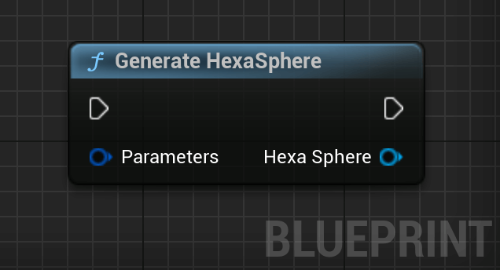

# Generating Tiles

This section covers how to generate tiles for a sphere.


## Synchronous Generation

<div class="code-switcher show-cpp-false">
<div class="switcher" >
<span class="sw-bp" onclick="switchBp()">Blueprints</span><span class="sw-cpp" onclick="switchCpp()">C++</span>
</div>
<div class="cpp">

A list of tiles can be generated with a call to `FHexaSphereLib::GenerateHexaSphere()`.

```cpp
// Includes the library.
#include "Generation/HexaSphereLib.h"

// ...

// The parameters to generate the tiles.
FHexaSphereParameters Parameters;
Parameters.Divisions = 12;
Parameters.Radius = 400.f;
Parameters.Percent = 1.f; 
Parameters.bGenerateNeighborData = true;

// Generates the tiles.
TArray<FHexaTile> Tiles = FHexaSphereLib::GenerateHexaSphere(Parameters);
```


A tile struct contains a few attributes defining the tiles:
1. `CenterPoint`: The center point of the hexagon representing the tile.
2. `Boundaries`: The boundaries of the tile. For an hexagon, it contains the 6 location of the edges relative to the center of the sphere.
3. `Offset`: The tile offset from the surface. If noise is applied to the tile, the noise vector is stored in this property. Can be modified to define an arbitrary offset to the tile.
4. `Color`: The color of the tile, that is passed to the material. Can be changed to modify a tile's color.
5. `Neighbors`: The index of neighbors of the tiles in the Tiles array. Can be empty if `bGenerateNeighborData` is set to false when generating the tiles.

```cpp
// Gets a tile at an arbitrary index. Make sure to use a ref (&)
// if you want to edit its properties.
FHexaTile& FirstTile = Tiles[0];

// Can access the tile's properties with Tile.X
// Tile.CenterPoint;
// Tile.Boundaries;
// Tile.Offset;
// Tile.Color;
// Tile.Neighbors;

// For example, we can set a tile's color:
Tile.Color = FLinearColor::Red;

// And do the same for its neighbors
for (const int32 NeighborIndex : Tile.Neighbors)
{
    Tiles[NeighborIndex].Color = FLinearColor::Blue;
}
```


</div>

<div class="bp">

A HexaSphere can be generated with a call to the `Generate HexaSphere` node.


<div class="bpcode">
<textarea readonly>
Begin Object Class=/Script/BlueprintGraph.K2Node_CallFunction Name="K2Node_CallFunction_1" ExportPath=/Script/BlueprintGraph.K2Node_CallFunction'"/Game/QuickStart/MyPlanet.MyPlanet:EventGraph.K2Node_CallFunction_1"'
   FunctionReference=(MemberParent=/Script/CoreUObject.Class'"/Script/HexaSphereLib.HexaSphere"',MemberName="GenerateHexaSphere")
   NodePosX=-432
   NodePosY=-576
   NodeGuid=031E3F964DE1EB358981D7B68C26FFC6
   CustomProperties Pin (PinId=B581677E4BD17A367980869296592A2A,PinName="execute",PinToolTip="\nExec",PinType.PinCategory="exec",PinType.PinSubCategory="",PinType.PinSubCategoryObject=None,PinType.PinSubCategoryMemberReference=(),PinType.PinValueType=(),PinType.ContainerType=None,PinType.bIsReference=False,PinType.bIsConst=False,PinType.bIsWeakPointer=False,PinType.bIsUObjectWrapper=False,PinType.bSerializeAsSinglePrecisionFloat=False,PersistentGuid=00000000000000000000000000000000,bHidden=False,bNotConnectable=False,bDefaultValueIsReadOnly=False,bDefaultValueIsIgnored=False,bAdvancedView=False,bOrphanedPin=False,)
   CustomProperties Pin (PinId=B95F675847C265571F4FA5A614018EDA,PinName="then",PinToolTip="\nExec",Direction="EGPD_Output",PinType.PinCategory="exec",PinType.PinSubCategory="",PinType.PinSubCategoryObject=None,PinType.PinSubCategoryMemberReference=(),PinType.PinValueType=(),PinType.ContainerType=None,PinType.bIsReference=False,PinType.bIsConst=False,PinType.bIsWeakPointer=False,PinType.bIsUObjectWrapper=False,PinType.bSerializeAsSinglePrecisionFloat=False,PersistentGuid=00000000000000000000000000000000,bHidden=False,bNotConnectable=False,bDefaultValueIsReadOnly=False,bDefaultValueIsIgnored=False,bAdvancedView=False,bOrphanedPin=False,)
   CustomProperties Pin (PinId=0D98338D45321D5D7AC106A2F66B0488,PinName="self",PinFriendlyName=NSLOCTEXT("K2Node", "Target", "Target"),PinToolTip="Target\nHexa Sphere Object Reference",PinType.PinCategory="object",PinType.PinSubCategory="",PinType.PinSubCategoryObject=/Script/CoreUObject.Class'"/Script/HexaSphereLib.HexaSphere"',PinType.PinSubCategoryMemberReference=(),PinType.PinValueType=(),PinType.ContainerType=None,PinType.bIsReference=False,PinType.bIsConst=False,PinType.bIsWeakPointer=False,PinType.bIsUObjectWrapper=False,PinType.bSerializeAsSinglePrecisionFloat=False,DefaultObject="/Script/HexaSphereLib.Default__HexaSphere",PersistentGuid=00000000000000000000000000000000,bHidden=True,bNotConnectable=False,bDefaultValueIsReadOnly=False,bDefaultValueIsIgnored=False,bAdvancedView=False,bOrphanedPin=False,)
   CustomProperties Pin (PinId=D119B6464B7C5DEA59744AA9606F6E85,PinName="Parameters",PinToolTip="Parameters\nHexa Sphere Parameters Structure (by ref)\n\nThe parameters to generate the tiles.",PinType.PinCategory="struct",PinType.PinSubCategory="",PinType.PinSubCategoryObject=/Script/CoreUObject.ScriptStruct'"/Script/HexaSphereLib.HexaSphereParameters"',PinType.PinSubCategoryMemberReference=(),PinType.PinValueType=(),PinType.ContainerType=None,PinType.bIsReference=True,PinType.bIsConst=True,PinType.bIsWeakPointer=False,PinType.bIsUObjectWrapper=False,PinType.bSerializeAsSinglePrecisionFloat=False,PersistentGuid=00000000000000000000000000000000,bHidden=False,bNotConnectable=False,bDefaultValueIsReadOnly=False,bDefaultValueIsIgnored=True,bAdvancedView=False,bOrphanedPin=False,)
   CustomProperties Pin (PinId=B9509FF64B3BFD2EACDBC984ABE66028,PinName="ReturnValue",PinFriendlyName=NSLOCTEXT("", "6157BE9E4E3349D290C06BB4CBABFC2E", "HexaSphere"),PinToolTip="Hexa Sphere\nHexa Sphere Object Reference\n\nA list of tiles covering a sphere.",Direction="EGPD_Output",PinType.PinCategory="object",PinType.PinSubCategory="",PinType.PinSubCategoryObject=/Script/CoreUObject.Class'"/Script/HexaSphereLib.HexaSphere"',PinType.PinSubCategoryMemberReference=(),PinType.PinValueType=(),PinType.ContainerType=None,PinType.bIsReference=False,PinType.bIsConst=False,PinType.bIsWeakPointer=False,PinType.bIsUObjectWrapper=False,PinType.bSerializeAsSinglePrecisionFloat=False,PersistentGuid=00000000000000000000000000000000,bHidden=False,bNotConnectable=False,bDefaultValueIsReadOnly=False,bDefaultValueIsIgnored=False,bAdvancedView=False,bOrphanedPin=False,)
End Object
</textarea>

<button onclick="copyBlueprintCode(this)">Copy Code</button>
</div>

The resulting `UHexaSphere` object consists of tiles and a few helper methods to manipulate those tiles. It is possible to get the tiles by calling the `Get Tiles` pure node.

<div class="bpcode">
<textarea readonly>
Begin Object Class=/Script/BlueprintGraph.K2Node_VariableGet Name="K2Node_VariableGet_1" ExportPath=/Script/BlueprintGraph.K2Node_VariableGet'"/Game/QuickStart/MyPlanet.MyPlanet:EventGraph.K2Node_VariableGet_1"'
   VariableReference=(MemberParent=/Script/CoreUObject.Class'"/Script/HexaSphereLib.HexaSphere"',MemberName="Tiles")
   SelfContextInfo=NotSelfContext
   NodePosX=-544
   NodePosY=-784
   NodeGuid=CC054E2844036A0CD470D799FC6B1F66
   CustomProperties Pin (PinId=4E23CD844485E9286D1949914A657F4A,PinName="Tiles",PinFriendlyName="Tiles",Direction="EGPD_Output",PinType.PinCategory="struct",PinType.PinSubCategory="",PinType.PinSubCategoryObject=/Script/CoreUObject.ScriptStruct'"/Script/HexaSphereLib.HexaTile"',PinType.PinSubCategoryMemberReference=(),PinType.PinValueType=(),PinType.ContainerType=Array,PinType.bIsReference=False,PinType.bIsConst=False,PinType.bIsWeakPointer=False,PinType.bIsUObjectWrapper=False,PinType.bSerializeAsSinglePrecisionFloat=False,PersistentGuid=00000000000000000000000000000000,bHidden=False,bNotConnectable=False,bDefaultValueIsReadOnly=False,bDefaultValueIsIgnored=False,bAdvancedView=False,bOrphanedPin=False,)
   CustomProperties Pin (PinId=30879727407F96ED4FD38F87756CE38B,PinName="self",PinFriendlyName=NSLOCTEXT("K2Node", "Target", "Target"),PinType.PinCategory="object",PinType.PinSubCategory="",PinType.PinSubCategoryObject=/Script/CoreUObject.Class'"/Script/HexaSphereLib.HexaSphere"',PinType.PinSubCategoryMemberReference=(),PinType.PinValueType=(),PinType.ContainerType=None,PinType.bIsReference=False,PinType.bIsConst=False,PinType.bIsWeakPointer=False,PinType.bIsUObjectWrapper=False,PinType.bSerializeAsSinglePrecisionFloat=False,LinkedTo=(K2Node_VariableGet_3 DB3F9FB14702CCE8017FF680823C6FB8,),PersistentGuid=00000000000000000000000000000000,bHidden=False,bNotConnectable=False,bDefaultValueIsReadOnly=False,bDefaultValueIsIgnored=False,bAdvancedView=False,bOrphanedPin=False,)
End Object
Begin Object Class=/Script/BlueprintGraph.K2Node_VariableGet Name="K2Node_VariableGet_3" ExportPath=/Script/BlueprintGraph.K2Node_VariableGet'"/Game/QuickStart/MyPlanet.MyPlanet:EventGraph.K2Node_VariableGet_3"'
   VariableReference=(MemberName="Hexa Sphere",MemberGuid=FD75A70E45BA20382AA5B9A8C345B35C,bSelfContext=True)
   NodePosX=-704
   NodePosY=-768
   NodeGuid=1B9855B544BC61DCEB21EC9D48D4E675
   CustomProperties Pin (PinId=DB3F9FB14702CCE8017FF680823C6FB8,PinName="Hexa Sphere",Direction="EGPD_Output",PinType.PinCategory="object",PinType.PinSubCategory="",PinType.PinSubCategoryObject=/Script/CoreUObject.Class'"/Script/HexaSphereLib.HexaSphere"',PinType.PinSubCategoryMemberReference=(),PinType.PinValueType=(),PinType.ContainerType=None,PinType.bIsReference=False,PinType.bIsConst=False,PinType.bIsWeakPointer=False,PinType.bIsUObjectWrapper=False,PinType.bSerializeAsSinglePrecisionFloat=False,LinkedTo=(K2Node_VariableGet_1 30879727407F96ED4FD38F87756CE38B,),PersistentGuid=00000000000000000000000000000000,bHidden=False,bNotConnectable=False,bDefaultValueIsReadOnly=False,bDefaultValueIsIgnored=False,bAdvancedView=False,bOrphanedPin=False,)
   CustomProperties Pin (PinId=F5D6718B4BD46765D3A035AA52BB8D2E,PinName="self",PinFriendlyName=NSLOCTEXT("K2Node", "Target", "Target"),PinType.PinCategory="object",PinType.PinSubCategory="",PinType.PinSubCategoryObject=/Script/Engine.BlueprintGeneratedClass'"/Game/QuickStart/MyPlanet.MyPlanet_C"',PinType.PinSubCategoryMemberReference=(),PinType.PinValueType=(),PinType.ContainerType=None,PinType.bIsReference=False,PinType.bIsConst=False,PinType.bIsWeakPointer=False,PinType.bIsUObjectWrapper=False,PinType.bSerializeAsSinglePrecisionFloat=False,PersistentGuid=00000000000000000000000000000000,bHidden=True,bNotConnectable=False,bDefaultValueIsReadOnly=False,bDefaultValueIsIgnored=False,bAdvancedView=False,bOrphanedPin=False,)
End Object
</textarea>

<button onclick="copyBlueprintCode(this)">Copy Code</button>
</div>

A tile struct contains a few attributes defining the tiles:
1. `Center Point`: The center point of the hexagon representing the tile.
2. `Boundaries`: The boundaries of the tile. For an hexagon, it contains the 6 location of the edges relative to the center of the sphere.
3. `Offset`: The tile offset from the surface. If noise is applied to the tile, the noise vector is stored in this property. Can be modified to define an arbitrary offset to the tile.
4. `Color`: The color of the tile, that is passed to the material. Can be changed to modify a tile's color.
5. `Neighbors`: The index of neighbors of the tiles in the `UHexaSphere`'s Tiles array. Can be empty if `bGenerateNeighborData` is set to false when generating the tiles.

<div class="bpcode">
<textarea readonly>
Begin Object Class=/Script/BlueprintGraph.K2Node_BreakStruct Name="K2Node_BreakStruct_0" ExportPath=/Script/BlueprintGraph.K2Node_BreakStruct'"/Game/QuickStart/MyPlanet.MyPlanet:EventGraph.K2Node_BreakStruct_0"'
   bMadeAfterOverridePinRemoval=True
   ShowPinForProperties(0)=(PropertyName="CenterPoint",PropertyFriendlyName="Center Point",PropertyTooltip="The center point of the tile.",CategoryName="Tile",bShowPin=True,bCanToggleVisibility=True)
   ShowPinForProperties(1)=(PropertyName="Faces",PropertyFriendlyName="Faces",PropertyTooltip="The faces composing this tile, represented by 3 vertices.",CategoryName="Tile",bShowPin=True,bCanToggleVisibility=True)
   ShowPinForProperties(2)=(PropertyName="Boundaries",PropertyFriendlyName="Boundaries",PropertyTooltip="The boundaries of the tile. Each element is a vertex of the (hexa/penta)gone.",CategoryName="Tile",bShowPin=True,bCanToggleVisibility=True)
   ShowPinForProperties(3)=(PropertyName="Offset",PropertyFriendlyName="Offset",PropertyTooltip="The offset of the tile.",CategoryName="Tile",bShowPin=True,bCanToggleVisibility=True)
   ShowPinForProperties(4)=(PropertyName="Color",PropertyFriendlyName="Color",PropertyTooltip="The color of the tile. Passed as Vertex color for the vertices composing\nthis tile.",CategoryName="Tile",bShowPin=True,bCanToggleVisibility=True)
   ShowPinForProperties(5)=(PropertyName="Neighbors",PropertyFriendlyName="Neighbors",PropertyTooltip="The index of the neighboring tiles.",CategoryName="Tile",bShowPin=True,bCanToggleVisibility=True)
   StructType=/Script/CoreUObject.ScriptStruct'"/Script/HexaSphereLib.HexaTile"'
   NodePosX=-832
   NodePosY=-1136
   AdvancedPinDisplay=Shown
   NodeGuid=84F57C7246A774B22BBB4CA1590DAF1A
   CustomProperties Pin (PinId=072E15904F7743A2ECCC5CA0488B4023,PinName="HexaTile",PinType.PinCategory="struct",PinType.PinSubCategory="",PinType.PinSubCategoryObject=/Script/CoreUObject.ScriptStruct'"/Script/HexaSphereLib.HexaTile"',PinType.PinSubCategoryMemberReference=(),PinType.PinValueType=(),PinType.ContainerType=None,PinType.bIsReference=True,PinType.bIsConst=True,PinType.bIsWeakPointer=False,PinType.bIsUObjectWrapper=False,PinType.bSerializeAsSinglePrecisionFloat=False,PersistentGuid=00000000000000000000000000000000,bHidden=False,bNotConnectable=False,bDefaultValueIsReadOnly=False,bDefaultValueIsIgnored=False,bAdvancedView=False,bOrphanedPin=False,)
   CustomProperties Pin (PinId=087A52E348F6499849C09D9F584274CC,PinName="CenterPoint",PinFriendlyName="Center Point",PinToolTip="Center Point\nVector\n\nThe center point of the tile.",Direction="EGPD_Output",PinType.PinCategory="struct",PinType.PinSubCategory="",PinType.PinSubCategoryObject=/Script/CoreUObject.ScriptStruct'"/Script/CoreUObject.Vector"',PinType.PinSubCategoryMemberReference=(),PinType.PinValueType=(),PinType.ContainerType=None,PinType.bIsReference=False,PinType.bIsConst=False,PinType.bIsWeakPointer=False,PinType.bIsUObjectWrapper=False,PinType.bSerializeAsSinglePrecisionFloat=False,PersistentGuid=00000000000000000000000000000000,bHidden=False,bNotConnectable=False,bDefaultValueIsReadOnly=False,bDefaultValueIsIgnored=False,bAdvancedView=False,bOrphanedPin=False,)
   CustomProperties Pin (PinId=4729F41F4A128B71827654A77674CB16,PinName="Faces",PinFriendlyName="Faces",PinToolTip="Faces\nArray of Vectors\n\nThe faces composing this tile, represented by 3 vertices.",Direction="EGPD_Output",PinType.PinCategory="struct",PinType.PinSubCategory="",PinType.PinSubCategoryObject=/Script/CoreUObject.ScriptStruct'"/Script/CoreUObject.Vector"',PinType.PinSubCategoryMemberReference=(),PinType.PinValueType=(),PinType.ContainerType=Array,PinType.bIsReference=False,PinType.bIsConst=False,PinType.bIsWeakPointer=False,PinType.bIsUObjectWrapper=False,PinType.bSerializeAsSinglePrecisionFloat=False,PersistentGuid=00000000000000000000000000000000,bHidden=False,bNotConnectable=False,bDefaultValueIsReadOnly=False,bDefaultValueIsIgnored=False,bAdvancedView=False,bOrphanedPin=False,)
   CustomProperties Pin (PinId=1FF4671A4BD575144F4E1C8012682A0A,PinName="Boundaries",PinFriendlyName="Boundaries",PinToolTip="Boundaries\nArray of Vectors\n\nThe boundaries of the tile. Each element is a vertex of the (hexa/penta)gone.",Direction="EGPD_Output",PinType.PinCategory="struct",PinType.PinSubCategory="",PinType.PinSubCategoryObject=/Script/CoreUObject.ScriptStruct'"/Script/CoreUObject.Vector"',PinType.PinSubCategoryMemberReference=(),PinType.PinValueType=(),PinType.ContainerType=Array,PinType.bIsReference=False,PinType.bIsConst=False,PinType.bIsWeakPointer=False,PinType.bIsUObjectWrapper=False,PinType.bSerializeAsSinglePrecisionFloat=False,PersistentGuid=00000000000000000000000000000000,bHidden=False,bNotConnectable=False,bDefaultValueIsReadOnly=False,bDefaultValueIsIgnored=False,bAdvancedView=True,bOrphanedPin=False,)
   CustomProperties Pin (PinId=4C7926BD419751ED4A6BEEA665C10859,PinName="Offset",PinFriendlyName="Offset",PinToolTip="Offset\nVector\n\nThe offset of the tile.",Direction="EGPD_Output",PinType.PinCategory="struct",PinType.PinSubCategory="",PinType.PinSubCategoryObject=/Script/CoreUObject.ScriptStruct'"/Script/CoreUObject.Vector"',PinType.PinSubCategoryMemberReference=(),PinType.PinValueType=(),PinType.ContainerType=None,PinType.bIsReference=False,PinType.bIsConst=False,PinType.bIsWeakPointer=False,PinType.bIsUObjectWrapper=False,PinType.bSerializeAsSinglePrecisionFloat=False,PersistentGuid=00000000000000000000000000000000,bHidden=False,bNotConnectable=False,bDefaultValueIsReadOnly=False,bDefaultValueIsIgnored=False,bAdvancedView=True,bOrphanedPin=False,)
   CustomProperties Pin (PinId=A630327047E928102A0D509B37747138,PinName="Color",PinFriendlyName="Color",PinToolTip="Color\nLinear Color Structure\n\nThe color of the tile. Passed as Vertex color for the vertices composing\nthis tile.",Direction="EGPD_Output",PinType.PinCategory="struct",PinType.PinSubCategory="",PinType.PinSubCategoryObject=/Script/CoreUObject.ScriptStruct'"/Script/CoreUObject.LinearColor"',PinType.PinSubCategoryMemberReference=(),PinType.PinValueType=(),PinType.ContainerType=None,PinType.bIsReference=False,PinType.bIsConst=False,PinType.bIsWeakPointer=False,PinType.bIsUObjectWrapper=False,PinType.bSerializeAsSinglePrecisionFloat=False,PersistentGuid=00000000000000000000000000000000,bHidden=False,bNotConnectable=False,bDefaultValueIsReadOnly=False,bDefaultValueIsIgnored=False,bAdvancedView=True,bOrphanedPin=False,)
   CustomProperties Pin (PinId=40CC21DD4D4E655BFE0FCDA930C008B1,PinName="Neighbors",PinFriendlyName="Neighbors",PinToolTip="Neighbors\nArray of Integers\n\nThe index of the neighboring tiles.",Direction="EGPD_Output",PinType.PinCategory="int",PinType.PinSubCategory="",PinType.PinSubCategoryObject=None,PinType.PinSubCategoryMemberReference=(),PinType.PinValueType=(),PinType.ContainerType=Array,PinType.bIsReference=False,PinType.bIsConst=False,PinType.bIsWeakPointer=False,PinType.bIsUObjectWrapper=False,PinType.bSerializeAsSinglePrecisionFloat=False,PersistentGuid=00000000000000000000000000000000,bHidden=False,bNotConnectable=False,bDefaultValueIsReadOnly=False,bDefaultValueIsIgnored=False,bAdvancedView=True,bOrphanedPin=False,)
End Object
</textarea>

<button onclick="copyBlueprintCode(this)">Copy Code</button>
</div>

</div>
</div>

## Asynchronous generation

As the number of divisions increases, the time it takes to generate the tiles increases. If you generate huge spheres and start to see a freeze, you might want to switch to asynchronous generation. Asnchronous generations performs the sphere generation in a background thread to not block the Game Thread.

!> Switching thread comes with a delay. You can expect up to nearly `2 * 1 / FPS` seconds (= `33ms` at `60` FPS) of idle delay to leave and come back to the Game Thread. 

<div class="code-switcher show-cpp-false">
<div class="switcher" >
<span class="sw-bp" onclick="switchBp()">Blueprints</span><span class="sw-cpp" onclick="switchCpp()">C++</span>
</div>
<div class="cpp">

```cpp
// Includes the library.
#include "Generation/HexaSphereLib.h"

// ...

// The parameters to generate the tiles.
FHexaSphereParameters Parameters;
Parameters.Divisions = 12;
Parameters.Radius = 400.f;
Parameters.Percent = 1.f; 
Parameters.bGenerateNeighborData = true;

// Generates the tiles asynchronously.
FHexaSphereLib::GenerateHexaSphereAsync(Parameters, FGenerateHexaSphereCallback::CreateLambda([](TArray<FHexaTile> Tiles) -> void
{
    // The HexaSphere is represented by the Tiles array.
}))
```

</div>

<div class="bp">

A HexaSphere can be generated asynchronously with a call to the `Generate HexaSphere` node.

!> *Common Mistake:* Make sure to connect any code that uses the HexaSphere to the `On Generated` pin. The HexaSphere object is `null` on the default pin.

<div class="bpcode">
<textarea readonly>
Begin Object Class=/Script/BlueprintGraph.K2Node_AsyncAction Name="K2Node_AsyncAction_0" ExportPath=/Script/BlueprintGraph.K2Node_AsyncAction'"/Game/QuickStart/MyPlanet.MyPlanet:EventGraph.K2Node_AsyncAction_0"'
   ProxyFactoryFunctionName="GenerateHexaSphereAsync"
   ProxyFactoryClass=/Script/CoreUObject.Class'"/Script/HexaSphereLib.GenerateHexaSphereProxy"'
   ProxyClass=/Script/CoreUObject.Class'"/Script/HexaSphereLib.GenerateHexaSphereProxy"'
   NodePosX=-544
   NodePosY=-592
   NodeGuid=FA9C436B4F1D1A7D5E0BAD8E9BB23992
   CustomProperties Pin (PinId=F36D3D0E4547CA4045CEA08806442901,PinName="execute",PinToolTip="\nExec",PinType.PinCategory="exec",PinType.PinSubCategory="",PinType.PinSubCategoryObject=None,PinType.PinSubCategoryMemberReference=(),PinType.PinValueType=(),PinType.ContainerType=None,PinType.bIsReference=False,PinType.bIsConst=False,PinType.bIsWeakPointer=False,PinType.bIsUObjectWrapper=False,PinType.bSerializeAsSinglePrecisionFloat=False,PersistentGuid=00000000000000000000000000000000,bHidden=False,bNotConnectable=False,bDefaultValueIsReadOnly=False,bDefaultValueIsIgnored=False,bAdvancedView=False,bOrphanedPin=False,)
   CustomProperties Pin (PinId=AB1629E5468FC8BE6735C78B80A88096,PinName="then",Direction="EGPD_Output",PinType.PinCategory="exec",PinType.PinSubCategory="",PinType.PinSubCategoryObject=None,PinType.PinSubCategoryMemberReference=(),PinType.PinValueType=(),PinType.ContainerType=None,PinType.bIsReference=False,PinType.bIsConst=False,PinType.bIsWeakPointer=False,PinType.bIsUObjectWrapper=False,PinType.bSerializeAsSinglePrecisionFloat=False,PersistentGuid=00000000000000000000000000000000,bHidden=False,bNotConnectable=False,bDefaultValueIsReadOnly=False,bDefaultValueIsIgnored=False,bAdvancedView=False,bOrphanedPin=False,)
   CustomProperties Pin (PinId=55A1C3EE4E4066E8D8AAE291F8CD6413,PinName="OnGenerated",PinFriendlyName=NSLOCTEXT("", "91F2007143E47D9EF08129B76D7659BD", "On Generated"),Direction="EGPD_Output",PinType.PinCategory="exec",PinType.PinSubCategory="",PinType.PinSubCategoryObject=None,PinType.PinSubCategoryMemberReference=(),PinType.PinValueType=(),PinType.ContainerType=None,PinType.bIsReference=False,PinType.bIsConst=False,PinType.bIsWeakPointer=False,PinType.bIsUObjectWrapper=False,PinType.bSerializeAsSinglePrecisionFloat=False,LinkedTo=(K2Node_Knot_0 B075BD744E801B73E855FDB899A5E7A5,),PersistentGuid=00000000000000000000000000000000,bHidden=False,bNotConnectable=False,bDefaultValueIsReadOnly=False,bDefaultValueIsIgnored=False,bAdvancedView=False,bOrphanedPin=False,)
   CustomProperties Pin (PinId=831FD72441842C6E870E3081F1F8848B,PinName="HexaSphere",PinToolTip="Hexa Sphere\nHexa Sphere Object Reference",Direction="EGPD_Output",PinType.PinCategory="object",PinType.PinSubCategory="",PinType.PinSubCategoryObject=/Script/CoreUObject.Class'"/Script/HexaSphereLib.HexaSphere"',PinType.PinSubCategoryMemberReference=(),PinType.PinValueType=(),PinType.ContainerType=None,PinType.bIsReference=False,PinType.bIsConst=False,PinType.bIsWeakPointer=False,PinType.bIsUObjectWrapper=False,PinType.bSerializeAsSinglePrecisionFloat=False,PersistentGuid=00000000000000000000000000000000,bHidden=False,bNotConnectable=False,bDefaultValueIsReadOnly=False,bDefaultValueIsIgnored=False,bAdvancedView=False,bOrphanedPin=False,)
   CustomProperties Pin (PinId=1C371A4243F03D7A69CB04AE2E9A0D12,PinName="Parameters",PinToolTip="Parameters\nHexa Sphere Parameters Structure",PinType.PinCategory="struct",PinType.PinSubCategory="",PinType.PinSubCategoryObject=/Script/CoreUObject.ScriptStruct'"/Script/HexaSphereLib.HexaSphereParameters"',PinType.PinSubCategoryMemberReference=(),PinType.PinValueType=(),PinType.ContainerType=None,PinType.bIsReference=False,PinType.bIsConst=False,PinType.bIsWeakPointer=False,PinType.bIsUObjectWrapper=False,PinType.bSerializeAsSinglePrecisionFloat=False,LinkedTo=(K2Node_MakeStruct_0 FF98C99043547AC5244A0C9774B46338,),PersistentGuid=00000000000000000000000000000000,bHidden=False,bNotConnectable=False,bDefaultValueIsReadOnly=False,bDefaultValueIsIgnored=False,bAdvancedView=False,bOrphanedPin=False,)
   CustomProperties Pin (PinId=630ED1114E44F0D2FA570592D70473A9,PinName="Noise",PinToolTip="Noise\nHexa Sphere Noise Structure",PinType.PinCategory="struct",PinType.PinSubCategory="",PinType.PinSubCategoryObject=/Script/CoreUObject.ScriptStruct'"/Script/HexaSphereLib.HexaSphereNoise"',PinType.PinSubCategoryMemberReference=(),PinType.PinValueType=(),PinType.ContainerType=None,PinType.bIsReference=False,PinType.bIsConst=False,PinType.bIsWeakPointer=False,PinType.bIsUObjectWrapper=False,PinType.bSerializeAsSinglePrecisionFloat=False,PersistentGuid=00000000000000000000000000000000,bHidden=False,bNotConnectable=False,bDefaultValueIsReadOnly=False,bDefaultValueIsIgnored=False,bAdvancedView=False,bOrphanedPin=False,)
End Object
Begin Object Class=/Script/BlueprintGraph.K2Node_MakeStruct Name="K2Node_MakeStruct_0" ExportPath=/Script/BlueprintGraph.K2Node_MakeStruct'"/Game/QuickStart/MyPlanet.MyPlanet:EventGraph.K2Node_MakeStruct_0"'
   bMadeAfterOverridePinRemoval=True
   ShowPinForProperties(0)=(PropertyName="Divisions",PropertyFriendlyName="Divisions",PropertyTooltip=NSLOCTEXT("", "A4EDBAB24C79BA1FCF535EBA6E9AD5CA", "The number of divisions to perform on the sphere.\nA higher number means more tiles. Greatly influences the generation time."),CategoryName="HexaSphere",bShowPin=True,bCanToggleVisibility=True)
   ShowPinForProperties(1)=(PropertyName="Radius",PropertyFriendlyName="Radius",PropertyTooltip=NSLOCTEXT("", "0673F3564904F9C7EC389D92DC1A7C74", "The radius of the hexasphere generated."),CategoryName="HexaSphere",bShowPin=True,bCanToggleVisibility=True)
   ShowPinForProperties(2)=(PropertyName="Percent",PropertyFriendlyName="Percent",PropertyTooltip=NSLOCTEXT("", "2F681C8647C7A8C9BF7E4F90050540BA", "The percentage each tile covers. Must be in [0;1]."),CategoryName="HexaSphere",bShowPin=True,bCanToggleVisibility=True)
   ShowPinForProperties(3)=(PropertyName="bGenerateNeighborData",PropertyFriendlyName="Generate Neighbor Data",PropertyTooltip=NSLOCTEXT("", "8B51DDE44FE60F60C0FCB79B9A630539", "If tile neighboring data should be generated."),CategoryName="HexaSphere",bShowPin=True,bCanToggleVisibility=True)
   StructType=/Script/CoreUObject.ScriptStruct'"/Script/HexaSphereLib.HexaSphereParameters"'
   NodePosX=-928
   NodePosY=-512
   NodeGuid=F2D577DC4FB7D17E3641949D48D0E4F3
   CustomProperties Pin (PinId=FF98C99043547AC5244A0C9774B46338,PinName="HexaSphereParameters",Direction="EGPD_Output",PinType.PinCategory="struct",PinType.PinSubCategory="",PinType.PinSubCategoryObject=/Script/CoreUObject.ScriptStruct'"/Script/HexaSphereLib.HexaSphereParameters"',PinType.PinSubCategoryMemberReference=(),PinType.PinValueType=(),PinType.ContainerType=None,PinType.bIsReference=False,PinType.bIsConst=False,PinType.bIsWeakPointer=False,PinType.bIsUObjectWrapper=False,PinType.bSerializeAsSinglePrecisionFloat=False,LinkedTo=(K2Node_AsyncAction_0 1C371A4243F03D7A69CB04AE2E9A0D12,),PersistentGuid=00000000000000000000000000000000,bHidden=False,bNotConnectable=False,bDefaultValueIsReadOnly=False,bDefaultValueIsIgnored=False,bAdvancedView=False,bOrphanedPin=False,)
   CustomProperties Pin (PinId=EF809302418C87EBEAE322ABC1990D97,PinName="Divisions",PinFriendlyName=NSLOCTEXT("", "70A46E6E44775189F5F0DFA11D6B39E9", "Divisions"),PinToolTip="Divisions\nInteger\n\nThe number of divisions to perform on the sphere.\nA higher number means more tiles. Greatly influences the generation time.",PinType.PinCategory="int",PinType.PinSubCategory="",PinType.PinSubCategoryObject=None,PinType.PinSubCategoryMemberReference=(),PinType.PinValueType=(),PinType.ContainerType=None,PinType.bIsReference=False,PinType.bIsConst=False,PinType.bIsWeakPointer=False,PinType.bIsUObjectWrapper=False,PinType.bSerializeAsSinglePrecisionFloat=False,DefaultValue="30",AutogeneratedDefaultValue="8",PersistentGuid=00000000000000000000000000000000,bHidden=False,bNotConnectable=False,bDefaultValueIsReadOnly=False,bDefaultValueIsIgnored=False,bAdvancedView=False,bOrphanedPin=False,)
   CustomProperties Pin (PinId=38E8572D4382F988CA8E3FAA546C49A5,PinName="Radius",PinFriendlyName=NSLOCTEXT("", "251EB26148F1284335A8CBB7DC52906F", "Radius"),PinToolTip="Radius\nFloat (single-precision)\n\nThe radius of the hexasphere generated.",PinType.PinCategory="real",PinType.PinSubCategory="float",PinType.PinSubCategoryObject=None,PinType.PinSubCategoryMemberReference=(),PinType.PinValueType=(),PinType.ContainerType=None,PinType.bIsReference=False,PinType.bIsConst=False,PinType.bIsWeakPointer=False,PinType.bIsUObjectWrapper=False,PinType.bSerializeAsSinglePrecisionFloat=False,DefaultValue="400.000000",AutogeneratedDefaultValue="10.000000",PersistentGuid=00000000000000000000000000000000,bHidden=False,bNotConnectable=False,bDefaultValueIsReadOnly=False,bDefaultValueIsIgnored=False,bAdvancedView=False,bOrphanedPin=False,)
   CustomProperties Pin (PinId=1682F1904AA2D67E6F9EF29C90111EA4,PinName="Percent",PinFriendlyName=NSLOCTEXT("", "47E251FF40C93EC05ADFDB9E8C330887", "Percent"),PinToolTip="Percent\nFloat (single-precision)\n\nThe percentage each tile covers. Must be in [0;1].",PinType.PinCategory="real",PinType.PinSubCategory="float",PinType.PinSubCategoryObject=None,PinType.PinSubCategoryMemberReference=(),PinType.PinValueType=(),PinType.ContainerType=None,PinType.bIsReference=False,PinType.bIsConst=False,PinType.bIsWeakPointer=False,PinType.bIsUObjectWrapper=False,PinType.bSerializeAsSinglePrecisionFloat=False,DefaultValue="1.000000",AutogeneratedDefaultValue="1.000000",PersistentGuid=00000000000000000000000000000000,bHidden=False,bNotConnectable=False,bDefaultValueIsReadOnly=False,bDefaultValueIsIgnored=False,bAdvancedView=False,bOrphanedPin=False,)
   CustomProperties Pin (PinId=1226DB60413E5E3FA6DEA297DED544FB,PinName="bGenerateNeighborData",PinFriendlyName=NSLOCTEXT("", "236F739846CDDD6FC45EA8B49B812FB5", "Generate Neighbor Data"),PinToolTip="Generate Neighbor Data\nBoolean\n\nIf tile neighboring data should be generated.",PinType.PinCategory="bool",PinType.PinSubCategory="",PinType.PinSubCategoryObject=None,PinType.PinSubCategoryMemberReference=(),PinType.PinValueType=(),PinType.ContainerType=None,PinType.bIsReference=False,PinType.bIsConst=False,PinType.bIsWeakPointer=False,PinType.bIsUObjectWrapper=False,PinType.bSerializeAsSinglePrecisionFloat=False,DefaultValue="True",AutogeneratedDefaultValue="True",PersistentGuid=00000000000000000000000000000000,bHidden=False,bNotConnectable=False,bDefaultValueIsReadOnly=False,bDefaultValueIsIgnored=False,bAdvancedView=False,bOrphanedPin=False,)
End Object
</textarea>

<button onclick="copyBlueprintCode(this)">Copy Code</button>
</div>


</div>
</div>

<script>
setTimeout(() => {
	bShowCPP = !JSON.parse(getCookie('bShowCPP'));
	switchCode();
}, 0);
</script>
